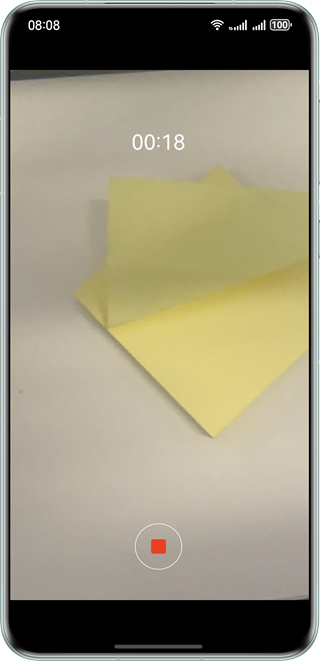

# 基于AVCodec能力的视频编解码

### 介绍

本实例基于AVCodec能力，实现了基于视频编解码的视频播放和录制的功能。通过调用Native侧的编码器，解码器，以及封装和解封装功能，完成从相机录制流到mp4文件的转换，以及对封装好的视频进行解封装，并解码送显。基于本示例可帮助应用开发需要编解码进行视频播放和录制的场景。

- 视频播放的主要流程是将视频文件通过解封装->解码->送显/播放。
- 视频录制的主要流程是相机采集->编码->封装成mp4文件。

### 播放支持的原子能力规格

| 媒体格式 | 封装格式    | 码流格式                                |
|------|:--------|:------------------------------------|
| 视频   | mp4     | 视频码流：H.264/H.265, 音频码流:AudioVivid   |
| 视频   | mkv     | 视频码流：H.264/H.265, 音频码流：aac/mp3/opus |
| 视频   | mpeg-ts | 视频码流：H.264, 音频码流：AudioVivid         |

### 录制支持的原子能力规格

| 封装格式 | 视频编解码类型     | 
|------|-------------|
| mp4  | H.264/H.265 |

### 效果预览

| 应用主界面                                              | 录制页面                                                |
|----------------------------------------------------|-----------------------------------------------------|
|  |  | 

### 使用说明

1. 在弹出是否允许“AVCodecVideo”使用相机后，点击“允许”。

#### 录制

1. 点击“录制”。

2. 确认允许录制文件保存到图库。

3. 录制完成后点击“停止录制”。

#### 播放

1. 推送视频文件至图库下或点击下方“开始录制”，录制一个视频文件。

2. 点击播放按钮，选择文件，开始播放。

### 工程目录

```       
├──entry/src/main/cpp                 // Native层
│  ├──capbilities                     // 能力接口和实现
│  │  ├──include                      // 能力接口
│  │  ├──AudioCapturer.cpp            // 音频采集实现
│  │  ├──AudioDecoder.cpp             // 音频解码实现
│  │  ├──AudioEncoder.cpp             // 音频编码实现
│  │  ├──Demuxer.cpp                  // 解封装实现
│  │  ├──Muxer.cpp                    // 封装实现
│  │  ├──VideoDecoder.cpp             // 视频解码实现
│  │  └──VideoEncoder.cpp             // 视频编码实现
│  ├──common                          // 公共模块
│  │  ├──dfx                          // 日志
│  │  ├──SampleCallback.cpp           // 编解码回调实现   
│  │  ├──SampleCallback.h             // 编解码回调定义
│  │  └──SampleInfo.h                 // 功能实现公共类  
│  ├──render                          // 送显模块接口和实现
│  │  ├──include                      // 送显模块接口
│  │  ├──PluginManager.cpp            // 送显模块管理实现
│  │  └──PluginRender.cpp             // 送显逻辑实现
│  ├──sample                          // Native层
│  │  ├──player                       // Native层播放接口和实现
│  │  │  ├──Player.cpp                // Native层播放功能调用逻辑的实现
│  │  │  ├──Player.h                  // Native层播放功能调用逻辑的接口
│  │  │  ├──PlayerNative.cpp          // Native层 播放的入口
│  │  │  └──PlayerNative.h         
│  │  └──recorder                     // Native层录制接口和实现
│  │     ├──Recorder.cpp              // Native层录制功能调用逻辑的实现
│  │     ├──Recorder.h                // Native层录制功能调用逻辑的接口
│  │     ├──RecorderNative.cpp        // Native层 录制的入口
│  │     └──RecorderNative.h       
│  ├──types                           // Native层暴露上来的接口
│  │  ├──libplayer                    // 播放模块暴露给UI层的接口
│  │  └──librecorder                  // 录制模块暴露给UI层的接口
│  └──CMakeLists.txt                  // 编译入口       
├──ets                                // UI层
│  ├──common                          // 公共模块
│  │  ├──utils                        // 共用的工具类
│  │  │  ├──CameraCheck.ets           // 检查相机参数是否支持
│  │  │  ├──DateTimeUtils.ets         // 获取当前时间
│  │  │  └──Logger.ets                // 日志工具
│  │  └──CommonConstants.ets          // 参数常量
│  ├──entryability                    // 应用的入口
│  │  └──EntryAbility.ets            
│  ├──entrybackupability            
│  │  └──EntryBackupAbility.ets   
│  ├──model            
│  │  └──CameraDataModel.ets          // 相机参数数据类  
│  └──pages                           // EntryAbility 包含的页面
│     ├──Index.ets                    // 首页/播放页面
│     └──Recorder.ets                 // 录制页面
├──resources                          // 用于存放应用所用到的资源文件
│  ├──base                            // 该目录下的资源文件会被赋予唯一的ID
│  │  ├──element                      // 用于存放字体和颜色 
│  │  ├──media                        // 用于存放图片
│  │  └──profile                      // 应用入口首页
│  ├──en_US                           // 设备语言是美式英文时，优先匹配此目录下资源
│  └──zh_CN                           // 设备语言是简体中文时，优先匹配此目录下资源
└──module.json5                       // 模块配置信息
```

### 具体实现

#### *录制*

##### UI层

1. 在UI层Index页面，用户点击“录制”后，会拉起半模态界面，用户确认保存录制文件到图库。录制结束后，文件会存放于图库。
2.
选择好文件后，会用刚刚打开的fd，和用户预设的录制参数，掉起ArkTS的initNative，待初始化结束后，调用OH_NativeWindow_GetSurfaceId接口，得到NativeWindow的surfaceId，并把surfaceId回调回UI层。
3. UI层拿到编码器给的surfaceId后，调起页面路由，携带该surfaceId，跳转到Recorder页面；
4. 录制页面XComponent构建时，会调起.onLoad()方法，此方法首先会拿到XComponent的surfaceId，然后调起createDualChannelPreview()
   ,此函数会建立一个相机生产，XComponent和编码器的surface消费的生产消费模型。

##### Native层

1. 进入录制界面后，编码器启动，开始对UI层相机预览流进行编码。
2. 编码器每编码成功一帧，sample_callback.cpp的输出回调OnNewOutputBuffer()就会调起一次，此时用户会拿到AVCodec框架给出的OH_AVBuffer；
3. 在输出回调中，用户需手动把帧buffer、index存入输出队列中，并通知输出线程解锁；
4. 在输出线程中，把上一步的帧信息储存为bufferInfo后，pop出队；
5. 在输出线程中，使用上一步的bufferInfo，调用封装接口WriteSample后，这一帧被封装入MP4中；
6. 最后调用FreeOutputBuffer接口后，这一帧buffer释放回AVCodec框架，实现buffer轮转。

#### *播放*

##### UI层

1. 在UI层Index页面，用户点击播放按钮后，触发点击事件，调起selectFile()函数，该函数会调起图库的选择文件模块，拿到用户选取文件的路径;
2. 用户选择文件成功后，调起play()
   函数，该函数会根据上一步获取到的路径，打开一个文件，并获取到该文件的大小，改变按钮状态为不可用，之后调起ArkTS层暴露给应用层的playNative()
   接口;
3. 根据playNative字段，调起PlayerNative::Play()函数，此处会注册播放结束的回调。
4. 播放结束时，Callback()中napi_call_function()接口调起，通知应用层，恢复按钮状态为可用。

##### ArkTS层

1. 在PlayerNative.cpp的Init()中调用PluginManager()中的Export()方法，注册OnSurfaceCreatedCB()
   回调，当屏幕上出现新的XComponent时，将其转换并赋给单例类PluginManager中的pluginWindow_;

##### Native层

1. 具体实现原理：
    - 解码器Start后，解码器每拿到一帧，OnNeedInputBuffer就会被调起一次，AVCodec框架会给用户一个OH_AVBuffer。
    - 在输入回调中，用户需手动把帧buffer、index存入输入队列中，并同时输入线程解锁。
    - 在输入线程中，把上一步的帧信息储存为bufferInfo后，pop出队。
    - 在输入线程中，使用上一步的bufferInfo，调用ReadSample接口解封装帧数据。
    - 在输入线程中，使用解封装后的bufferInfo，调用解码的PushInputData接口，此时这片buffer用完，返回框架，实现buffer轮转。
    - PushInputData后，这一帧开始解码，每解码完成一帧，输出回调会被调起一次，用户需手动把帧buffer、index存入输出队列中。
    - 在输出线程中，把上一步的帧信息储存为bufferInfo后，pop出队。
    - 在输出线程中，调用FreeOutputData接口后，就会送显并释放buffer。释放的buffer会返回框架，实现buffer轮转。
2. 解码器config阶段，OH_VideoDecoder_SetSurface接口的入参OHNativeWindow*，即为PluginManager中的pluginWindow_。
3. 解码器config阶段，SetCallback接口，sample_callback.cpp的输入输出回调需将回调上来的帧buffer和index存入一个用户自定义容器sample_info.h中，方便后续操作。
4. Player.cpp的Start()起两个专门用于输入和输出的线程。

### 相关权限

- 允许应用使用相机: ohos.permission.CAMERA。
- 允许应用使用麦克风: ohos.permission.MICROPHONE。

### 依赖

- 不涉及

### 约束与限制

1. 本示例仅支持标准系统上运行，支持设备：华为手机;

2. HarmonyOS系统：HarmonyOS 5.0.5 Release及以上;

3. DevEco Studio版本：DevEco Studio 5.0.5 Release及以上;

4. HarmonyOS SDK版本：HarmonyOS 5.0.5 Release SDK及以上。    