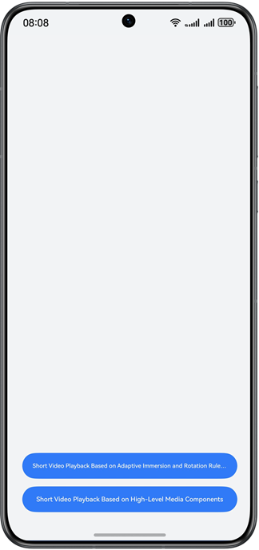

# Immersive Mode and Rotation of Short Videos

#### Overview

This sample shows how to use the adaptive_video library and an advanced component to implement the immersive mode and rotation of short videos, optimizing development efficiency and costs.

#### Effect



#### Description

1. In common scenarios, immersive and full-screen playback is supported when the mobile phone is held horizontally. Users can swipe up or down to switch between videos.
2. In advanced scenarios, immersive and full-screen playback is supported when the mobile phone is held horizontally. Users can double-tap the screen to favorite videos, hold down on the screen to play the video at a 2x speed, and operate the keyboard on PCs/2-in-1 devices.

#### Project Directory

```
├──commons
│  ├──base/src/main/ets
│  │  ├──constants
│  │  │  ├──BreakpointConstants.ets                 // Breakpoint constants
│  │  │  └──CommonConstants.ets                     // Common constants
│  │  └──model
│  │     ├──BreakpointType.ets                      // Breakpoint values
│  │     └──VideoDataSource.ets                     // Lazy loading data source
│  └──base/src/main/resources                       // Static resources
├──features
│  ├──adaptive_video_component/src/main/ets
│  │  ├──components
│  │  │  ├──AdaptiveAVPlayer.ets                    // Implementation of the immersive mode and rotation
│  │  │  ├──CustomAdaptiveVideoComponent.ets        // Implementation of the advanced component
│  │  │  ├──PCVideoControl.ets                      // Playback control bar for PC
│  │  │  └──VideoControl.ets                        // Full-screen playback control bar
│  │  ├──pages
│  │  │  ├──Home.ets                                // Bottom tab
│  │  │  └──Recommend.ets                           // Top tab
│  │  └──utils
│  │     └──AVPlayerUtil.ets                        // Playback utility
│  └──adaptive_video_component/src/main/resources   // Static resources
└──products
   ├──entry/src/main/ets
   │  ├──entryability
   │  │  └──EntryAbility.ets
   │  ├──entrybackupability
   │  │  └──EntryBackupAbility.ets
   │  └──pages
   │     └──Index.ets                              // Home page
   └──entry/src/main/resources                     // Static resources
```

#### Dependencies

The adaptive video effect is achieved through immersive mode, rotation functionality, and an advanced component library.

Source code address: https://gitcode.com/openharmony-sig/hadss_adaptive/tree/master/adaptive_video

#### Precautions

1. To achieve an immersive effect, set the video to play in full-screen mode and control the display based on the outputs.

```typescript
windowClass.setWindowLayoutFullScreen(true)
```

To remove the title bar on 2-in-1 devices, add the following settings:

```typescript
if (canIUse('SystemCapability.Window.SessionManager')) {
  // Hide the title bar and adjust its height on 2-in-1 devices. 
  windowClass.setWindowDecorVisible(false);
}
```

2. To modify the local video source, place it in rawfile under the features directory and modify VIDEO_SOURCE in CommonConstants.
3. To switch the network video source, modify VIDEO_SOURCE in CommonConstants.
4. If the expected effect is not achieved after API calling—for example, the desired immersive layout fails to be implemented or the video cannot rotate—you must call the init() method for initialization before using the adaptive tools in adaptive_video.
5. When implementing the swipe-to-play feature for short videos, use multiple AVPlayers where each controls the playback of a single video. This ensures all videos maintain independent playback states, and based on their indices, only one AVPlayer is in the playing state at a time.
6. For video rotation in non-full-screen mode, you are advised to call the setOrientationNotFullScreen() method of AdaptiveRotation when the video page is initially loaded or during video switches.

#### Required Permissions

ohos.permission.INTERNET: allows for network video playback.

#### Constraints

1. The sample is only supported on Huawei phones, foldable phones, tablets, and PCs/2-in-1 devices with standard systems. 
2. The HarmonyOS version must be HarmonyOS 5.0.5 Release or later. 
3. The DevEco Studio version must be DevEco Studio 5.0.5 Release or later. 
4. The HarmonyOS SDK version must be HarmonyOS 5.0.5 Release SDK or later.
