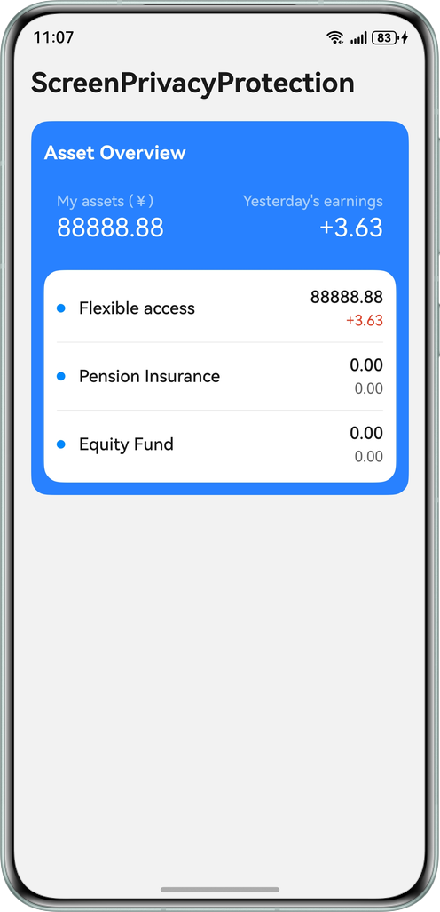
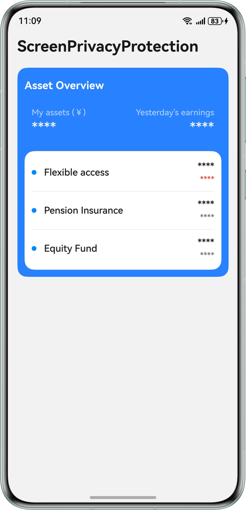

# Anti-peeping for Sensitive Information

### Overview

This sample leverages screen privacy protection and ArkUI state management to help you implement the functionality of hiding sensitive information when there are strangers peeping at the screen.

### Preview

| Non-peeping State                       | Peeping State                           |
|-----------------------------------------|-----------------------------------------|
|  |  |

### How to Use

1. Download the sample code and import it to the IDE. Open the AppScope > app.json file and change the value of bundleName to your application name.

2. Refer to the [Requesting ACL Permissions and Signing Your App/Atomic Service](https://developer.huawei.com/consumer/cn/doc/harmonyos-guides/ide-signing#section157591551175916) to apply for a profile file with the ohos.permission.DLP_GET_HIDE_STATUS permission for the application corresponding to the bundleName in the first step, and configure the corresponding signature information in the project.

3. After building and installing the application, go to Settings > Privacy & security > Screen Privacy, and turn on the switch.

4. When both the owner and non-owner view the screen, the number information on the screen is hidden. In other cases, the content is directly displayed.


### Project Directory

```
├──entry/src/main/ets
│  ├──common
│  │  ├──models
│  │  │  └──ItemInfo.ets                // Service data class
│  │  ├──utils
│  │  │  └──AntiPeepUtils.ets           // Anti-peeping protection utility
│  │  └──CommonConstants.ets            // Common constants  
│  ├──entryability
│  │  └──EntryAbility.ets               // Entry point class
│  ├──entrybackupability
│  │  └──EntryBackupAbility.ets         // Data backup and restoration
│  ├──pages
│  │  └──Index.ets                      // Home page
│  └──view
│     ├──CustomItemInfo.ets             // Item information
│     └──Titles.ets                     // Title information
└──entry/src/main/resources             // Static resources of the application
```

### How to Implement

1. The UI text is displayed using the Text component, and the content is modified using the `@State` and `@ObjectLink` state variables.

2. During page display, the `getDlpAntiPeepInfo` API is called to obtain the latest peeping state of the current device.

3. During page display, the `dlpAntiPeep.on('dlpAntiPeep',callback)` callback API is called to obtain the latest peeping state of the current device.

4. Based on the data returned in steps 2 and 3, update the variables modified by `@State` and `@ObjectLink` to hide and display sensitive content when someone is peeking and no one is peeking.


### Required Permissions

- Permission for checking whether a non-owner is peeping on the screen: `ohos.permission.DLP_GET_HIDE_STATUS`

### Dependencies

- N/A

### Constraints

1. In this sample, the `Screen Privacy` option must be available in `Settings > Privacy & security`.

2. The HarmonyOS version must be HarmonyOS 6.0.0 Beta1 or later.

3. The DevEco Studio version must be DevEco Studio 6.0.0 Beta1 or later.

4. The HarmonyOS SDK version must be HarmonyOS 6.0.0 Beta1 SDK or later. 