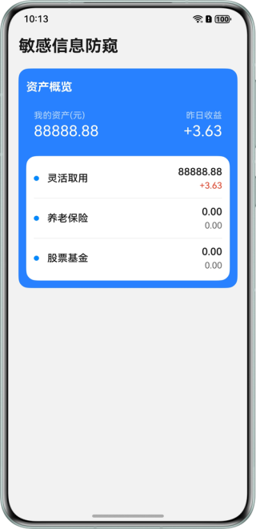
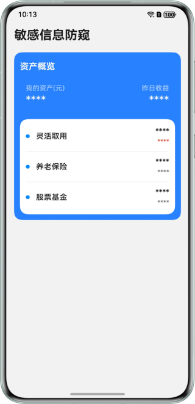
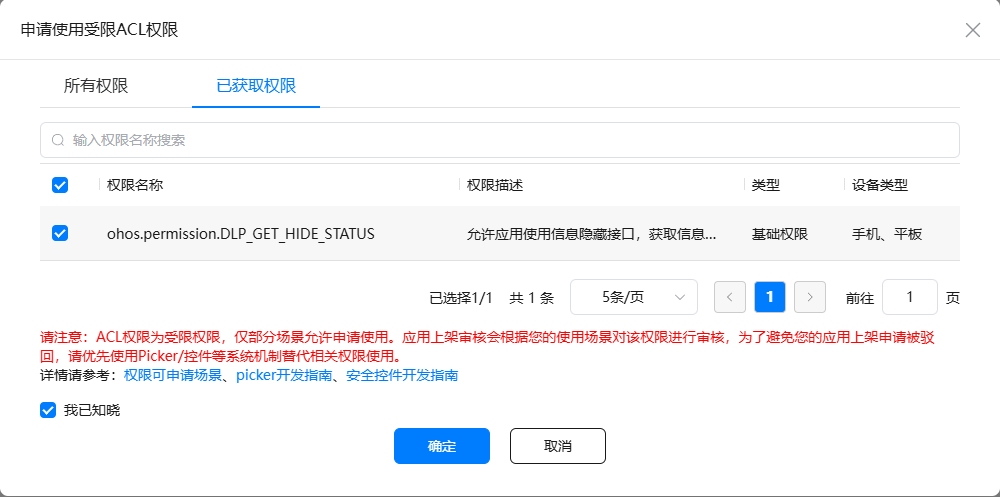

# 基于防窥保护能力实现敏感信息防窥功能

### 简介


本示例基于敏感信息的防窥场景，通过系统的防窥保护能力，同时搭配ArkUI的状态管理，帮助开发者解决在有陌生人窥视屏幕的情况下， 达到隐藏敏感信息的功能。


### 效果预览：

| 非窥视状态 | 窥视状态 |
|--------------------------------------|--------------------------------------|
|  |  |

### 使用说明：

1. 下载本示例代码导入到IDE，打开AppScope->app.json文件，修改bundleName为您自己的应用名称。

2. 参考[ACL签名配置指导](https://developer.huawei.com/consumer/cn/doc/harmonyos-guides/ide-signing#section157591551175916)为第一步对应的bundleName的应用，申请带有"ohos.permission.DLP_GET_HIDE_STATUS"权限的profile文件，并在工程中配置相应的签名信息。<br>
   

3. 编译安装应用后，找到系统的设置->隐私和安全->防窥保护->打开对应应用的开关。

4. 当机主和非机主共同查看屏幕的时候，页面上的数字信息会隐藏显示，其他情况会直接显示内容。


### 工程目录

```
├──entry/src/main/ets
│  ├──common
│  │  ├──models
│  │  │  └──ItemInfo.ets                // 业务数据类
│  │  ├──utils
│  │  │  └──AntiPeepUtils.ets           // 防窥保护工具类
│  │  └──CommonConstants.ets            // 公共常量类
│  ├──entryability
│  │  └──EntryAbility.ets               // 程序入口类
│  ├──entrybackupability
│  │  └──EntryBackupAbility.ets         // 备份恢复类
│  ├──pages
│  │  └──Index.ets                      // 首页
│  └──view
│     ├──CustomItemInfo.ets             // 条目信息
│     └──Titles.ets                     // 标题信息
└──entry/src/main/resources             // 应用静态资源目录
```

### 具体实现

1. 界面上的文字主要使用Text组件展示，内容用`@State`和`@ObjectLink`状态变量修饰。

2. 页面展示的时候，通过`getDlpAntiPeepInfo`接口，拿到当前设备最新的窥视状态。

3. 页面展示的时候，通过`dlpAntiPeep.on('dlpAntiPeep',callback)`回调接口，实时获取设备的最新窥视状态。

4. 通过2、3步骤返回的数据，分别判断在有人在窥视和无人在窥视的时候，更新`@State`和`@ObjectLink`修饰的变量内容，达到敏感内容的隐藏和展示。


### 相关权限

- 1.获取屏幕是否有非机主人在窥视权限: ohos.permission.DLP_GET_HIDE_STATUS

### 依赖

- 不涉及

### 约束与限制

1. 本示例需要设备在"设置 > 隐私与安全"中存在"防窥保护"选项。

2. HarmonyOS系统：HarmonyOS 6.0.0 Beta1及以上。

3. DevEco Studio版本：DevEco Studio 6.0.0 Beta1及以上。

4. HarmonyOS SDK版本：HarmonyOS 6.0.0 Beta1 SDK及以上。