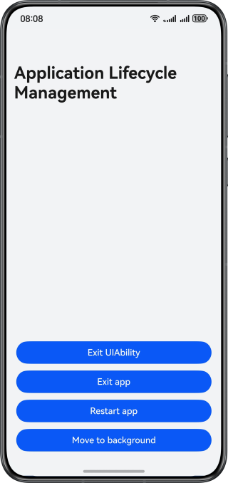

# Application Lifecycle State Management

## Overview

This sample introduces how to exit and restart an application, switch an application to the background, and subscribe to the state change of the application in the case of foreground-and-background switchover.

## Preview


## Project Directory

```
├──entry/src/main/ets/
│  ├──common
│  │  ├──ToastUtils.ets                   // Toast utilities
│  │  └──Logger.ets                       // Logger
│  ├──entryability
│  │  └──EntryAbility.ets                 // Entry ability
│  ├──entrybackupability
│  │  └──EntryBackupAbility.ets           // Data backup and restoration
│  └──pages
│     └──Index.ets                        // App entry
└──entry/src/main/resources               // Static resources of the app
```
## How to Implement

* The switchover between the foreground and background of an application is monitored using the [ApplicationContext.on('applicationStateChange')](https://developer.huawei.com/consumer/en/doc/harmonyos-references/js-apis-inner-application-applicationcontext#applicationcontextonapplicationstatechange10) method.
* The UIAbility is closed using the [UIAbilityContext.terminateSelf()](https://developer.huawei.com/consumer/en/doc/harmonyos-references/js-apis-inner-application-uiabilitycontext#uiabilitycontextterminateself) method.
* The application is closed using the [ApplicationContext.killAllProcesses()](https://developer.huawei.com/consumer/en/doc/harmonyos-references/js-apis-inner-application-applicationcontext#applicationcontextkillallprocesses) method.
* The application is restarted using the [ApplicationContext.restartApp()](https://developer.huawei.com/consumer/en/doc/harmonyos-references/js-apis-inner-application-applicationcontext#applicationcontextrestartapp12) method.
* The application is switched to the background using the [minimize()](https://developer.huawei.com/consumer/en/doc/harmonyos-references/js-apis-window#minimize11) method of the **Window** module.

## Permissions

N/A

## Dependencies

N/A

## Constraints

1. The sample is only supported on Huawei phones with standard systems.
2. The HarmonyOS version must be HarmonyOS 5.0.5 Release or later.
3. The DevEco Studio version must be DevEco Studio 5.0.5 Release or later.
4. The HarmonyOS SDK version must be HarmonyOS 5.0.5 Release SDK or later.