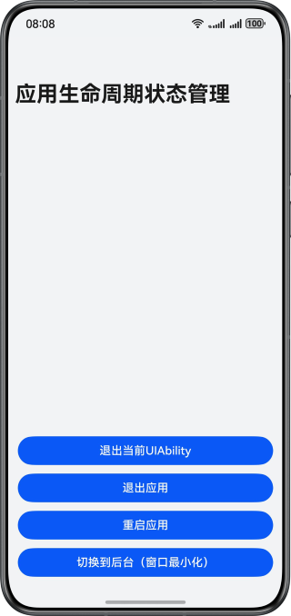

# 实现应用生命周期状态管理切换功能

### 介绍

本示例详细介绍了应用如何实现主动退出、重启和切换至后台功能，同时展示了订阅应用前后台状态变化的方法。通过这些机制，开发者可以更好地控制应用生命周期，优化用户体验，并响应不同的运行时需求。

### 效果预览


### 目录结构

```
├──entry/src/main/ets/
│  ├──common
│  │  ├──ToastUtils.ets                   // 提示弹窗工具类
│  │  └──Logger.ets                       // 日志打印工具类
│  ├──entryability
│  │  └──EntryAbility.ets                 // 程序入口类
│  ├──entrybackupability
│  │  └──EntryBackupAbility.ets           // 数据备份恢复类
│  └──pages
│     └──Index.ets                        // 应用入口页
└──entry/src/main/resources               // 应用静态资源目录
```
### 具体实现

* 应用前后台切换变化通过[ApplicationContext.on('applicationStateChange')](https://developer.huawei.com/consumer/cn/doc/harmonyos-references/js-apis-inner-application-applicationcontext#applicationcontextonapplicationstatechange10)方法进行监听。
* UIAbility的关闭通过[UIAbilityContext.terminateSelf()](https://developer.huawei.com/consumer/cn/doc/harmonyos-references/js-apis-inner-application-uiabilitycontext#terminateself)方法来实现。
* 应用程序的关闭通过[ApplicationContext.killAllProcesses()](https://developer.huawei.com/consumer/cn/doc/harmonyos-references/js-apis-inner-application-applicationcontext#applicationcontextkillallprocesses)方法实现。
* 应用重启通过[ApplicationContext.restartApp()](https://developer.huawei.com/consumer/cn/doc/harmonyos-references/js-apis-inner-application-applicationcontext#applicationcontextrestartapp12)方法实现。
* 应用切换到后台通过Window模块的[minimize()](https://developer.huawei.com/consumer/cn/doc/harmonyos-references/arkts-apis-window-window#minimize11-1)方法来实现。

### 相关权限

不涉及。

### 依赖

不涉及。

### 约束与限制

1. 本示例仅支持标准系统上运行，支持设备：华为手机。
2. HarmonyOS系统：HarmonyOS 5.0.5 Release及以上。
3. DevEco Studio版本：DevEco Studio 5.0.5 Release及以上。
4. HarmonyOS SDK版本：HarmonyOS 5.0.5 Release SDK及以上。


