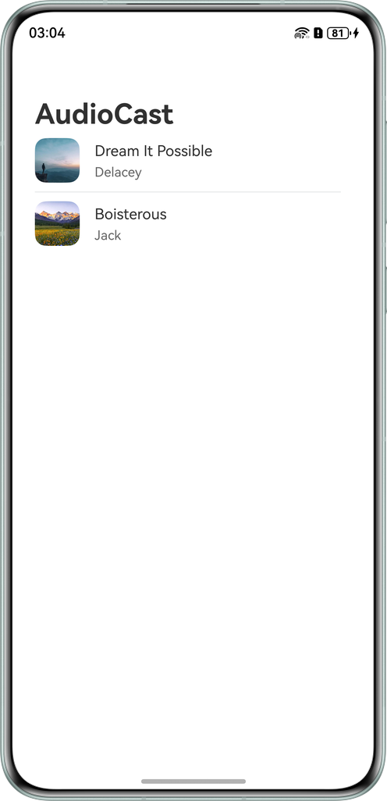
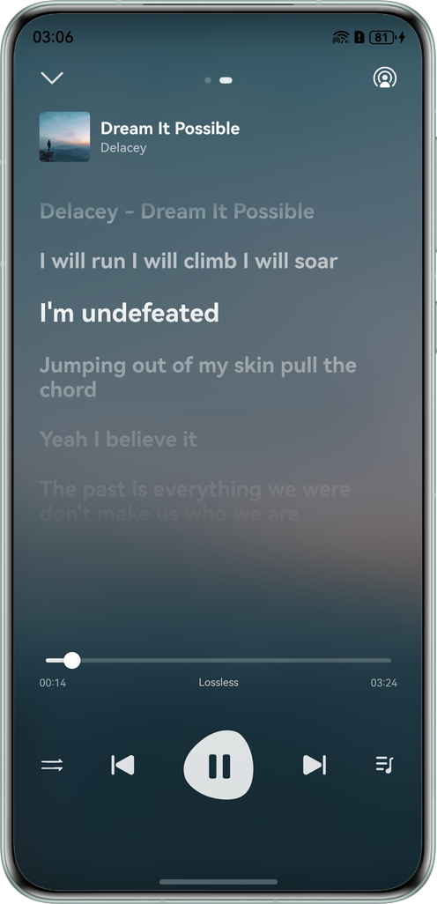
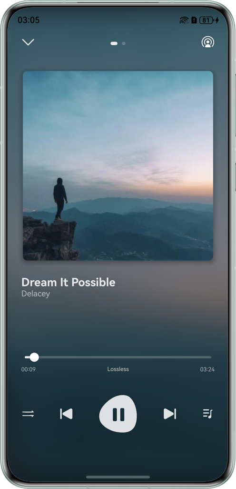

# Audio Casting

## Overview

This sample demonstrates how to implement a complete audio casting feature using the Media Controller and system casting capabilities, enabling you to change devices and songs, adjust volume and progress, and switch between play modes.
## Effect
| Song Selection                                          | Local Playback                                          | Lyrics Page                                             |
|---------------------------------------------------------|---------------------------------------------------------|---------------------------------------------------------|
|  |  |  |

## How to Use

1. When playing audio on the local device, you can control playback progress, adjust volume, change songs, adjust tone quality, and switch between playback modes.
2. You can also use the Media Controller to manage progress, adjust volume, and change songs.
3. Once a casting connection is established, you can control the remote device's playback progress, volume, and songs from your local device.

## Project Directory

```
├───entry/src/main/ets
│   ├───common                              
│   │   ├───contants                        
│   │   │   ├───BreakpointConstants.ets    // Breakpoint constants
│   │   │   ├───LyricConst.ets             // Lyric constants
│   │   │   ├───PlayerConstants.ets        // Playback page constants
│   │   │   └───RouterConstants.ets        // Route constants
│   │   └───utils                           
│   │       ├───BackgroundUtil.ets         // Background task utility class
│   │       ├───BreakpointSystem.ets       // Breakpoint utility class
│   │       ├───ColorConversion.ets        // Color conversion utility class
│   │       ├───LrcUtils.ets               // Lyrics utility class
│   │       ├───MediaTools.ets             // Media data conversion utility class
│   │       ├───ResourceConversion.ets     // Resource conversion utility class
│   │       ├───SecondBufferWalk.ets       // Byte reading utility class
│   │       └───SongItemBuilder.ets        // Music data conversion utility class
│   ├───component                                
│   │   ├───ControlAreaComponent.ets       // Controller component
│   │   ├───LrcInfoComponent.ets           // Lyrics page component
│   │   ├───LyricsComponent.ets            // Lyrics controller component
│   │   ├───MusicInfoComponent.ets         // Music details component
│   │   ├───PlayerInfoComponent.ets        // Playback page component
│   │   ├───ToneQualityList.ets            // Tone quality dialog component
│   │   └───TopAreaComponent.ets           // Top area component
│   ├───controller                          
│   │   ├───AudioCastController.ets        // Remote playback controller
│   │   ├───AudioPlayerController.ets      // Local AVPlayer
│   │   ├───AudioRendererController.ets    // Local Audiorenderer
│   │   └───AVSessionController.ets        // AVSession controller
│   ├───entryability                        
│   │   └───EntryAbility.ets               // Entry ability lifecycle callbacks
│   ├───entrybackupability                  
│   │   └───EntryBackupAbility.ets         // EntryBackupAbility lifecycle callbacks
│   ├───model    
│   │   ├───LrcEntry.ets                   // Lyric APIs                      
│   │   ├───SongData.ets                   // Song information class
│   │   ├───SongDataSource.ets             // Song utility class
│   │   └───SongListData.ets               // Song data
│   └───pages                               
│       ├───Index.ets                      // Song list page
│       └───MusicPlayPage.ets              // Local playback page
└───entry/src/main/resources                        
```

## Required Permissions

1.ohos.permission.KEEP_BACKGROUND_RUNNING: allows a continuous task to run in the background.

2.ohos.permission.INTERNET: allows an application to access the Internet.


## Constraints

1.Device restrictions

Local device: mobile phone/tablet

Remote device: PC/2-in-1 device
  
2.The HarmonyOS version must be HarmonyOS 6.0.0 Beta2 or later.

3.The DevEco Studio version must be DevEco Studio 6.0.0 Beta2 or later.

4.The HarmonyOS SDK version must be HarmonyOS 6.0.0 Beta2 SDK or later.