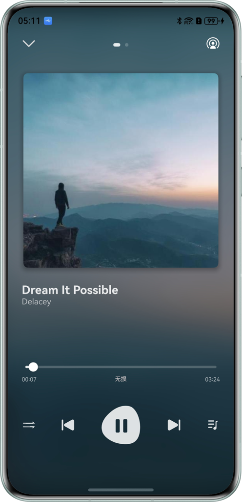
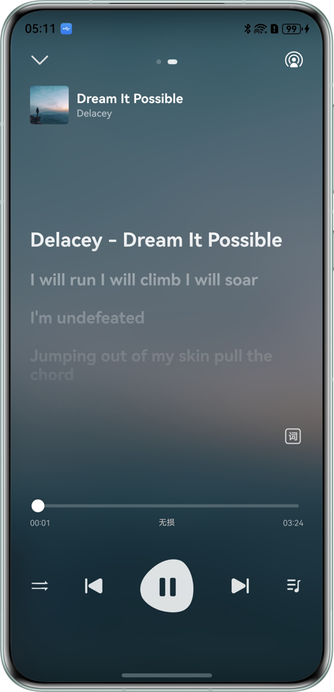

# 实现音频投播功能

## 项目简介

本实例基于播控中心和系统投播实现完整的音频投播功能，包含投播和播控中心基础控制：设备切换、歌曲切换、音量增减、进度切换、播放模式切换。

## 效果预览
| 歌曲选择                                                 | 本端播放                                                 | 歌词页                                                  |
|------------------------------------------------------|------------------------------------------------------|------------------------------------------------------|
|  |  |  |

## 使用说明

1. 本端设备播放音频，进度/音量/歌曲控制/音质切换/播放模式切换。
2. 播控中心控制本端设备，进度/音量/歌曲控制。
3. 建立投播，本端控制远端设备进度/音量/歌曲控制。

## 工程目录

```
├───entry/src/main/ets
│   ├───common                              
│   │   ├───contants                        
│   │   │   ├───BreakpointConstants.ets    // 断点常量
│   │   │   ├───LyricConst.ets             // 歌词常量
│   │   │   ├───PlayerConstants.ets        // 播放页常量
│   │   │   └───RouterConstants.ets        // 路由常量
│   │   └───utils                           
│   │       ├───BackgroundUtil.ets         // 后台任务工具类
│   │       ├───BreakpointSystem.ets       // 断点工具类
│   │       ├───ColorConversion.ets        // 颜色转换工具类
│   │       ├───LrcUtils.ets               // 歌词通用方法
│   │       ├───MediaTools.ets             // 媒体数据转换工具类
│   │       ├───ResourceConversion.ets     // 资源转换工具类
│   │       ├───SecondBufferWalk.ets       // 字节读取工具类
│   │       └───SongItemBuilder.ets        // 音乐数据转换工具类
│   ├───component                                
│   │   ├───ControlAreaComponent.ets       // 控制器组件
│   │   ├───LrcInfoComponent.ets           // 歌词展示页
│   │   ├───LyricsComponent.ets            // 歌词控制器组件
│   │   ├───MusicInfoComponent.ets         // 音乐详情组件
│   │   ├───PlayerInfoComponent.ets        // 音乐播放页组件
│   │   ├───ToneQualityList.ets            // 音乐音质弹框组件
│   │   └───TopAreaComponent.ets           // 音乐播放头部组件
│   ├───controller                          
│   │   ├───AudioCastController.ets        // 远端投播播放控制器
│   │   ├───AudioPlayerController.ets      // 本地AvPlayer播放控制器
│   │   ├───AudioRendererController.ets    // 本地Audiorenderer播放控制器
│   │   └───AVSessionController.ets        // 播控中心控制器
│   ├───entryability                        
│   │   └───EntryAbility.ets               // Ability的生命周期回调内容
│   ├───entrybackupability                  
│   │   └───EntryBackupAbility.ets         // Ability的生命周期回调内容
│   ├───model    
│   │   ├───LrcEntry.ets                   // 歌词接口                      
│   │   ├───SongData.ets                   // 歌曲信息类
│   │   ├───SongDataSource.ets             // 歌曲工具类
│   │   └───SongListData.ets               // 歌曲数据
│   └───pages                               
│       ├───Index.ets                      // 首页歌曲列表页
│       └───MusicPlayPage.ets              // 本地播放页
└───entry/src/main/resources                        
```

## 相关权限

1.后台长时任务权限：ohos.permission.KEEP_BACKGROUND_RUNNING

2.允许使用Internet网络权限：ohos.permission.INTERNET


## 约束与限制

1.设备限制

本端设备：手机/平板设备。

远端设备：PC/2in1设备。
  
2.HarmonyOS系统：HarmonyOS 6.0.0 Beta2 及以上。

3.DevEco Studio版本：DevEco Studio 6.0.0 Beta2 及以上。

4.HarmonyOS SDK版本：HarmonyOS 6.0.0 Beta2 SDK及以上。