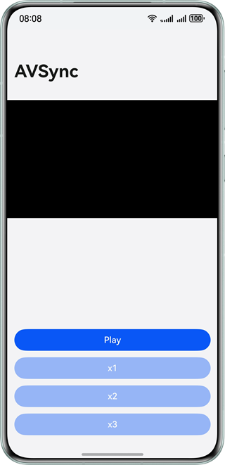
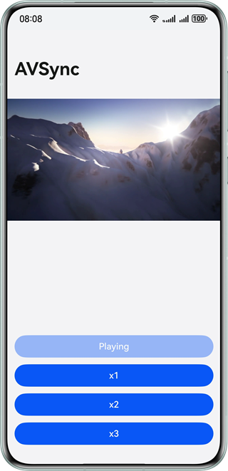

# Synchronous Audio and Video Playback

### Overview

This sample showcases how to implement synchronous audio and video playback in scenarios such as Bluetooth earphones. The synchronization is implemented by calculating the latency of audio and video frames based on video decoding. With the audio and video synchronization module, users can enjoy better video experience in high-latency scenarios.

### Preview

| App UI                                                     | Playback                                       |
|------------------------------------------------------------|------------------------------------------------|
|  |  |

### How to Use

1. Record videos with the camera or push video files to Gallery.
2. Open the app, touch the play button, and select a video from Gallery to play.

### Project Directory

```
├──entry/src/main/cpp                 // Native layer
│  ├──capbilities                     // Capability interfaces and implementation
│  │  ├──include                      // Capability interfaces
│  │  ├──AudioDecoder.cpp             // Audio decoder implementation
│  │  ├──Demuxer.cpp                  // Demuxer implementation
│  │  ├──VideoDecoder.cpp             // Video decoder implementation
│  ├──common                          // Common modules
│  │  ├──dfx                          // Logs
│  │  ├──SampleCallback.cpp           // Codec callback implementation
│  │  ├──SampleCallback.h             // Codec callback definition
│  │  └──SampleInfo.h                 // Common classes for function implementation
│  ├──player                          // Native layer
│  │  ├──Player.cpp                   // Player invocation logic implementation at the native layer
│  │  ├──Player.h                     // Player invocation logic interfaces at the native layer
│  │  ├──PlayerNative.cpp             // Player entry implementation at the native layer
│  │  └──PlayerNative.h               // Player interfaces at the native layer
│  ├──render                          // Interfaces and implementation of the display module
│  │  ├──include                      // Display module interfaces
│  │  ├──EglCore.cpp                  // Display parameter settings
│  │  ├──PluginManager.cpp            // Display module management implementation
│  │  └──PluginRender.cpp             // Display logic implementation
│  ├──types                           // Interfaces exposed by the native layer
│  │  ├──libplayer                    // Interfaces exposed by the player to the UI layer
│  └──CMakeLists.txt                  // Compilation entry
├──ets                                // UI layer
│  ├──common                          // Common modules
│  │  └──CommonConstants.ets          // Common constants
│  ├──entryability                    // App entry
│  │  └──EntryAbility.ets
│  ├──entrybackupability
│  │  └──EntryBackupAbility.ets
│  └──pages                           // Pages contained in the EntryAbility
│     └──Index.ets                    // Home page/Playback page
├──resources                          // Static resources of the app
│  ├──base                            // Resource files in this directory are assigned unique IDs.
│  │  ├──element                      // Fonts and colors
│  │  ├──media                        // Images
│  │  └──profile                      // Home page of the app entry
│  ├──en_US                           // Resources in this directory are preferentially matched when the device language is American English.
│  └──zh_CN                           // Resources in this directory are preferentially matched when the device language is simplified Chinese.
└──module.json5                       // Module configuration
```

### How to Implement

##### Video Decoding

1. If you tap the play button, a tap event is triggered to call the **PhotoViewPicker()** API. This function calls the picker module of Gallery to obtain the path of the tapped video.
2. If you select a file, the **playNative()** API calls the **PlayerNative::Play()** function to initialize the player and calls the decoding module to start decoding.
3. If you start the decoder, the input callback is called to fill the data to be decoded in **OH_AVBuffer**. The **PushInputBuffer** API is called to send the data to the decoder. Each time the decoder is started, the XPS information frame needs to be pushed at least once.
4. Each time the decoder decodes a frame, the output callback is called. You need to call the display or freeing API in time to free the buffer to the decoder. Because the maximum size of the buffer is limited, the buffer needs to be freed in time. Otherwise, the decoder stops working when the buffer is full.
5. When the playback ends, the **napi_call_function()** API in **Callback()** is called to execute the corresponding callback event.

##### Audio and Video Synchronization

1. When a video frame is received, call **OH_AudioRenderer_GetTimestamp()** to obtain information such as the audio rendering position.
2. Before audio is started, video frames are directly sent for display to avoid stuttering, without waiting for synchronization.
3. After audio is started, the delay is calculated based on the presentation time stamp (PTS) of the video frame and the audio rendering position, and the delay determines the audio and video synchronization policy.
- If a video frame is lagging behind an audio frame for 40 ms or longer, the video frame is discarded.
- If a video frame is lagging behind an audio frame for less than 40 ms, the video frame is directly displayed.
- If a video frame is ahead of an audio frame, progressive synchronization is performed and the video frame waits for a period of time before being displayed.

### Permissions

- N/A

### Dependencies

- N/A

### Constraints

1. The sample is only supported on Huawei phones with standard systems.

2. The HarmonyOS version must be HarmonyOS 5.0.5 Release or later.

3. The DevEco Studio version must be DevEco Studio 5.0.5 Release or later.

4. The HarmonyOS SDK version must be HarmonyOS 5.0.5 Release SDK or later.