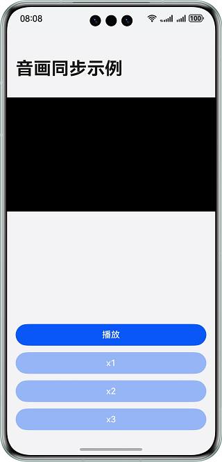
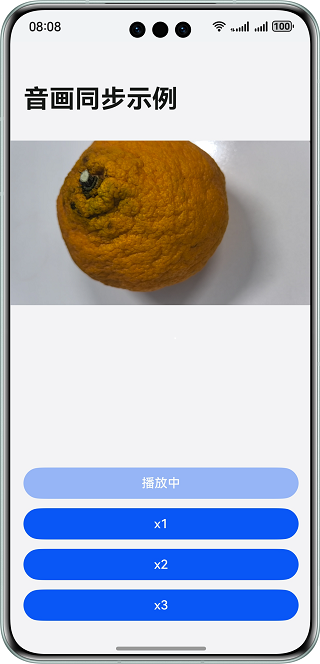

# 实现音画同步播放效果

### 介绍

本示例基于视频解码，通过计算音视频帧的延时进行音画同步适配，解决在蓝牙耳机播放等场景的音画不同步问题。开发者在实现解码播放视频功能时，加入音画同步模块，保持视频画面和音频同步播放，让用户在高时延场景下观看视频有更好的体验。

### 效果预览

| 应用界面                                                 | 播放展示                                     |
|------------------------------------------------------|------------------------------------------|
|  |  |

### 使用说明

1. 通过系统相机录制或者推送视频文件至图库下；
2. 打开应用，点击播放按钮，选择图库中的视频，开始播放。
3. 点击x1、x2、x3可调节至对应的倍速进行播放。

### 工程目录

```       
├──entry/src/main/cpp                 // Native层
│  ├──capbilities                     // 能力接口和实现
│  │  ├──include                      // 能力接口
│  │  ├──AudioDecoder.cpp             // 音频解码实现
│  │  ├──Demuxer.cpp                  // 解封装实现
│  │  └──VideoDecoder.cpp             // 视频解码实现
│  ├──common                          // 公共模块
│  │  ├──dfx                          // 日志
│  │  ├──SampleCallback.cpp           // 编解码回调实现   
│  │  ├──SampleCallback.h             // 编解码回调定义
│  │  └──SampleInfo.h                 // 功能实现公共类  
│  ├──player                          // Native层
│  │  ├──Player.cpp                   // Native层播放功能调用逻辑的实现
│  │  ├──Player.h                     // Native层播放功能调用逻辑的接口
│  │  ├──PlayerNative.cpp             // Native层播放的入口实现
│  │  └──PlayerNative.h               // Native层播放的接口
│  ├──render                          // 送显模块接口和实现
│  │  ├──include                      // 送显模块接口
│  │  ├──EglCore.cpp                  // 送显参数设置
│  │  ├──PluginManager.cpp            // 送显模块管理实现
│  │  └──PluginRender.cpp             // 送显逻辑实现
│  ├──types                           // Native层暴露上来的接口
│  │  └──libplayer                    // 播放模块暴露给UI层的接口
│  └──CMakeLists.txt                  // 编译入口       
├──ets                                // UI层
│  ├──common                          // 公共模块
│  │  └──CommonConstants.ets          // 参数常量
│  ├──entryability                    // 应用的入口
│  │  └──EntryAbility.ets            
│  ├──entrybackupability            
│  │  └──EntryBackupAbility.ets   
│  └──pages                           // EntryAbility 包含的页面
│     └──Index.ets                    // 首页/播放页面
├──resources                          // 用于存放应用所用到的资源文件
│  ├──base                            // 该目录下的资源文件会被赋予唯一的ID
│  │  ├──element                      // 用于存放字体和颜色 
│  │  ├──media                        // 用于存放图片
│  │  └──profile                      // 应用入口首页
│  ├──en_US                           // 设备语言是美式英文时，优先匹配此目录下资源
│  └──zh_CN                           // 设备语言是简体中文时，优先匹配此目录下资源
└──module.json5                       // 模块配置信息
```

### 具体实现

##### 视频解码部分

1. 用户点击播放按钮后，触发点击事件，调起PhotoViewPicker()接口，该函数会调起图库的选择文件模块，拿到用户选取视频的路径;
2. 用户选择文件成功后，playNative()接口调用PlayerNative::Play()函数，进行初始化并调用解码模块开始解码；
3. 解码器Start后，输入回调会调起，将待解码的数据填入OH_AVBuffer中，调用PushInputBuffer接口，送给解码器解码，每次Start后，至少要Push一次XPS帧；
4. 解码器每解出来一帧，输出回调就会调起一次，用户需要及时调用送显或释放接口，归还buffer给解码器，由于解码器的buffer数量有上限，需要及时归还，否则达到上限后解码器就会停止工作，直到有buffer被归还；
5. 播放结束时，Callback()中napi_call_function()接口调起，执行对应的回调事件。

##### 音画同步部分

1. 收到视频帧的时候，通过调用OH_AudioRenderer_GetTimestamp()接口获取音频渲染位置等信息。
2. 音频未启动前，为避免出现卡顿等问题，暂不同步，视频帧直接送显。
3. 音频启动后，根据视频帧pts和音频渲染位置计算延迟，根据延迟选择音画同步策略：
    - 视频帧晚于音频帧40ms以上，直接丢弃此视频帧；
    - 视频帧晚于音频帧40ms以下，直接送显；
    - 视频帧早于音频帧时，进行渐进同步，等待一段时间送显。

### 相关权限

- 不涉及

### 依赖

- 不涉及

### 约束与限制

1.本示例仅支持标准系统上运行，支持设备：华为手机。

2.HarmonyOS系统：HarmonyOS 5.0.5 Release及以上。

3.DevEco Studio版本：DevEco Studio 5.0.5 Release及以上。

4.HarmonyOS SDK版本：HarmonyOS 5.0.5 Release SDK及以上。    