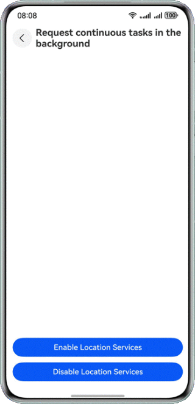

# Smooth App Experience Development Based on Background Tasks

### Overview
This sample describes how to keep apps active in the background based on background task development services. Two modes are provided: transient task mode and continuous task mode. In transient task mode, **onApplicationForeground()** and **onApplicationBackground()** are used to listen for the task switchover between the foreground and background. When an app is switched to run in the background, a transient task is requested. In continuous task mode, a continuous task is requested and its location changes are subscribed (the location service is used as an example). When an app is switched to run in the background, the system can still automatically obtain the location information.
### Preview
|          **Home page**           | **Requesting a transient task in the background** | **Requesting a continuous task in the background** |
| :------------------------------: | :-----------------------------------------------: | :------------------------------------------------: |
|  |      |        |
### Project Directory
```
├──entry/src/main/ets                           // Code area
│  ├──entryability
│  │  └──EntryAbility.ets                       // Entry ability
│  ├──entrybackupability
│  │  └──EntryBackupAbility.ets
│  ├──pages
│  │  └──Index.ets                              // Home page
│  ├──utils
│  │  └──SuspendTaskUtils.ets                   // Utilities
│  ├──view
│  │  ├──LongTermTaskPage.ets                   // Page for requesting a continuous task in the background
│  │  └──ShortTermTaskPage.ets                  // Page for requesting a transient task in the background
│  └──viewModel
│     ├──LongTermTaskModel.ets                  // Continuous task page API
│     ├──ShortTermTaskModel.ets                 // Transient task page API
│     └──SuspendTaskInfo.ets                    // Transient task entity
└──entry/src/main/resources                     // Resources
```

### How to Use
1. On the home page, tap the button to request a transient task in the background. On the page that is displayed, view the console logs in which the message "already sent: x messages" is automatically sent every 2 seconds.
2. On the current page, after the app is minimized, the message "already sent: x messages" is still displayed in the log every 2 seconds.
3. Return to the page and tap the button to obtain the remaining time before the app is suspended. A dialog box is displayed, indicating the remaining time before the app is suspended.
4. Tap the button to cancel the transient task, and the message "Cancel Transient Task: Succeeded" is displayed. (If the app is minimized or you tap this button for multiple times, the message "Cancel Transient Task: Failed" is displayed.)
5. When the app is minimized for more than 3 minutes, the message "Request suspension delay will time out." is displayed in the log.
6. On the home page, tap the button to request a continuous task in the background. The continuous task page is displayed.
7. Tap the button to enable the location service. The log console periodically prints the current location information.
8. After the app is minimized on the current page, the log console periodically prints the current location information.
9. Note: The location service is used as an example for a continuous task. Therefore, you need to enable the network or connection to a hotspot with the network, and enable Location on your phone.

### Permissions

- **ohos.permission.LOCATION**: allows an app to obtain the device location.
- **ohos.permission.LOCATION_IN_BACKGROUND**: allows an app running in the background to obtain the device location.
- **ohos.permission.APPROXIMATELY_LOCATION**: allows an app to obtain the approximate location of a device.
- **ohos.permission.KEEP_BACKGROUND_RUNNING**: allows a service ability to keep running in the background.

### Constraints
1. The sample is only supported on Huawei phones with standard systems.
2. The HarmonyOS version must be HarmonyOS 5.0.5 Release or later.
3. The DevEco Studio version must be DevEco Studio 5.0.5 Release or later.
4. The HarmonyOS SDK version must be HarmonyOS 5.0.5 Release SDK or later.