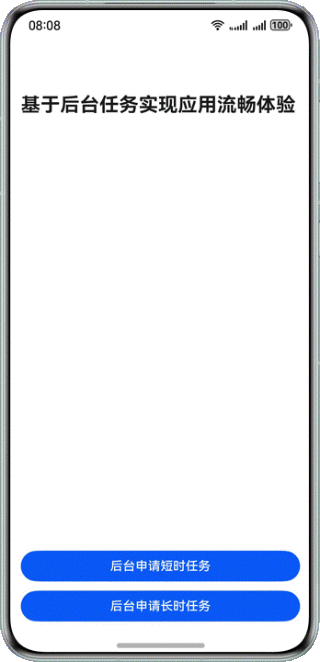
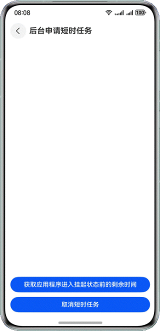
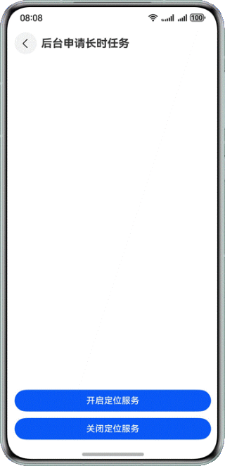

# 基于后台任务实现应用流畅体验

### 简介
基于后台任务开发服务实现应用后台保活，本示例分为短时与长时任务模式。短时任务模式使用onApplicationForeground()/onApplicationBackground()监听前后台切换，转后台时申请短时任务。长时模式以位置服务为例，申请长时任务并订阅位置变化，应用切后台时系统仍能自动获取位置信息。
### 效果预览
|                     **主页面**                     |                     **后台申请短时任务页面**                     |                 **后台申请长时任务页面**                  |
|:-----------------------------------------------:|:------------------------------------------------------:|:-----------------------------------------------:|
|  |         |  |
### 工程目录 
```
├──entry/src/main/ets                           // 代码区
│  ├──entryability
│  │  └──EntryAbility.ets                       // 本地启动ability      
│  ├──entrybackupability
│  │  └──EntryBackupAbility.ets                     
│  ├──pages
│  │  └──Index.ets                              // 主页面    
│  ├──utils
│  │  └──SuspendTaskUtils.ets                   // 工具类
│  ├──view
│  │  ├──LongTermTaskPage.ets                   // 后台申请长时任务页面
│  │  └──ShortTermTaskPage.ets                  // 后台申请短时任务页面        
│  └──viewModel
│     ├──LongTermTaskModel.ets                  // 长时任务页面接口
│     ├──ShortTermTaskModel.ets                 // 短时任务页面接口
│     └──SuspendTaskInfo.ets                    // 短时任务实体类
└──entry/src/main/resources                     // 资源文件目录
```

### 使用说明
1. 主页面，点击“后台申请短时任务页面”按钮，进入短时任务页面，查看控制台日志，每隔2s自动发送：“already sent ：x messages”；
2. 在当前页面，把应用最小化之后，日志每隔2s依旧打印“already sent ：x messages”；
3. 回到页面，点击“获取应用程序进入挂起状态前的剩余时间”，弹框提示：应用程序进入挂起状态前的剩余时间；
4. 点击“取消短时任务”，弹框提示：“取消短时任务：成功”（若应用最小化下或多次点击“取消短时任务”，则提示：“取消短时任务：失败”）；
5. 当应用最小化，超过3分钟时，日志会打印：“Request suspension delay will time out.”；
6. 主页面，点击“后台申请长时任务页面”按钮，进入长时任务页面；
7. 点击“开启定位服务”，日志控制台会周期性地打印出当前的位置信息数据；
8. 在当前页面，把应用最小化之后，日志控制台会周期性地打印出当前的位置信息数据；
9. 注：由于长时模式以位置服务为例，手机需要打开网络/连接有网络的热点且打开手机需要打开“位置”。
   
### 相关权限

- 允许应用获取设备位置信息：ohos.permission.LOCATION
- 允许应用在后台运行时获取设备位置信息：ohos.permission.LOCATION_IN_BACKGROUND
- 允许应用获取设备模糊位置信息：ohos.permission.APPROXIMATELY_LOCATION
- 允许Service Ability在后台持续运行：ohos.permission.KEEP_BACKGROUND_RUNNING

### 约束与限制
1. 本示例仅支持标准系统上运行，支持设备：华为手机。
2. HarmonyOS系统：HarmonyOS 5.0.5 Release及以上。
3. DevEco Studio版本：DevEco Studio 5.0.5 Release及以上。
4. HarmonyOS SDK版本：HarmonyOS 5.0.5 Release SDK及以上。