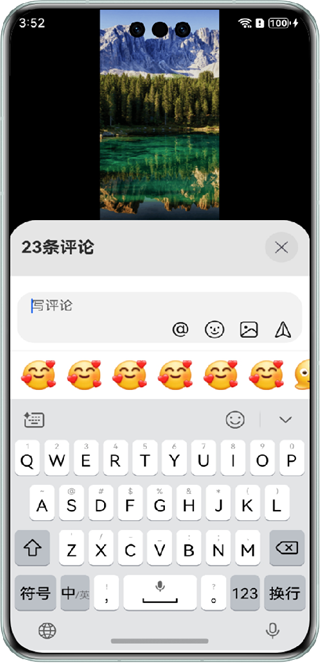
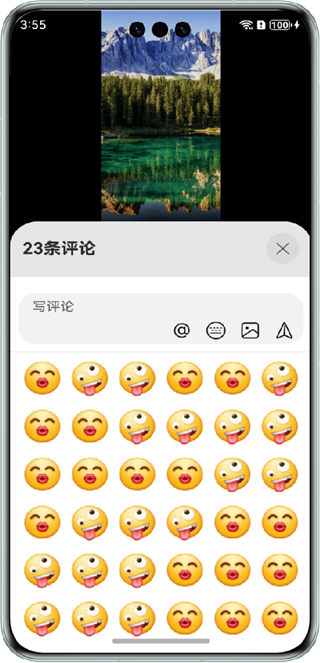

## 实现评论回复弹窗模块

### 介绍

本示例实现在视频应用中，使用Navigation Dialog在评论列表上层弹出评论回复模块，在该模块中使用RichEditor组件实现输入文字、表情、@好友功能。为开发者提供评论回复模块的开发实践。

### 效果预览

| 首页                                  | 评论列表                                        | 评论回复弹窗（软键盘）                             | 评论回复弹窗（表情面板）                                  |
|-------------------------------------|---------------------------------------------|-----------------------------------------|-----------------------------------------------|
|  |  |  |  |

使用说明：

1. 打开应用，在首页点击消息图标，弹出评论列表弹窗。
2. 点击评论列表下方写评论输入框，弹出评论回复模块弹窗。
3. 评论模块默认是软键盘输入，点击编辑区域表情按钮，可切换到表情面板输入表情。
4. 点击@按钮，或通过软键盘输入@符号，显示好友列表，点击好友头像在编辑区域添加@好友内容。
5. 点击删除按钮，@好友内容先整体选中高亮，再点击删除，@好友内容整体删除。

### 工程目录

```
├──commons
│  ├──commons/src/main/ets
│  │  └──utils
│  │     ├──FileUtils.ets                  // 文件工具类     
│  │     └──Logger.ets                     // 日志工具类
│  └──commons/src/main/resources           // 应用静态资源目录
├──features
│  ├──home/src/main/ets
│  │  ├──constants
│  │  │  └──HomeConstants.ets              // 常量类	
│  │  └──view	                    
│  │     ├──CommentKeyboard.ets            // 评论回复模块
│  │  	 ├──CommentList.ets				   // 评论列表
│  │     ├──CommentSendDialog.ets          // 评论发送弹窗
│  │     ├──Home.ets                       // 首页
│  │     ├──HomeContent.ets                // 视频页
│  │     └──NavigationDialog.ets           // 基于Navigation弹窗组件
│  └──home/src/main/resources              // 应用静态资源目录
└──products                  
   ├──default/src/main/ets
   │  ├──entryability
   │  │  └──EntryAbility.ets               // 程序入口类
   │  ├──entrybackupability
   │  │  └──EntryBackupAbility.ets         // 数据备份与恢复类   
   │  └──pages           
   │     └──Index.ets                      // 主页面
   └──default/src/main/resources             // 应用静态资源目录
```

### 具体实现
1. 使用[Navigation Dialog](https://developer.huawei.com/consumer/cn/doc/harmonyos-guides/arkts-navigation-navigation)实现弹窗功能。
2. 使用[RichEditor](https://developer.huawei.com/consumer/cn/doc/harmonyos-references/ts-basic-components-richeditor)相关API实现评论模块编辑区域输入文字、表情、@好友功能。

### 相关权限

不涉及

### 依赖

不涉及

### 约束与限制

1.本示例仅支持标准系统上运行，支持设备：华为手机。

2.HarmonyOS系统：HarmonyOS 5.0.5 Release及以上。

3.DevEco Studio版本：DevEco Studio 5.0.5 Release及以上。

4.HarmonyOS SDK版本：HarmonyOS 5.0.5 Release SDK及以上。

