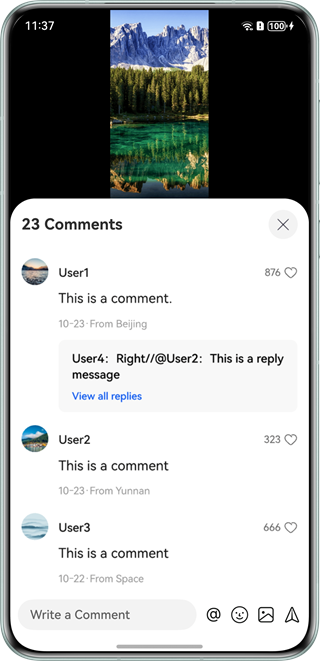
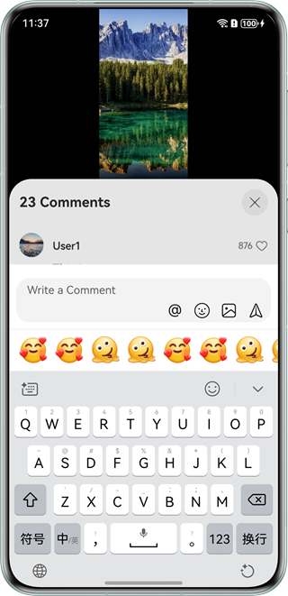
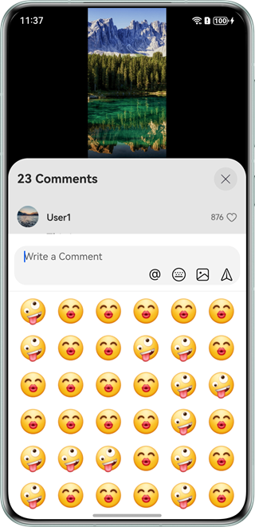

## Comment Reply Window

### Overview

This sample demonstrates how to implement a comment reply window that allows text, emojis, and @ friends above the comment list in a video app.

### Preview

| Homepage                               | Comment List                                   | Comment Reply Window (Soft Keyboard)                          | Comment Reply Window (Emoticon Panel)            |
|----------------------------------------|------------------------------------------------|-----------------------------------------|--------------------------------------------------|
|  |  |  |  |

Instructions:

1. Open the app and tap the message icon on the home screen. The comment list window is displayed.
2. Tap the text box below the comment list. The comment reply window is displayed.
3. By default, the comment module uses the soft keyboard. You can tap the emoji button in the editing area to switch to the emoji panel and enter emojis.
4. Tap the @ button or enter the @ symbol using the soft keyboard to display the friend list. Tap a friend's profile picture to add the @ friend content in the editing area.
5. Tap the delete button. The @ friend content is selected and highlighted. Then tap the delete button. The @ friend content is deleted.

### Project Directory

```
├──commons
│  ├──commons/src/main/ets
│  │  └──utils
│  │     ├──FileUtils.ets                  // File utility class     
│  │     └──Logger.ets                     // Log utility class
│  └──commons/src/main/resources           // Static resources
├──features
│  ├──home/src/main/ets
│  │  ├──constants
│  │  │  └──HomeConstants.ets              // Constant class
│  │  └──view	                    
│  │     ├──CommentKeyboard.ets            // Comment reply module
│  │  	 ├──CommentList.ets				   // Comment list
│  │     ├──CommentSendDialog.ets          // Comment sending pop-up window
│  │     ├──Home.ets                       // Homepage
│  │     ├──HomeContent.ets                // Video page
│  │     └──NavigationDialog.ets           // Navigation-based pop-up component
│  └──home/src/main/resources              // Static resources
└──products                  
   ├──default/src/main/ets
   │  ├──entryability
   │  │  └──EntryAbility.ets               // Entry ability
   │  ├──entrybackupability
   │  │  └──EntryBackupAbility.ets         // Entry backup ability   
   │  └──pages           
   │     └──Index.ets                      // Index page
   └──default/src/main/resources             // Static resources
```

### How to Implement
1. Use [Navigation Dialog](https://developer.huawei.com/consumer/en/doc/harmonyos-guides/arkts-navigation-navigation) to implement a window.
2. Use [RichEditor](https://developer.huawei.com/consumer/en/doc/harmonyos-references/ts-basic-components-richeditor) APIs to implement the functions of entering text, emojis, and @ friends in the editing area of the comment module.

### Required Permissions

N/A

### Dependency

N/A

### Constraints

1. The sample is supported only on Huawei phones with standard systems.

2. The HarmonyOS version must be HarmonyOS 5.0.5 Release or later.

3. The DevEco Studio version must be DevEco Studio 5.0.5 Release or later.

4. The HarmonyOS SDK version must be HarmonyOS 5.0.5 Release SDK or later.
