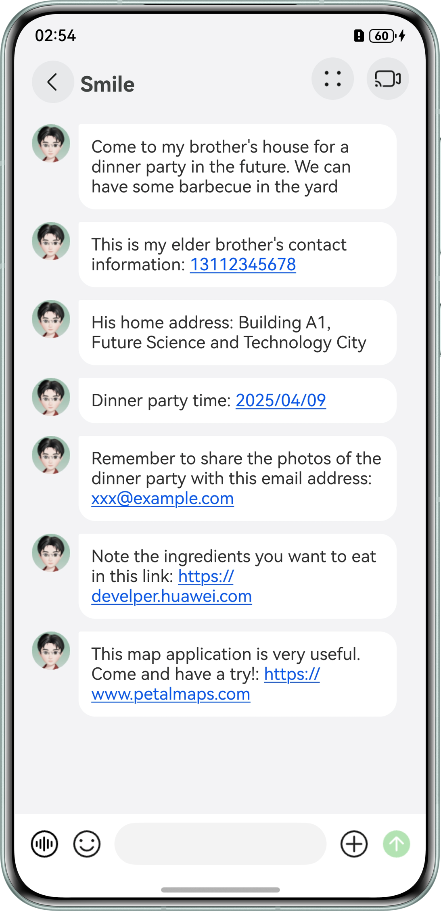

# **Special Text Recognition Using enableDataDetector**
## Overview
This sample shows how to use the enableDataDetector attribute of the Text component to automatically identify and highlight special texts, such as links, phone numbers, dates, addresses, and email addresses, by marking them in blue and underlining them. 
Users can tap one of these texts and select to open the link on the operation menu displayed.
## Effect


## Project Directory
``` 
├──entry/src/main/ets                                   // Code
│  ├──entryability
│  |  └──EntryAbility.ets                               // Entry ability
│  ├──entrybackupability
│  |  └──EntryBackupAbility.ets
│  ├──pages
│  |  ├──Index.ets                                      // Home page
│  |  └──LinksPage.ets                                  // Page for special text recognition
|  └──uiComponent.ets
│     └──TextLink.ets                                   // Text UI component
└──entry/src/main/resources                             // Application resources
``` 

## How to Use

* Standard HTTP/HTTPS link: Tap the link and open it in the default browser.
* AppLinking link: Tap the link and open it to start an application if it has been installed. Otherwise, you'll be redirected to the AppGallery or a browser's web page for installation.
* Date link: Tap the link and start a page for creating an event reminder.
* Phone number link: Tap the link to call, send an SMS message, or create a contact.
* Address link: Tap the link to get the direction using an installed map application. Currently, the system does not support redirection to an English address.
* Email link: Tap the link to start an email application to create an email.

## Required Permissions

N/A
## Constraints
* This sample is only supported on Huawei phones with standard systems.
* The HarmonyOS version must be HarmonyOS 5.0.5 Release or later.
* The DevEco Studio version must be DevEco Studio 5.0.5 Release or later.
* The HarmonyOS SDK version must be HarmonyOS 5.0.5 Release SDK or later.
