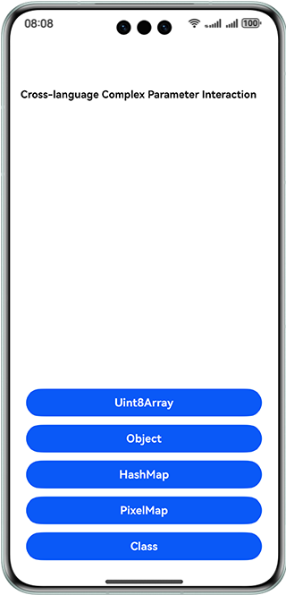
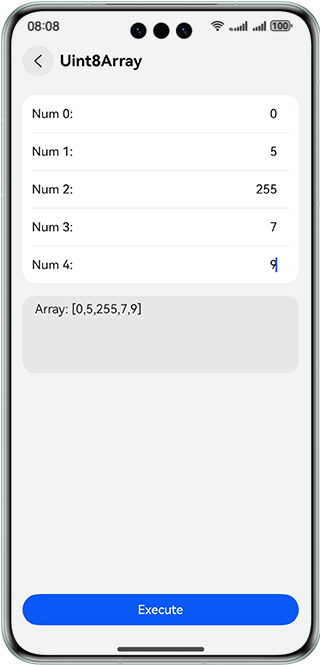
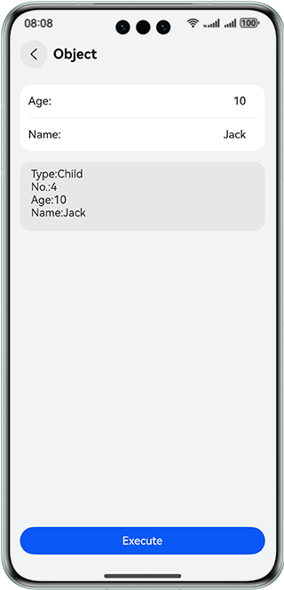
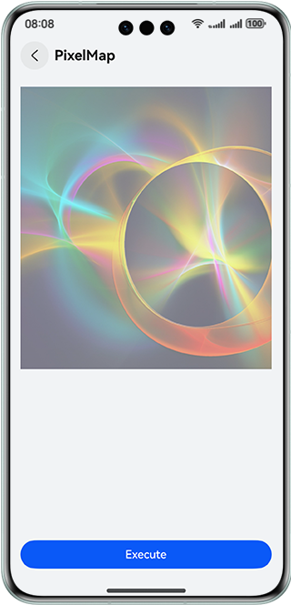

# Cross-language Complex Parameter Interaction

### Overview

This sample shows how to pass and call complex data types, including **uint8Array**, **object**, **hashMap**, **pixelMap**, and **class**, between ArkTS and C++.

### Preview

| **App Home Page**                            | Uint8Array                           | Object                               |
| ------------------------------------ | ------------------------------------ | ------------------------------------ |
| | | |

| HashMap                              | PixelMap                             | Class                                |
| ------------------------------------ | ------------------------------------ | ------------------------------------ |
| | |  |

### **How to Use**

1. On the home page, there are five buttons corresponding to the following data types:
2. **Uint8Array**: Input a number ranging from 0 to 255 in each text box in the upper part. After you tap **Execute**, the program passes the array from ArkTS to C++, and then returns the array to the output box in the lower part.
3. **Object**: Input a proper value of **Age** and **Name** in the text box in the upper part. After you tap **Execute**, the program passes the object that contains the input information from ArkTS to C++. C++ determines whether the object is an adult, sorts the objects by group, and returns the object that contains the output information to the output box in the lower part.
4. **HashMap**: Input a number ranging from 0 to 9 in each text box in the upper part. After you tap **Execute**, the program passes the **hashMap** that contains the input information from ArkTS to C++. C++ accumulates the input values of each object and returns the **hashMap** that contains the output information to the output box in the lower part.
5. **PixelMap**: After you tap **Execute**, the program passes the **pixelMap** of the image from ArkTS to C++. C++ processes the image as a black-and-white image, returns the image to ArkTS, and then re-renders the image.
6. **Class**: After you tap **ArkTS class pass to Napi**, the program passes the ArkTS class to C++. C++ calls the method and returns the result to the output box. After you tap **Napi class pass to ArkTS**, the program passes the C++ class to ArkTS. ArkTS calls the method and returns the result to the output box.

### How to Implement

1. Use the **napi_define_properties** and **napi_define_class** APIs to bind the functions and classes of ArkTS and C++.
2. Use **uint8ArrayPassing** function to pass **uint8Array** data. You can construct a buffer, use the **napi_get_arraybuffer_info** API to pass the array from ArkTS to C++, and then use the **use napi_create_arraybuffer** API to return the array.
3. Use **objectPassing** function to pass **object** data. You can use the **napi_get_cb_info** API to pass data from ArkTS to C++, and then use the **napi_create_object_with_named_properties** API to construct an object and return it.
4. Call the **hashMapPassing** function to pass **hashMap** data. This function serializes the **hashMap** and passes the result to C++ as a string. Then the **nlohmann** library is used to deserialize the **hashMap** in C++, edit it, and then serialize it again. Finally,the **hashMap** is returned to ArkTS as a string and JSON is used to deserialize the **hashMap** again.
5. Call the **pixelMapPassing** function to pass **pixelMap** data in the **uint8Array** format, which is almost the same as calling the **uint8ArrayPassing** function.
6. Call the **classPassingTs2Napi** function to pass **class** data from ArkTS to C++. You can obtain the property through the **napi_get_named_property** API and call the function through the **napi_call_function** API 
7. Call **new sampleClassNapi2Ts()** to pass **class** data from C++ to ArkTS. You can query and set properties using **getHintStr** and **setHintStr** respectively, define a class using the **napi_define_class** API, and define a parameter using the **napi_set_named_property** API.
8. For details about the implementation, see [napi_init.cpp](./entry/src/main/cpp/napi_init.cpp).

### Project Directory

   ```
    ├───entry/src/main/ets                             
    │   ├───entryability
    │   │   └───EntryAbility.ets                        // Ability lifecycle callbacks
    │   ├───entrybackupability
    │   │   └───EntryBackupAbility.ets                  // Backup ability lifecycle callbacks
    │   ├───model
    │   │   ├───IDModel.ets                             // Ad component parameters
    │   │   └───SampleObject.ets                        // Object type declaration
    │   └───pages
    │       ├───ClassPage.ets                           // Class passing page
    │       ├───HashMapPage.ets                         // HashMap passing page
    │       ├───Index.ets                               // Home page
    │       ├───ObjectPage.ets                          // Object passing page
    │       ├───PixelMapPage.ets                        // PixelMap passing page
    │       └───Uint8ArrayPage.ets                      // Uint8Array passing page
    ├───entry/src/main/cpp  
    │   ├───thirdparty                                  // Third-party library files
    │   ├───types/libentry/Index.d.ts                   // Functions and type declarations
    │   ├───CMakeLists.txt                              // Cmake compilation configuration file
    │   └───napi_init.cpp                               // C++ project
    └───entry/src/main/resources                        // Static resources
   ```

### Dependencies

**N/A**

### Constraints

1. The sample is only supported on Huawei phones with standard systems.

2. The HarmonyOS version must be HarmonyOS 5.0.5 Release or later.

3. The DevEco Studio version must be DevEco Studio 5.0.5 Release or later.

4. The HarmonyOS SDK version must be HarmonyOS 5.0.5 Release SDK or later.