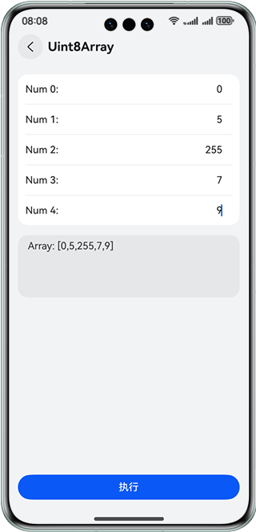
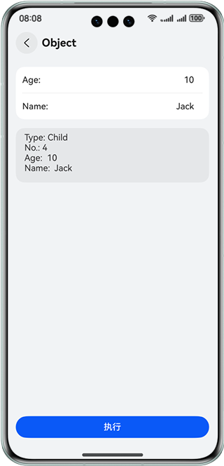
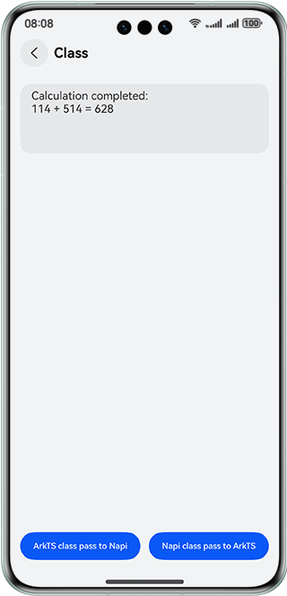

# 实现复杂参数的跨语言交互功能

### 介绍

本示例介绍了复杂数据类型在ArkTS与C++两种语言间的交互能力。主要包含Array、Object、HashMap、PixelMap、Class五种类型。五种类型分别设计了五个小案例来帮助开发者了解不同数据交互时需要调用的Node-API接口。通过该案例开发者可以学到Node-API数据交互相关接口能力的使用，并且可以在应用开发过程中熟练的进行数据跨语言传递。

### 效果图预览

| 应用首页                                 | Uint8Array                           | Object                               |
|--------------------------------------|--------------------------------------|--------------------------------------|
|  |  |  |

| HashMap                              | PixelMap                             | Class                                |
|--------------------------------------|--------------------------------------|--------------------------------------|
|  |  |  |

**使用说明**

1. 进入应用后，下方按钮，分别对应五种数据类型的示例。
2. Uint8Array，uint8Array类型示例。在上部输入框内可以输入0-255的数字。点击“执行”后，程序会将数组从ArkTS传递至C++再返回，之后显示在下方输出框中。
3. Object，object类型示例。在上部输入框内可以输入合理年龄和姓名。点击“执行”后，程序会将包含输入信息的object从ArkTS传递至C++，C++会判断其为成人与否，并分组排序，再返回包含输出信息的object，之后显示在下方输出框中。
4. HashMap，hashMap类型示例。在上部输入框内可以输入0-9的数字。点击“执行”后，程序会将包含输入信息的hashMap从ArkTS传递至C++，C++会累加每个对象每次的输入值，再返回包含输出信息的hashMap，之后显示在下方输出框中。
5. PixelMap，pixelMap类型示例。点击“执行”后，程序会将图片的pixelMap从ArkTS传递至C++，C++将其处理为黑白图片，再返回ArkTS，之后刷新图片。
6. Class，class类型示例。点击“ArkTS class pass to Napi”后，程序会将ArkTS的Class传递至C++，C++调用其方法后，将结果显示至输出框中。点击“Napi class pass to ArkTS”后，程序会将C++的Class传递至ArkTS，ArkTS调用其方法后，将结果显示至输出框中。

### 实现思路

1. 通过napi_define_properties和napi_define_class绑定ArkTS和C++两端的函数和class。
2. uint8ArrayPassing函数实现uint8Array数据的传递。通过构造buffer完成数组传递，使用napi_get_arraybuffer_info将数组从ArkTS传递至C++，而后使用napi_create_arraybuffer将数组传回。
3. objectPassing函数实现object数据的传递。通过napi_get_cb_info将数据从ArkTS传递至C++，而后使用napi_create_object_with_named_properties构造object并传回。
4. hashMapPassing函数实现hashMap数据的传递。先将hashMap序列化，以字符串的形式传递至C++，在C++反序列化，编辑后再序列化，以字符串形式传回ArkTS并完成反序列化。ArkTS中使用JSON完成序列化与反序列化，C++中使用nlohmann库。
5. pixelMapPassing函数实现pixelMap数据的传递。将pixelMap以uint8Array的格式传递，实现方法几乎相同。
6. classPassingTs2Napi函数实现class数据从ArkTS至C++传递。通过napi_get_named_property获取属性，napi_call_function调用函数。
7. new sampleClassNapi2Ts()实现class数据从C++至ArkTS传递。getHintStr与setHintStr分别负责属性的查询与设置，napi_define_class绑定class，napi_set_named_property绑定参数。
8. 主要实现内容参考[napi_init.cpp](./entry/src/main/cpp/napi_init.cpp)

### 工程结构&模块类型

   ```
    ├───entry/src/main/ets                             
    │   ├───entryability
    │   │   └───EntryAbility.ets                        // Ability的生命周期回调内容
    │   ├───entrybackupability
    │   │   └───EntryBackupAbility.ets                  // BackupAbility的生命周期回调内容
    │   ├───model
    │   │   ├───IDModel.ets                             // 广告组件参数
    │   │   └───SampleObject.ets                        // object类型声明
    │   └───pages
    │       ├───ClassPage.ets                           // class传递页面
    │       ├───HashMapPage.ets                         // hashMap传递页面
    │       ├───Index.ets                               // 应用入口
    │       ├───ObjectPage.ets                          // object传递页面
    │       ├───PixelMapPage.ets                        // pixelMap传递页面
    │       └───Uint8ArrayPage.ets                      // uint8Array传递页面
    ├───entry/src/main/cpp  
    │   ├───thirdparty                                  // 三方库文件
    │   ├───types/libentry/Index.d.ts                   // 函数、类型声明
    │   ├───CMakeLists.txt                              // Cmake编译配置文件
    │   └───napi_init.cpp                               // c++工程
    └───entry/src/main/resources                        // 应用静态资源目录
   ```

### 模块依赖

**不涉及**

### 约束与限制

1. 本示例仅支持标准系统上运行，支持设备：华为手机。

2. HarmonyOS系统：HarmonyOS 5.0.5 Release及以上。

3. DevEco Studio版本：DevEco Studio 5.0.5 Release及以上。

4. HarmonyOS SDK版本：HarmonyOS 5.0.5 Release SDK及以上。