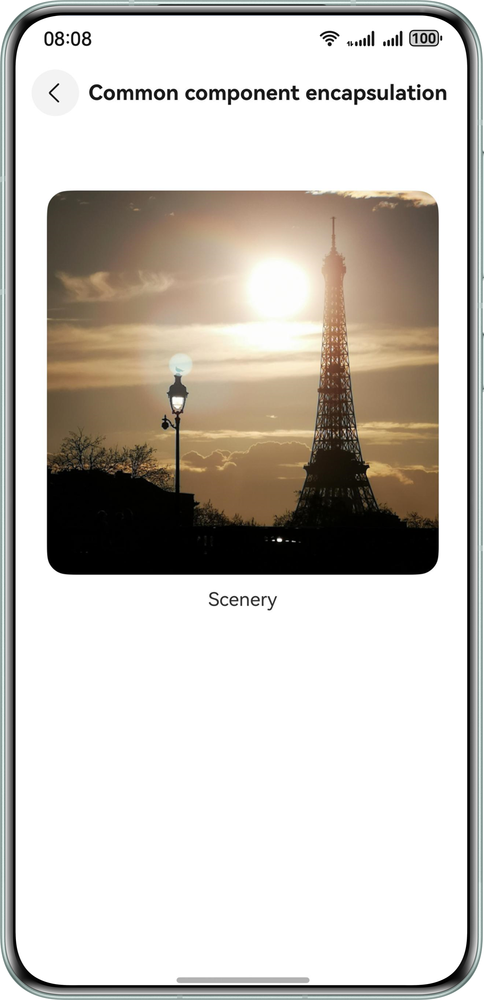

# ArkUI Component Encapsulation

### Overview

This sample describes three typical scenarios of ArkUI component encapsulation: common component encapsulation, dialog component encapsulation, and component factory encapsulation.

### Preview

| Home page                                             | Attribute Style                                       | Common component                                       | Dialog component                                       | Component factory                                       |
|-------------------------------------------------------|-------------------------------------------------------|--------------------------------------------------------|--------------------------------------------------------|---------------------------------------------------------|
|  |  |  |  |  |

### How to Use

On the home page, tap the corresponding button to access the page for common component encapsulation, dialog component encapsulation, or component factory encapsulation.

### Project Directory

```
├──entry/src/main/ets/
│  ├──common
│  │  └──CommonConstants.ets         // Common constants
│  ├──entryability
│  │  └──EntryAbility.ets            // Entry ability
│  ├──model
│  │  ├──AttributeModifier.ets       // AttributeModifier interface
│  │  ├──GetResourceString.ets       // Resource-to-string conversion function
│  │  └──PopViewUtils.ets            // Custom pop-up window
│  ├──pages
│  │  ├──AttributeStylePage.ets      // Attribute Style
│  │  ├──CommonComponent.ets         // Common component
│  │  ├──ComponentFactory.ets        // Component factory
│  │  ├──DialogComponent.ets         // Dialog component
│  │  └──Index.ets                   // Home page
│  └──view
│     ├──CustomImageText.ets         // Custom image and text component
│     └──FactoryMap.ets              // Component factory
└──entry/src/main/resources          // Static resources of the app
```

### How to Implement

1. Common component encapsulation: The **attributeModifier** method is provided, and the **AttributeModifier** API is implemented through the custom class to extend the system component attributes.

2. Dialog component encapsulation: The **PromptAction** object obtained from **UIContext** is used to encapsulate the custom dialog box. The **openCustomDialog** API in the **PromptAction** object is used to open the dialog box, and the **closeCustomDialog** API is used to close the dialog box.

3. Component factory encapsulation: The **Map** structure is used to store encapsulated components. The provider encapsulates the factory components using the global **@Builder** method, wraps the global **@Builder** method using the **wrapBuilder** function, and stores the return as the **value** of the component factory **Map**. The corresponding component is obtained based on the **key** value of **Map**.

### Permissions

N/A

### Constraints

1. The sample is only supported on Huawei phones with standard systems.

2. The HarmonyOS version must be HarmonyOS 5.0.5 Release or later.

3. The DevEco Studio version must be DevEco Studio HarmonyOS 5.0.5 Release or later.

4. The HarmonyOS SDK version must be HarmonyOS 5.0.5 Release SDK or later.