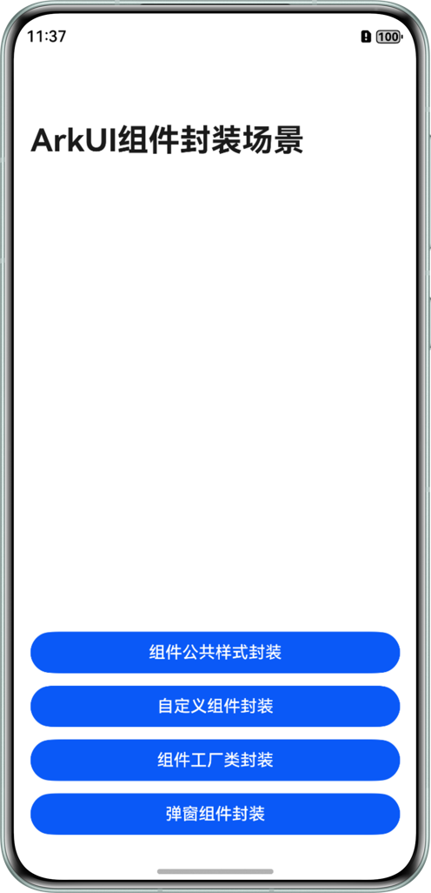
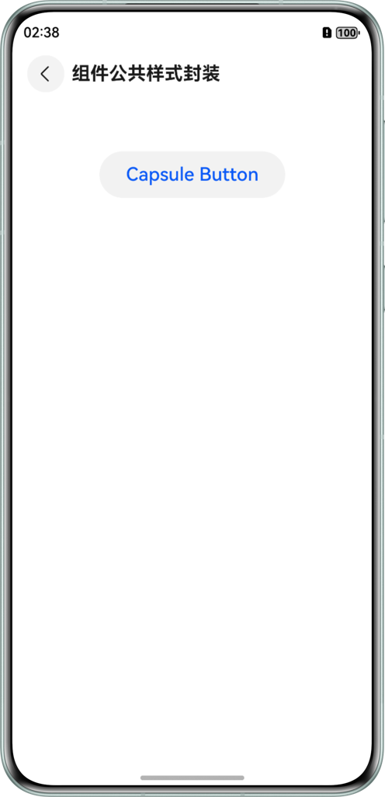
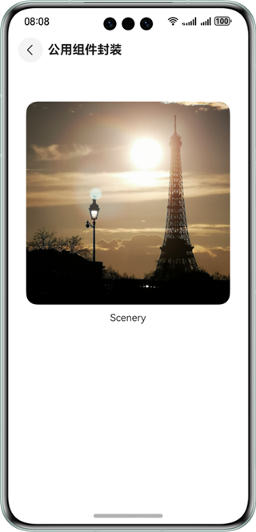
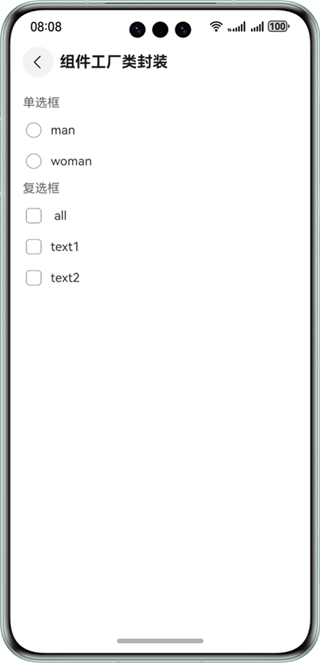
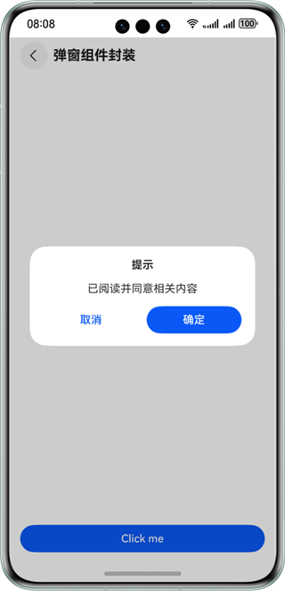

# 实现组件的封装

### 介绍

本示例通过系统组件的attributeModifier属性、PromptAction对象、wrapBuilder函数等，实现组件公共样式封装、自定义组件的封装、弹窗组件的封装、全局@Builder。帮助开发者掌握如何优化重复性的组件、布局，使代码简洁，易维护。

### 效果图预览

| 首页                                                 | 组件公共样式封装                                           | 自定义组件封装场景                               | 组件工厂类封装场景                                | 弹窗组件封装场景                                |
|----------------------------------------------------|----------------------------------------------------|-----------------------------------------|------------------------------------------|-----------------------------------------|
|  |  |  |  |  |

##### 使用说明

进入首面，会看到各封装场景的按钮，点击按钮会进入对应的封装场景实现的页面，查看效果。

### 工程目录

```
├──entry/src/main/ets/
│  ├──common
│  │  └──CommonConstants.ets         // 公共常量类
│  ├──entryability
│  │  └──EntryAbility.ets            // 程序入口类
│  ├──model
│  │  ├──GetResourceString.ets       // Resource转换String函数
│  │  └──PopViewUtils.ets            // 自定义弹窗类
│  ├──pages
│  │  ├──AttributeStylePage.ets      // 组件公共样式封装
│  │  ├──CommonComponent.ets         // 自定义组件封装
│  │  ├──ComponentFactory.ets        // 组件工厂类封装
│  │  ├──DialogComponent.ets         // 弹窗组件封装        
│  │  └──Index.ets                   // 首页
│  └──view
│     ├──CustomImageText.ets         // 自定义图片加文本组件
│     └──FactoryMap.ets              // 组件工厂
└──entry/src/main/resources          // 应用静态资源目录
```

### 具体实现

1. 自定义组件封装：系统组件提供了attributeModifier属性方法，通过自定义Class类实现AttributeModifier接口对系统组件属性进行扩展。

2. 弹窗组件封装：通过使用UIContext中获取到的PromptAction对象来实现自定义弹窗封装，使用PromptAction对象中openCustomDialog接口打开弹窗，closeCustomDialog接口关闭弹窗。

3. 组件工厂类封装：使用Map结构将封装的各个组件存入，提供方将需要工厂化的组件通过全局@Builder方法封装，将封装好的全局@Builder方法使用wrapBuilder函数包裹，并将返回值作为组件工厂Map的value值存入，使用时通过Map的key值获取相应组件。

### 相关权限

不涉及。

### 约束与限制

1. 本示例仅支持标准系统上运行，支持设备：华为手机。

2. HarmonyOS系统：HarmonyOS 5.0.5 Release及以上。

3. DevEco Studio版本：DevEco Studio 5.0.5 Release及以上。

4. HarmonyOS SDK版本：HarmonyOS 5.0.5 Release SDK及以上。