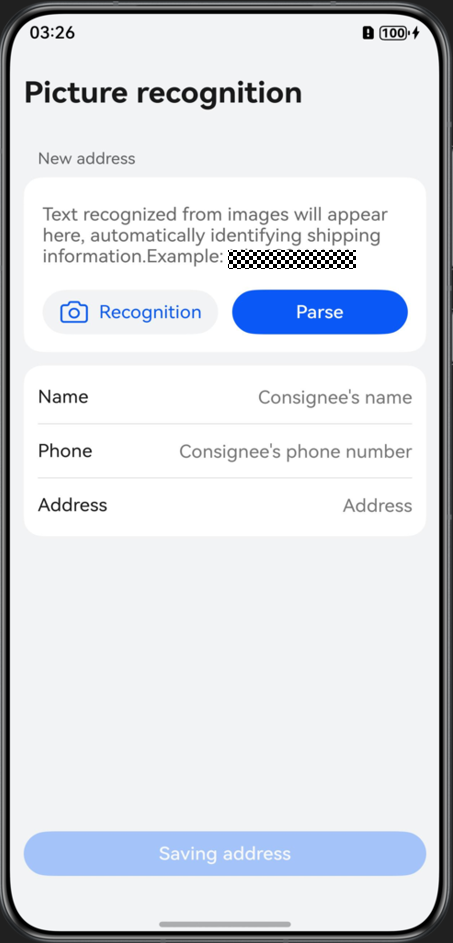
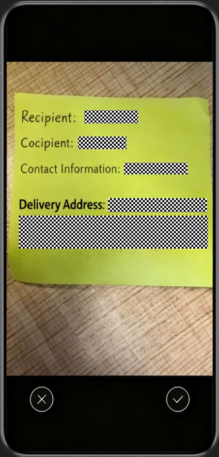
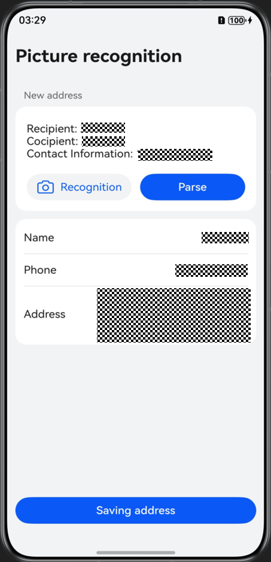
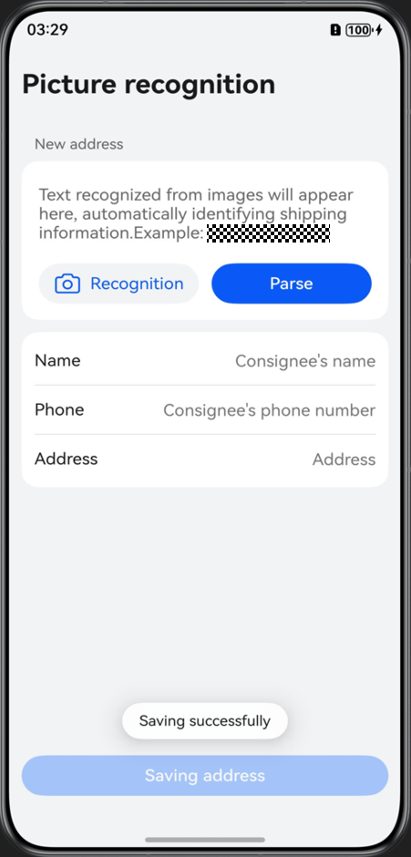

# Text Autofill Using Photo Recognition

## Overview

This sample demonstrates how to use the general text recognition capability provided by @kit.CoreVisionKit to convert printed text (such as delivery information) into image information through CameraPicker or PhotoViewPicker, convert the image information into text characters that can be used by the device using the text recognition technology, and extract structured data based on actual service rules.

## Effect

| Home Pag                                              | Photo Capture                                                 | Recognition                                               | Saving                                          |
|-------------------------------------------------------|---------------------------------------------------------------|-----------------------------------------------------------|-------------------------------------------------|
|  |  |  |  |

How to Use
1. Tap the Recognition button to open a dialog for selecting an image source. Choose the photo mode to capture the text you want to recognize, or select the album to pick the target image directly from your Gallery.
2. Once the text in the image is recognized, the text content will be automatically populated into the text box.
3. Tap the Recognition button again. The information in the text box will be extracted as structured data and displayed in the list below the button.
4. Tap the Saving address button. A message will be displayed, indicating that the address is saved successfully, and the previous content in the text box will be automatically cleared.

## Project Directory

```
entry/src/main/
├──ets
|  ├──common
|  |  ├──constants
|  |  |  └──CommonConstants.ets                               // Common constant class
|  |  └──utils
|  |     ├──AddressParse.ets                                  // Delivery information
|  |     ├──OCRManager.ets                                    // Visual recognition class
|  |     ├──PromptActionManager.ets                           // Dialog management class
|  |     └──Logger.ets                                        // Log class
|  ├──entryability
|  |  └──EntryAbility.ets                                     // Entry Ability
|  ├──viewmodel
|  |  └──DataModel.ets                                        // UI model class
|  ├──views
|  |  ├──ConsigneeInfoItem.ets                                // List item UI
|  |  └──DialogBuilder.ets                                    // Dialog UI
|  └──pages
|     └──Index.ets                                            // Home page
└──resources                                                  // Resources
```

## How to Implement

You can implement the general text recognition capability by calling the textRecognition.recognizeText() method of @kit.CoreVisionKit.

* Photo capture: call CameraPicker.pick() of @kit.CameraKit to take photos. The system provides the interactive UI, and no camera permissions are required.
* Album: call the select() method of the photoAccessHelper.PhotoViewPicker object of @kit.MediaLibraryKit to open the Gallery and select an image.
* Visual text recognition: call the textRecognition.recognizeText() method of @kit.CoreVisionKit to recognize image information.
* Structured data extraction: extract data using regular expressions. This sample focuses on extracting common delivery information. To cover complex scenarios and achieve accurate extraction, consider leveraging professional cloud services or NLP tools.

## Required Permissions

N/A

## Constraints

1. This sample is only supported on Huawei phones running standard systems.
2. Core Vision Kit is available only in the Chinese mainland (excluding Hong Kong (China), Macao (China), and Taiwan (China)).
3. The HarmonyOS version must be HarmonyOS 5.1.1 Release or later.
4. The DevEco Studio version must be DevEco Studio 5.1.1 Release or later.
5. The HarmonyOS SDK version must be HarmonyOS 5.1.1 Release SDK or later.
6. Supported formats include JPG, JPEG, and PNG.
7. Supported languages are simplified Chinese, English, Japanese, Korean, and traditional Chinese.
8. The text length should not exceed 10,000 characters.
9. Printed font recognition is supported, though there are limitations in recognizing handwritten fonts.
10. The input image should have a suitable imaging quality (720p or higher recommended), with a height between 100 px and 15,210 px, a width between 100 px and 10,000 px, and an aspect ratio preferably greater than 1:10, ideally close to the aspect ratio of a smartphone screen.
11. The shooting angle should be less than 30 degrees from the vertical direction of the plane where the text is located.
12. It is recommended that you use the following standard delivery information formats for recognition (replace \* with numbers):

    1. Recipient: Zhao Liu Contact: 13\*\*\*\*\*\*\*\*\* Address: \*\*Floor, Chengjian Building, No. \*\*\*\*\*, Tiyuxi Road, Tianhe District, Guangzhou
    2. Mr. Zhang (13\*-\*\*\*\*-\*\*\*\*) Address: Room ****, Building \*\*, No. \*\*\* Jianguo Road, Chaoyang District, Beijing
    3. Recipient: Mr. Wang, Contact: 010-\*\*\*\*\*\*\*\*, Address: Room \*\*\*, Unit \*\*, Building \*\*, No. \*\*, South Street, Zhongguancun, Haidian District
    4. Lucky Tea House, No. \*\*\*\*, Panshan Road, Xiangzhou District, Zhuhai City, Guangdong Province, Mr. Chen, 13\*\*\*\*\*\*\*\*\*
    