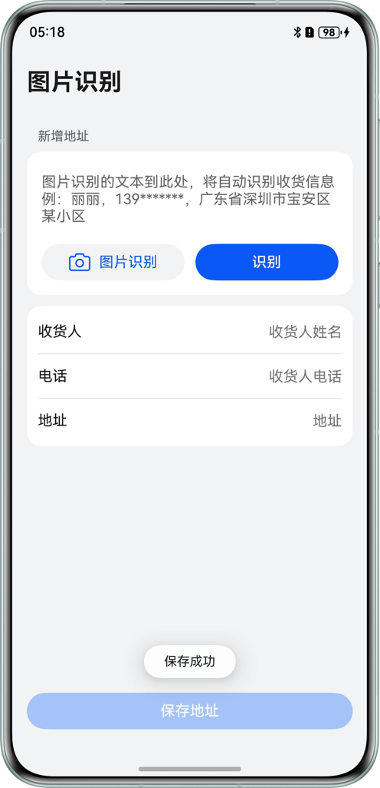

# 基于拍照识别能力实现文字自动填充

## 介绍

本示例基于基础视觉服务，使用`@kit.CoreVisionKit`提供的通用文字识别能力，通过拍照（CameraPicker）或者相册（PhotoViewPicker）方式，将印刷品文字（如：收货信息）转化为图像信息，再利用文字识别技术将图像信息转化为设备可以使用的文本字符，最后可以根据实际业务规则提取结构化数据。

## 效果预览

| 主页                                     | 拍照                                     | 识别                                          | 保存                                      |
|----------------------------------------|----------------------------------------|---------------------------------------------|-----------------------------------------|
|  |  |  |  |

使用说明：
1. 点击`图片识别`按钮，拉起`选择图片获取方式`的弹窗，选择`拍照`方式，通过对要识别的文字进行拍照获得要识别的图片。也可以选择`相册`方式，在图库中直接选择需要识别的图片。
2. 识别出图片包含的文本信息后，会自动将文本内容填充到文本输入框。
3. 点击`识别`按钮，会将文本框中的信息提取为结构化数据，显示到按钮下方的列表中。
4. 点击`保存地址`按钮，提示保存成功，文本框旧的内容会自动清空。

## 工程目录

```
entry/src/main/
├──ets
|  ├──common
|  |  ├──constants
|  |  |  └──CommonConstants.ets                               // 公共常量类
|  |  └──utils
|  |     ├──AddressParse.ets                                  // 收货信息解析类
|  |     ├──OCRManager.ets                                    // 视觉识别类
|  |     ├──PromptActionManager.ets                           // 弹窗管理类
|  |     └──Logger.ets                                        // 日志类
|  ├──entryability
|  |  └──EntryAbility.ets                                     // 入口Ability
|  ├──viewmodel
|  |  └──DataModel.ets                                        // UI模型类
|  ├──views
|  |  ├──ConsigneeInfoItem.ets                                // 列表项UI
|  |  └──DialogBuilder.ets                                    // 弹窗UI
|  └──pages
|     └──Index.ets                                            // 首页
└──resources                                                  // 资源目录
```

## 具体实现

通用文字识别能力，是调用`@kit.CoreVisionKit`的textRecognition.recognizeText()方法实现

* 拍照：通过调用`@kit.CameraKit`的CameraPicker.pick()拍摄照片。交互界面由系统提供，无需申请相机权限。
* 相册：通过调用`@kit.MediaLibraryKit`的photoAccessHelper.PhotoViewPicker对象的select()方法拉起图库，选择图片。
* 视觉文字识别：通过调用`@kit.CoreVisionKit`的textRecognition.recognizeText()方法对图像信息进行识别。
* 结构化数据提取：通过正则处理和提取数据。示例中只是对常见的收货信息进行简单提取。如需覆盖复杂的场景，做到精确提取，可以考虑使用专业的云服务或NLP工具。

## 相关权限

无

## 约束与限制

1. 本示例仅支持标准系统上运行，支持设备：华为手机。
2. Core Vision Kit仅支持中国境内（不包含中国香港、中国澳门、中国台湾）提供服务。
3. HarmonyOS系统：HarmonyOS 5.1.1 Release及以上。
4. DevEco Studio版本：DevEco Studio 5.1.1 Release及以上。
5. HarmonyOS SDK版本：HarmonyOS 5.1.1 Release SDK及以上。
6. 支持的图片格式：JPEG、JPG、PNG。
7. 支持的语言：简体中文、英文、日文、韩文、繁体中文。
8. 文本长度：不超过10000字符。
9. 支持文档印刷体识别，在识别手写字体方面能力有所欠缺。
10. 输入图像具有合适成像的质量（建议720p以上），100px<高度<15210px，100px<宽度<10000px，高宽比例建议10:1以下（高度小于宽度的10倍），接近手机屏幕高宽比例为宜。
11. 拍摄角度与文本所在平面垂直方向的夹角应小于30度。
12. 推荐使用以下常规的收货信息进行拍照识别（使用时替换\*号为数字）：

    1. 收货人：赵六 联系方式：13\*\*\*\*\*\*\*\*\* 收货地址：广州市天河区体育西路\*\*\*\*\*号城建大厦\*\*层 
    2. 张先生 (13\*-\*\*\*\*-\*\*\*\*) 收货地址: 北京市朝阳区建国路\*\*\*号院\*\*号楼\*\*\*\*室
    3. 收件人：王工，联系电话：010-\*\*\*\*\*\*\*\*，地址：海淀区中关村南大街\*\*号院\*\*号楼\*\*单元\*\*\*室
    4. 广东省珠海市香洲区盘山路\*\*\*\*号幸运茶馆,陈先生，13\*\*\*\*\*\*\*\*\*