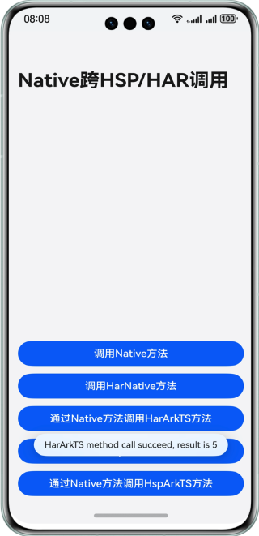

# Native侧调用HAR/HSP模块接口

## 介绍

本示例展示了Native侧跨HAR/HSP模块调用接口，用于大型应用开发过程中，Native侧代码直接调用其他HAR/HSP模块提供的接口。通过该案例，开发者可以了解Native侧跨HAR/HSP模块调用Native方法和ArkTS方法的文件配置以及调用逻辑。

## 效果预览

 


## 使用说明

1、点击【调用Native方法】按钮，调用Native方法。

2、点击【调用HarNative方法】按钮，调用staticModule模块的Native方法。

3、点击【通过Native方法调用HarArkTS方法】按钮，通过staticModule模块的Native方法调用Har模块的ArkTS方法。

4、点击【调用HspNative方法】按钮，调用sharedModule模块的Native方法。

5、点击【通过Native方法调用HspArkTS方法】按钮，通过sharedModule模块的Native方法调用sharedModule模块的ArkTS方法。

注意：在运行应用时，需要设置Deploy Multi Hap。点击Edit Configuration -> 选择entry -> 点击Deploy Multi Hap -> 勾选Deploy Multi Hap Packages。

## 工程目录
```
├──entry/src/main                     // Native层
│  ├──cpp
│  │  ├──types                        // Native层暴露上来的接口
│  │  │  └──libentry            
│  │  │     ├──index.d.ts             // 暴露给UI层的接口
│  │  │     └──oh-package.json5
│  │  ├──CMakeLists.txt               // 编译入口
│  │  └──napi_init.cpp                // Native文件操作方法       
│  └──ets                             // UI层
│     ├──entryability                 // 应用的入口
│     │  └──EntryAbility.ets            
│     ├──entrybackupability            
│     │  └──EntryBackupAbility.ets          
│     ├──model            
│     │  └──FileNameModel.ets            
│     └──pages                        // EntryAbility 包含的页面
│        └──Index.ets                 // 应用主页面
├──staticModule/src/main              // har模块
│  ├──cpp
│  │  ├──types                        // Native层暴露上来的接口
│  │  │  └──libhsp            
│  │  │     ├──index.d.ts             // 暴露给UI层的接口
│  │  │     └──oh-package.json5
│  │  ├──CMakeLists.txt               // 编译入口
│  │  ├──napi_har.cpp                 // har模块提供的native方法
│  │  ├──napi_har.h                   // napi_har的头文件
│  │  └──napi_init.cpp                       
│  └──ets                             // UI层
│     ├──components                 
│     │  └──MainPage.ets            
│     └──utils            
│        └──Util.ets                  // ArkTS方法   
└──sharedModule/src/main              // hsp模块
   ├──cpp
   │  ├──types                        // Native层暴露上来的接口
   │  │  └──liblibrary            
   │  │     ├──index.d.ts             // 暴露给UI层的接口
   │  │     └──oh-package.json5
   │  ├──CMakeLists.txt               // 编译入口
   │  ├──napi_hsp.cpp                 // hsp模块提供的native方法
   │  ├──napi_hsp.h                   // napi_hsp的头文件
   │  └──napi_init.cpp                       
   └──ets                             // UI层
      ├──components                 
      │  └──MainPage.ets            
      └──utils            
         └──Calc.ets                  // ArkTS方法   
```
## 具体实现
* 创建staticModule(HAR)/sharedModule(HSP)模块，并在entry的oh-package.json5配置对应的依赖。
* 在staticModule(HAR)/sharedModule(HSP)模块中创建Native方法及其头文件，在staticModule(HAR)/sharedModule(HSP)模块的build-profile.json5进行头文件导出配置。
* 在staticModule(HAR)/sharedModule(HSP)模块中Native侧引用ArkTS方法。
* 在entry的Native侧引用staticModule(HAR)/sharedModule(HSP)模块中Native方法。

## 相关权限

不涉及。

## 依赖

不涉及。

## 约束与限制

1. 本示例仅支持标准系统上运行，支持设备：华为手机。

2. HarmonyOS系统：HarmonyOS 5.0.5 Release及以上。

3. DevEco Studio版本：DevEco Studio 5.0.5 Release及以上。

4. HarmonyOS SDK版本：HarmonyOS 5.0.5 Release SDK及以上。