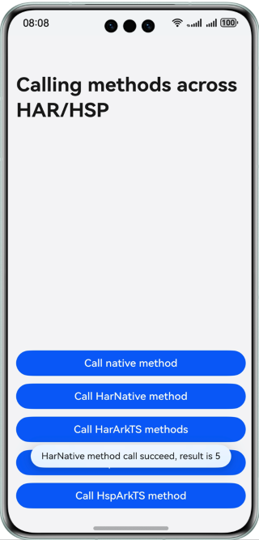

# Calling APIs Across HAR and HSP Modules on the Native Side

### Overview

This sample shows how to call APIs across HAR and HSP modules on the native side. It is used for large-scale app development, in which the native code directly calls APIs provided by other HAR and HSP modules. Through this sample, you can understand the file configuration and call logic for calling **Native** and **ArkTS** methods across HAR and HSP modules on the native side.

### Preview




How to Use

1. Tap the first button to call the **Native** method.

2. Tap the second button to call the **Native** method of the **staticModule** module.

3. Tap the third button to call the **ArkTS** method of the **Har** module through the **Native** method of the **staticModule** module.

4. Tap the fourth button to call the **Native** method of the **sharedModule** module.

5. Tap the last button to call the **ArkTS** method of the **sharedModule** module through the **Native** method of the **sharedModule** module.

Note: When running an app, you need to set **Deploy Multi Hap**. Tap **Edit Configuration** and select an entry. Tap **Deploy Multi Hap** and select **Deploy Multi Hap Packages**.

### Project Directory
```
├──entry/src/main                     // Native层
│  ├──cpp
│  │  ├──types                        // Native层暴露上来的接口
│  │  │  └──libentry            
│  │  │     ├──index.d.ts             // 暴露给UI层的接口
│  │  │     └──oh-package.json5
│  │  ├──CMakeLists.txt               // 编译入口
│  │  └──napi_init.cpp                // Native文件操作方法       
│  └──ets                             // UI层
│     ├──entryability                 // 应用的入口
│     │  └──EntryAbility.ets            
│     ├──entrybackupability            
│     │  └──EntryBackupAbility.ets          
│     ├──model            
│     │  └──FileNameModel.ets            
│     └──pages                        // EntryAbility 包含的页面
│        └──Index.ets                 // 应用主页面
├──staticModule/src/main              // har模块
│  ├──cpp
│  │  ├──types                        // Native层暴露上来的接口
│  │  │  └──libhsp            
│  │  │     ├──index.d.ts             // 暴露给UI层的接口
│  │  │     └──oh-package.json5
│  │  ├──CMakeLists.txt               // 编译入口
│  │  ├──napi_har.cpp                 // har模块提供的native方法
│  │  ├──napi_har.h                   // napi_har的头文件
│  │  └──napi_init.cpp                       
│  └──ets                             // UI层
│     ├──components                 
│     │  └──MainPage.ets            
│     └──utils            
│        └──Util.ets                  // ArkTS方法   
└──sharedModule/src/main              // hsp模块
   ├──cpp
   │  ├──types                        // Native层暴露上来的接口
   │  │  └──liblibrary            
   │  │     ├──index.d.ts             // 暴露给UI层的接口
   │  │     └──oh-package.json5
   │  ├──CMakeLists.txt               // 编译入口
   │  ├──napi_hsp.cpp                 // hsp模块提供的native方法
   │  ├──napi_hsp.h                   // napi_hsp的头文件
   │  └──napi_init.cpp                       
   └──ets                             // UI层
      ├──components                 
      │  └──MainPage.ets            
      └──utils            
         └──Calc.ets                  // ArkTS方法   
```
### How to Implement
* Create **staticModule** (HAR) and **sharedModule** (HSP) and configure the corresponding dependencies in **oh-package.json5** of **entry**.
* Create the **Native** method and its header file in the **staticModule** (HAR) and **sharedModule** (HSP), and configure the header file export in the **build-profile.json5** file of the modules.
* Reference the **ArkTS** method in the **staticModule** (HAR) and **sharedModule** (HSP) on the native side.
* Reference the **Native** method in the **staticModule** (HAR) and **sharedModule** (HSP) on the native side of **entry**.

### Permissions

N/A

### Dependencies

N/A

### Constraints

1. The sample is only supported on Huawei phones with standard systems.

2. The HarmonyOS version must be HarmonyOS 5.0.5 Release or later.

3. The DevEco Studio version must be DevEco Studio 5.0.5 Release or later.

4. The HarmonyOS SDK version must be HarmonyOS 5.0.5 Release SDK or later.