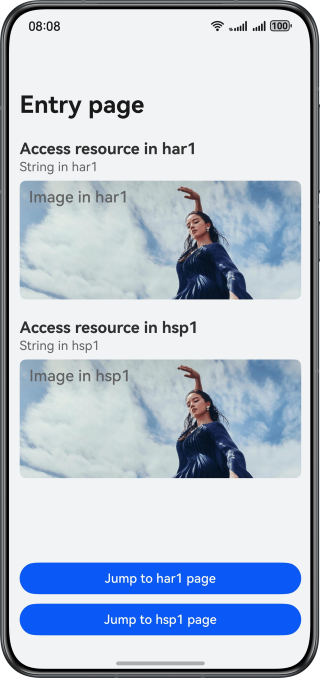
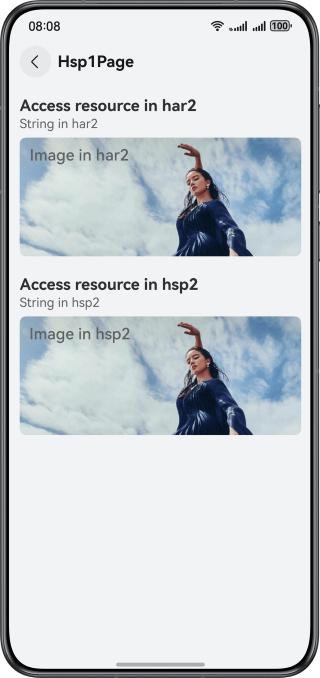

# Cross-Module Access to HAR/HSP Resource Files

### Overview

In HarmonyOS, application modular design typically uses the HAR and HSP to share resources. This reduces redundancy, simplifies management, and boosts development efficiency. This sample describes how to access HAP/HSP across modules. You can use $r to directly reference resources or use the APIs of the [resourceManager](https://developer.huawei.com/consumer/en/doc/harmonyos-references/js-apis-resource-manager) module to access the text and image resources in the HAP/HSP.


### Preview

| Accessing HSP/HAR Resources from HAP | Accessing HSP/HAR Resources from HAR    | Accessing HSP/HAR Resources from HSP    |
|--------------------------------------|-----------------------------------------|-----------------------------------------|
|  |  |  |

### Project Directory

```
├──entry
│  ├──src/main/ets/
│  │  ├──common
│  │  │  └──Logger.ets                       // Loggers 
│  │  ├──entryability
│  │  │  └──EntryAbility.ets                 // Entry ability
│  │  ├──entrybackupability
│  │  │  └──EntryBackupAbility.ets           // Data backup and restoration 
│  │  └──pages
│  │     └──Index.ets                        // Application entry page
│  └──src/main/resources                     // Static resources of the application
├──har1                                      // har1 module
│  ├──src/main/ets/components                                
│  │  └──Har1Page.ets                        // har1 page   
│  ├──src/main/resources                     // Static resources of the application 
│  └──Index.ets                              // Entry file, which exposes the module methods 
├──har2                                      // har2 module
│  ├──src/main/resources                     // Static resources of the application 
│  └──Index.ets                              // Entry file, which exposes the module methods
├──hsp1                                      // hsp1 module
│  ├──src/main/ets/pages                                
│  │  └──Hsp1Page.ets                        // hsp1 page
│  ├──src/main/resources                     // Static resources of the application   
│  └──Index.ets                              // Entry file, which exposes the module methods
└──hsp2                                      // hsp2 module
   ├──src/main/ets/pages                                
   │  └──Index.ets                           // Home page 
   ├──src/main/resources                     // Static resources of the application
   └──Index.ets                              // Entry file, which exposes the module methods
```

**Module dependency**


### How to Use

1.	Run the sample code.
2.	Touch Go to har1 page to access Har1Page, and load the text and images in the har2 and hsp2 modules.
3.	Touch Go to hsp1 page to access Hsp1Page, and load the text and images in the har2 and hsp2 modules.

### How to Implement
**Cross-module access to HAP resources**
* Use $(`app.type.name`) or $rawfile(`name`) to access resources.
* Call [resrouceManager.getStringSync](https://developer.huawei.com/consumer/en/doc/harmonyos-references/js-apis-resource-manager#getstringsync10) and [resrouceManager.getMediaContentSync](https://developer.huawei.com/consumer/en/doc/harmonyos-references/js-apis-resource-manager#getmediacontentsync10-1) to obtain resources.

**Cross-module access to HSP resources**
* Use $(`[hsp].type.name`) or $rawfile(`[hsp].name`) to access resources.
* Call [createModuleContext(context, moduleName)](https://developer.huawei.com/consumer/en/doc/harmonyos-references/js-apis-app-ability-application#applicationcreatemodulecontext12) to create a context for different modules within the same application. After obtaining resourceManager, call different resource management APIs to access different resources.

If resource file conflicts occur due to duplicate names in different modules, DevEco Studio overwrites them based on the following priorities (in descending order):
* Modules in the HAP/HSP.
* Dependent HAR/HSP modules. If resource conflicts occur between dependent HAR/HSP modules, they are overwritten based on the dependency sequence. (The module that is higher in the dependency sequence list has a higher priority.)


### Permissions
N/A


### Constraints
1.	This sample is only supported on Huawei phones with standard systems.
2.	The HarmonyOS version must be HarmonyOS 5.0.5 Release or later.
3.	The DevEco Studio version must be DevEco Studio 5.0.5 Release or later.
4.	The HarmonyOS SDK version must be HarmonyOS 5.0.5 Release SDK or later.

