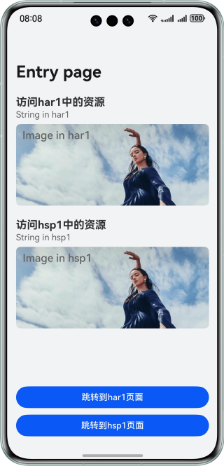
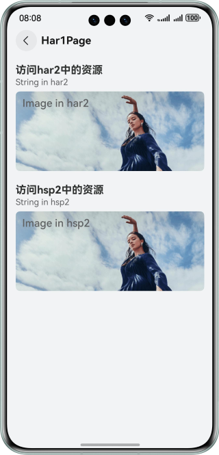
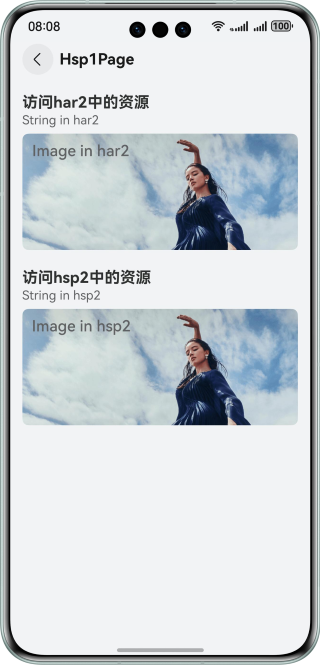
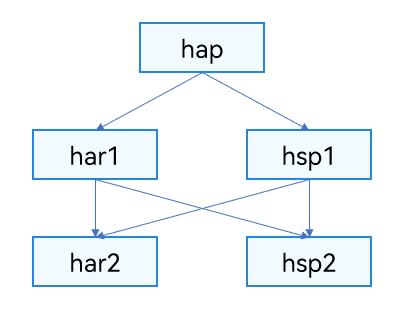

# 实现跨模块访问HAR/HSP资源文件功能

### 介绍

在HarmonyOS应用模块化设计中，一般使用HAR和HSP模块来共享资源，可以减少重复定义，简化资源管理，提升开发效率。
本示例实现了跨模块访问HAP/HSP资源，分别使用"$r"直接引用和[resourceManager](https://developer.huawei.com/consumer/cn/doc/harmonyos-references/js-apis-resource-manager)模块的相关API，访问所依赖HAP/HSP模块中的文本和图片资源。

### 效果预览

| HAP访问HSP/HAR资源                    | HAR访问HSP/HAR资源                       | HSP访问HSP/HAR资源                       |
|-----------------------------------|--------------------------------------|--------------------------------------|
|  |  |  |

### 工程目录

```
├──entry
│  ├──src/main/ets/
│  │  ├──common
│  │  │  └──Logger.ets                       // 日志打印工具类
│  │  ├──entryability
│  │  │  └──EntryAbility.ets                 // 程序入口类
│  │  ├──entrybackupability
│  │  │  └──EntryBackupAbility.ets           // 数据备份恢复类
│  │  └──pages
│  │     │──GetHspResource.ets               // 获取HSP中资源页面
│  │     └──Index.ets                        // 应用入口页
│  └──src/main/resources                     // 应用静态资源目录
├──har1                                      // har1模块
│  ├──src/main/ets/components                                
│  │  └──Har1Page.ets                        // 模块业务页面  
│  ├──src/main/resources                     // 应用静态资源目录   
│  └──Index.ets                              // 入口文件，对外暴露模块方法  
├──har2                                      // har2模块
│  ├──src/main/resources                     // 应用静态资源目录   
│  └──Index.ets                              // 入口文件，对外暴露模块方法 
├──hsp1                                      // hsp1模块
│  ├──src/main/ets/pages                                
│  │  └──Hsp1Page.ets                        // 模块业务页面  
│  ├──src/main/resources                     // 应用静态资源目录   
│  └──Index.ets                              // 入口文件，对外暴露模块方法 
└──hsp2                                      // hsp2模块
   ├──src/main/ets/pages                                
   │  └──Index.ets                           // 模块业务页面  
   ├──src/main/resources                     // 应用静态资源目录   
   └──Index.ets                              // 入口文件，对外暴露模块方法 
```

**模块依赖关系**



### 使用说明

1. 安装运行示例代码。
2. 点击“跳转到har1页面”按钮跳转到Har1Page，加载har2和hsp2模块中的文本和图片。
3. 点击“跳转到hsp1页面”按钮跳转到Hsp1Page，加载har2和hsp2模块中的文本和图片。

### 实现说明

**跨模块访问HAP包资源**

* 通过`$('app.type.name')`或`$rawfile('name')`访问资源。
* 通过[resrouceManager.getStringSync](https://developer.huawei.com/consumer/cn/doc/harmonyos-references/js-apis-resource-manager#getstringsync10)、[resrouceManager.getMediaContentSync](https://developer.huawei.com/consumer/cn/doc/harmonyos-references/js-apis-resource-manager#getmediacontentsync10-1)。
等方式获取。

**跨模块访问HSP包资源**

* 通过`$('[hsp].type.name')`或`$rawfile('[hsp].name')`访问资源。
* 通过[createModuleContext(context, moduleName)](https://developer.huawei.com/consumer/cn/doc/harmonyos-references/js-apis-app-ability-application#applicationcreatemodulecontext12)
接口创建同应用中不同module的上下文，获取resourceManager对象后，调用不同资源管理接口访问不同资源。

如果不同模块下的资源文件出现重名冲突时，DevEco Studio会按照以下优先级进行覆盖（优先级由高到低）：
* HAP/HSP包自身模块。
* 依赖的HAR/HSP模块，如果依赖的多个HAR/HSP之间有资源冲突，会按照依赖顺序进行覆盖（依赖顺序在前的优先级较高）。

### 相关权限

不涉及。

### 约束与限制

1. 本示例仅支持标准系统上运行，支持设备：华为手机。
2. HarmonyOS系统：HarmonyOS 5.0.5 Release及以上。
3. DevEco Studio版本：DevEco Studio 5.0.5 Release及以上。
4. HarmonyOS SDK版本：HarmonyOS 5.0.5 Release SDK及以上。
