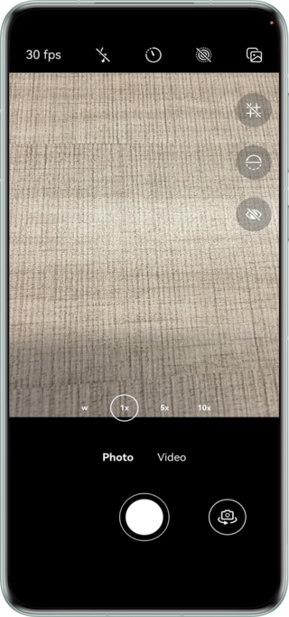

## Custom Camera Implementation

### Overview

Based on the Camera Kit, this sample implements a range of core camera functionalities such as basic preview, preview image adjustments (switching between the front and rear cameras, flash light, focus, zoom, etc.), advanced preview functionalities (grid line, level, timeout pause, etc.), dual-channel preview, photographing (such as motion photo and delayed shooting), and video recording. It serves as a comprehensive reference and practice guidance for developing a custom camera service.

### Preview



How to use:

1. After launching the application and completing authorization, the preview UI is displayed.
2. The buttons from left to right at the top of the screen are as follows: preview frame rate setting, flash setting, delayed shooting mode setting, motion photo mode setting, and single/dual-stage shutter mode setting. (The single-stage shutter mode does not support motion photo shooting.)
3. When switched to video recording mode, the top buttons from left to right are: preview frame rate setting, flash setting and image stabilization mode setting.
4. On the right side, the buttons are grid line, level, and dual-channel preview in order.
5. At the bottom, the buttons can be used to take photos, record videos, and switch between the front and rear cameras.

### Project Directory

```
├──camera/src/
│  ├──main/ets/
│  │  ├──components
│  │  │  ├──GridLine.ets                            // Grid line component.
│  │  │  └──LevelIndicator.ets                      // Level indicator component.
│  │  ├──constants
│  │  │  └──CameraConstants.ets                     // Constant file.
│  │  └──cameraManagers
│  │     ├──CamaraManager.ets                       // Camera session management class.
│  │     ├──ImageReceiverManager.ets                // ImageReceiver preview stream.
│  │     ├──OutputManager.ets                       // Output stream management abstract.
│  │     ├──PhotoManager.ets                        // Photo stream management class.
│  │     ├──VideoManager.ets                        // Video stream management class.
│  │     └──PreviewManager.ets                      // Preview stream management class.
│  └──Index.ets                                     // Exported file of the camera module.
├──commons/src/main/ets/
│  └──utils
│     └──Logger.ets                                 // Log class.
├──entry/src/main/ets/
│  ├──entryability
│  │  └──EntryAbility.ets                           // Entry point class.
│  ├──constants
│  │  └──Constants.ets                              // Constant file.
│  ├──pages
│  │  └──Index.ets                                  // Entry preview page.
│  ├──views
│  │  ├──ModeButtonsView.ets                        // Photo mode switch button view.
│  │  ├──OperateButtonsView.ets                     // Operation button view.
│  │  ├──SettingButtonsView.ets                     // Setting button view.
│  │  └──ZoomButtonsView.ets                        // Zoom control button view.
│  ├──viewModels
│  │  └──PreviewViewModel.ets                       // Preview-related state management.
│  └──utils
│     ├──CommonUtil.ets                             // Common utility function module.
│     ├──PermissionManager.ets                      // Permission management class.
│     ├──RefreshableTimer.ets                       // Timer management class.
│     └──WindowUtil.ets                             // Window utility class.
└──entry/src/main/resources                         // Static resources.
```

### How to Implement

1. Use Camera Kit capabilities.

### Required Permissions

- ohos.permission.CAMERA: required for camera operations.
- ohos.permission.MICROPHONE: required to access the microphone for video recording.
- ohos.permission.MEDIA_LOCATION: required to obtain geographical information.
- ohos.permission.WRITE_IMAGEVIDEO: required to write media files.
- ohos.permission.READ_IMAGEVIDEO: required to read media files.
- ohos.permission.APPROXIMATELY_LOCATION: required to obtain approximate location information of the device.
- ohos.permission.ACCELEROMETER: required for the acceleration sensor.

### Constraints

1. The sample is only supported on Huawei phones and tablets running standard systems.

2. HarmonyOS: HarmonyOS 5.1.1 Release or later.

3. DevEco Studio: DevEco Studio 5.1.1 Release or later.

4. HarmonyOS SDK: HarmonyOS 5.1.1 Release SDK or later.
