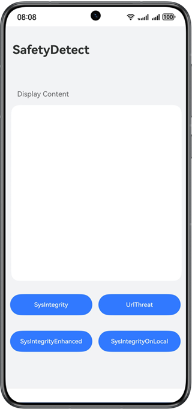

# 设备安全服务-安全检测

## 介绍

本示例向您介绍如何在应用中获取系统完整性检测、系统完整性本地检测、系统完整性增强检测和URL检测的结果。

需要使用设备安全服务接口 **@kit.DeviceSecurityKit**。

## 效果预览


## Sample工程的配置与使用

### 在DevEco中配置Sample工程的步骤如下

1. [创建项目](https://developer.huawei.com/consumer/cn/doc/app/agc-help-create-project-0000002242804048)及[应用](https://developer.huawei.com/consumer/cn/doc/app/agc-help-create-app-0000002247955506)。
2. 打开Sample应用，使用[AppGallery Connect](https://developer.huawei.com/consumer/cn/service/josp/agc/index.html)配置的应用包名替换app.json5文件中的bundleName属性值。
3. 在[AppGallery Connect](https://developer.huawei.com/consumer/cn/service/josp/agc/index.html)开通安全检测服务，具体请参考[Device Security Kit开发指南](https://developer.huawei.com/consumer/cn/doc/harmonyos-guides/devicesecurity-deviceverify-activateservice)。

#### Sample工程使用说明
1. 运行该 Sample 应用前，先对设备进行联网。
2. 运行该 Sample 应用，点击"SysIntegrity"按钮获取系统完整性检测结果，点击"SysIntegrityOnLocal"按钮获取系统完整性本地检测结果，点击"SysIntegrityEnhanced"按钮获取系统完整性增强检测结果，点击"UrlThreat"按钮获取URL检测结果，如果获取成功，页面会显示检测结果，如果获取失败，页面会显示相应的错误码。

## 工程目录

```
├─entry/src/main/ets       // 代码区。
│ ├─entryability
│ │ └─EntryAbility.ets     // 程序入口类。
│ ├─model
│ │ └─SafetyDetectModel.ts // 系统完整性检测、系统完整性本地检测、系统完整性增强检测和URL检测结果获取类。
│ ├─pages
│ │ └─Index.ets            // 首页，获取系统完整性检测、系统完整性本地检测、系统完整性增强检测和URL检测结果的页面。
```
## 具体实现

本示例展示系统完整性检测、系统完整性本地检测、系统完整性增强检测和URL检测的功能在页面中直接调用，使用safetyDetect.checkSysIntegrity()方法获取当前设备的系统完整性检测结果，使用safetyDetect.checkSysIntegrityOnLocal()方法获取当前设备的系统完整性本地检测结果，使用safetyDetect.checkSysIntegrityEnhanced()方法获取当前设备的系统完整性增强检测结果，使用safetyDetect.checkUrlThreat()方法获取URL检测结果，源码参考SafetyDetectModel.ts。

参考：
1. entry\src\main\ets\entryability\EntryAbility.ets
2. entry\src\main\ets\model\SafetyDetectModel.ts
3. entry\src\main\ets\pages\Index.ets

## 相关权限

不涉及。

## 依赖

依赖设备联网。

## 约束与限制

1.本示例仅支持标准系统上运行，支持设备：Phone、Tablet、PC/2in1。

2.HarmonyOS系统：HarmonyOS NEXT Developer Beta1及以上。

3.DevEco Studio版本：DevEco Studio NEXT Developer Beta1及以上。

4.HarmonyOS SDK版本：HarmonyOS NEXT Developer Beta1 SDK及以上。