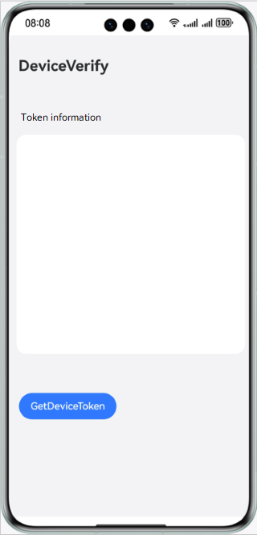

# Device Security Kit - DeviceVerify

## Overview

This sample code illustrates how to obtain a device token in an app to check the status of the app on the device.

The APIs that you need to use are packaged into **@kit.DeviceSecurityKit**.

## Preview

## How to Configure and Use

### Configuring the Sample App in DevEco Studio

1. [Create a project](https://developer.huawei.com/consumer/en/doc/app/agc-help-createproject-0000001100334664). Under the project, [add an app](https://developer.huawei.com/consumer/en/doc/app/agc-help-createapp-0000001146718717).
2. Open the sample app and set **bundleName** in the **app.json5** file to the app package name configured in [AppGallery Connect](https://developer.huawei.com/consumer/en/service/josp/agc/index.html).
3. Enable **Device status detection** in [AppGallery Connect](https://developer.huawei.com/consumer/en/service/josp/agc/index.html). For details, please refer to [here](https://developer.huawei.com/consumer/en/doc/harmonyos-guides/devicesecurity-introduction).

#### Using the Sample App
1. Before running the sample app, connect the device to the network.
2. Run the sample app. Tap **GetDeviceToken** to obtain the device token. If the device token is successfully obtained, it will be displayed on the page. If the device token fails to be obtained, an error code will be displayed.

## Project Directory
├─entry/src/main/ets            // Code area. 
│ ├─entryability                    
│ │ └─EntryAbility.ets          // Entry point class. 
│ ├─model                
│ │ └─DevCertManagerModel.ts    // Device token obtaining class. 
│ ├─pages                                     
│ │ └─Index.ets              // Home page, where a device token can be obtained.

## How to Implement

Call the device token obtaining function directly on the page. To be specific, call the **deviceCertificate.getDeviceToken()** method to obtain a device token. For details about the source code, please refer to **DevCertManagerModel.ts**.

Reference
1. entry\src\main\ets\entryability\EntryAbility.ets
2. entry\src\main\ets\model\DevCertManagerModel.ts
3. entry\src\main\ets\pages\Index.ets

## Required Permissions

None

## Dependencies

The device where the sample app runs must connect to the network.

## Constraints

1. The sample app is only supported on Huawei phones, tablets, 2-in-1 devices, wearables and TV devices with standard systems.

2. The HarmonyOS version must be HarmonyOS NEXT Developer Beta1 or later.

3. The DevEco Studio version must be DevEco Studio NEXT Developer Beta1 or later.

4. The HarmonyOS SDK version must be HarmonyOS NEXT Developer Beta1 SDK or later.
