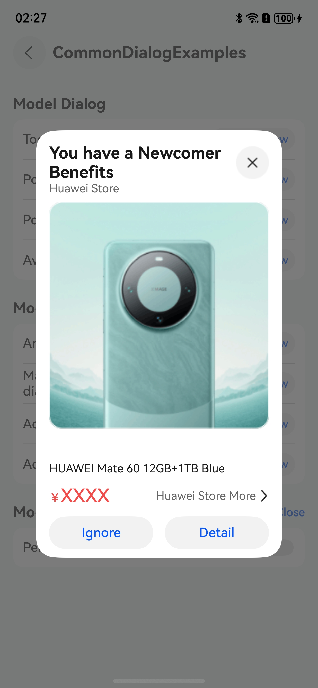
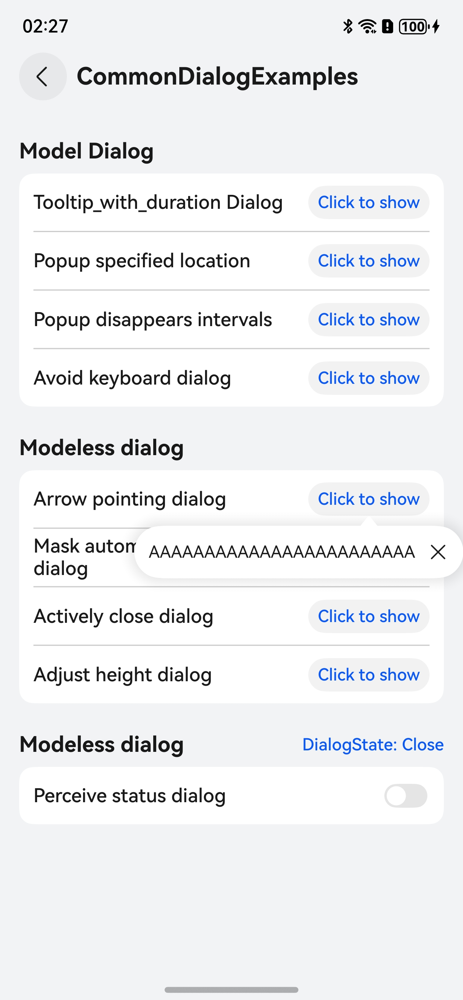
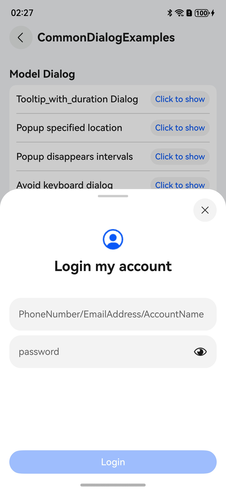
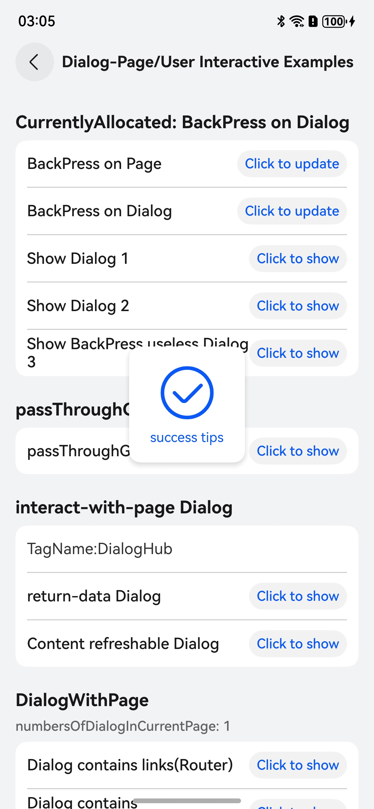

# DialogHub-based Common Dialog
## Overview
This sample shows how to use [DialogHub](https://gitcode.com/openharmony-sig/dialoghub) to implement various dialog features, including common dialog types, interaction modes among dialogs, pages, and users,how to reuse dialog components, and how to effectively manage multiple dialogs on the same page. Through these instances, you can quickly learn to use DialogHub flexibly, improving UI interactivity and functionality.

## Effect

| Custom Dialog Box                           | Finger-following Dialog Box                | Semi-modal Dialog Box                      | Toast Dialog Box                           |
|---------------------------------------------|--------------------------------------------|--------------------------------------------|--------------------------------------------|
|  |  |  |  |

## Project Directory
```text
├─entry/src/main/ets                         // Code
├── components                               // UI components
│   ├── ActiveCloseBuilder.ets               // Builder for the dialog that can be manually closed
│   ├── AutoDismissBuilder.ets               // Builder for the dialog that is automaticallu
│   ├── IconToastBuilder.ets                 // Builder for the dialog supporting gesture pass-through
│   ├── ImagePopupBuilder.ets                // Builder for the dialog with an arrow pointing to the selected component
│   ├── InputBuilder.ets                     // Builder for the dialog that avoids the keyboard
│   ├── InputCallbackBuilder.ets             // Builder for the dialog that needs to return data to the page
│   ├── ProgressBuilder.ets                  // Builder for the dialog whose content can be refreshed by the parent page
│   ├── SheetBuilder.ets                     // Builder for the bottom dialog with adjustable height
│   ├── SimpleCustomBuilder.ets              // Builder for the template dialog
│   ├── SkipBuilder.ets                      // Builder for the dialog containing a redirection link
│   ├── SnackbarBuilder.ets                  // Builder for the non-modal dialog at a specified position
│   ├── TextToastBuilder.ets                 // Builder for the simple template dialog
│   └── TimeToastBuilder.ets                 // Builder for the time-limited dialog
├── entryability
│   └── EntryAbility.ets
├── pages                                    // Page
│   ├── Others                               // Page containing a redirection link
│   │   ├── RouterSkip.ets                   // Page for router redirection
│   │   └── SkipAction.ets                   // Page for navigation redirection
│   ├── CommonExamples.ets                   // Page containing common examples
│   ├── Index.ets                            // Home page
│   ├── MultiDialogExample.ets               // Page for processing multiple dialogs
│   ├── OperableExample.ets                  // Page for user interaction
│   └── ReuseExample.ets                     // Page for dialog reuse
└── utils    
    ├── CommonConstant.ets                   // Common constants                           
    ├── ItemHead.ets                         // Module header components
    └── SampleModifier.ets                   // Dynamic attribute utilities
```

## Constraints
- This sample is only supported on Huawei phones with standard systems.
- The HarmonyOS version must be HarmonyOS 5.0.0 Release or later.
- The DevEco Studio version must be DecEco Studio 5.0.0 Release or later.
- The HarmonyOS SDK version must be HarmonyOS 5.0.0 Release SDK or later.
- The Previewer is not supported currently. Run the code to view the actual effect.