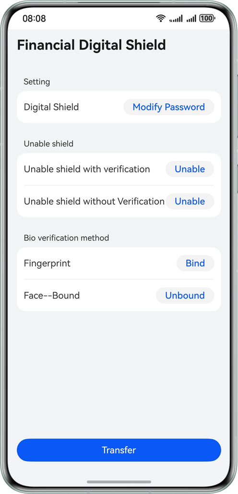

# Securing Large-Value Transfer with Digital Shield

## Overview
This sample demonstrates how to develop a digital shield for bank transfer using Device Security Kit. You can directly use APIs in the Trusted Execution Environment (TEE) to implement functionalities such as identity authentication, key management, unified trusted UI, and asset store, thereby jointly building the digital shield capabilities.

## Effect
| Digital Shield                                   | 
|--------------------------------------------------|
|  | 

## How to Use
### Signature Application
1. Prepare for application development (https://developer.huawei.com/consumer/en/doc/harmonyos-guides/application-dev-overview).
2. Enable the digital shield service in Device Security Kit (https://developer.huawei.com/consumer/en/doc/harmonyos-guides/devicesecurity-deviceverify-activateservice).
3. Generate an access token based on the service account (https://developer.huawei.com/consumer/en/doc/harmonyos-guides/devicesecurity-deviceverify-token).
4. Add the signature to signingConfigs in build-profile.json5.

### Compilation and Installation
Use DevEco Studio to open the project, and compile and install the project.

### Biometric Authentication
> The biometric authentication capability of the digital shield relies on fingerprint and facial data registered in the system. Therefore, users must first register their fingerprint and facial information in the system settings before completing transaction authentication via biometrics.

### Usage
1. When users open the application, they first need to activate the digital shield. They can set an initial PIN in the format of digits only or digits plus letters.
2. Users can modify the digital shield PIN as required, with the same format options available: digits only or digits plus letters.
3. Based on the device's supported capabilities and personal preferences, users can bind their fingerprint or facial recognition within the application.
4. When entering the transfer page, users input transfer information and select one of the following methods for transaction authentication: password (PIN), facial recognition (visible after binding), and fingerprint recognition (visible after binding).
5. Users can deactivate the digital shield with or without authentication as required.

## Project Directory

```
├──entry/src/main/ets/
│  ├──entryability
│  │  └──EntryAbility.ets                // Entry ability lifecycle callbacks 
│  ├──entrybackupability
│  │  └──EntryBackupAbility.ets          // EntryBackupAbility lifecycle callbacks 
│  ├──model                
│  │  └──TrustedAuthentication.ets       // Implementation of digital shield 
│  ├──pages                
│  │  ├──Index.ets                       // Navigation entry 
│  │  ├──MainPage.ets                    // Main page of digital shield 
│  │  ├──PasswordSelectionPage.ets       // Password selection page 
│  │  └──TradingPage.ets                 // Transaction information page 
│  └──utils                              // Utility
│     ├──AssetUtils.ets                  // Asset store service utility 
│     └──TrustedServiceOption.ets        // Trusted service configuration 
├──resource
└──module.json5

```

## How to Implement
1. Use Universal Keystore Kit to generate a session key and initialize the session.
2. Call the API of Device Security Kit to enable the digital shield and save the credential ID in Asset Store Kit.
3. Call APIs of Device Security Kit to complete capabilities such as modifying and disabling the digital shield, binding biometric information, and confirming transaction information.
4. Use User Authentication Kit to check whether biometric information is supported and recorded, and whether biometric authentication is available.

## Required Permissions
ohos.permission.ACCESS_BIOMETRIC: allows an application to use biometric recognition for identity authentication.

## Dependencies
1. Asset Store Kit
2. Universal Keystore Kit
3. User Authentication Kit

## Constraints
1. This sample is only supported on Huawei phones running standard systems.
2. The HarmonyOS version must be HarmonyOS 6.0 Beta3 or later.
3. The DevEco Studio version must be DevEco Studio 6.0 Beta3 or later.
4. The HarmonyOS SDK version must be HarmonyOS 6.0 Bete3 SDK or later.
5. You need to register as a developer on https://developer.huawei.com/consumer/en/ and complete identity verification as an enterprise developer.
6. You need to request the digital shield permission in AppGallery Connect (https://developer.huawei.com/consumer/cn/service/josp/agc/index.html#/).
7. Currently, the facial recognition capability of the digital shield is available only for devices that support 3D facial recognition (Mate series later than 60).