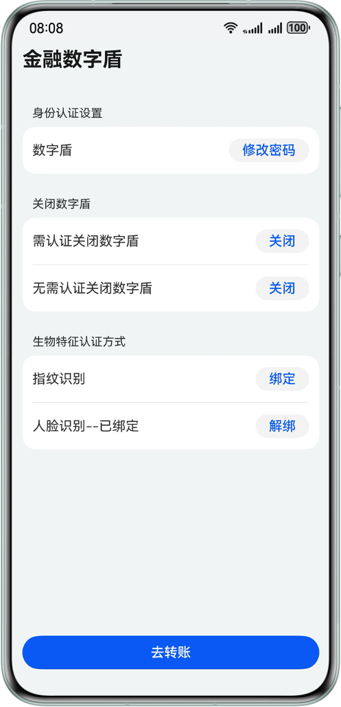

# 基于数字盾服务实现大额转账交易安全数字盾

## 介绍
本示例利用Device Security Kit的数字盾服务，开发一个银行转账的数字盾。
通过在可信执行环境(TEE)中开放固定的接口，帮助用户直接调用接口进行身份认证，密钥管理，统一可信UI界面展示，关键资产存储等能力共同构建数字盾能力

## 效果预览
| 数字盾预览                                         | 
|-----------------------------------------------|
|  | 

## 使用说明
### 数字盾服务签名申请
1. 完成应用开发准备 (https://developer.huawei.com/consumer/cn/doc/harmonyos-guides/application-dev-overview)
2. 开通Device Security服务中的数字盾服务 (https://developer.huawei.com/consumer/cn/doc/harmonyos-guides/devicesecurity-deviceverify-activateservice)
3. 基于服务账号生成鉴权令牌 (https://developer.huawei.com/consumer/cn/doc/harmonyos-guides/devicesecurity-deviceverify-token)
4. 将签名补充在build-profile.json5的signingConfigs中

### 编译安装
使用DevEco Studio打开工程，并进行编译安装。

### 生物认证
> 数字盾的生物认证能力依赖于系统录入的指纹和人脸信息，在进行生物信息交易认证前，需要用户在系统设置页面对指纹和人脸信息进行录入

### 应用使用
1. 用户打开应用首先进行数字盾的开通，根据用户需要设置纯数字或数字+英文的格式的初始PIN码开通数字盾
2. 用户根据需要对数字盾PIN码进行修改，同样可选纯数字或数字+英文的格式
3. 根据设备支持能力类型及个人诉求在应用内绑定指纹或者人脸
4. 进入转账页面，输入转账信息，选择密码(PIN)，人脸(绑定后按钮可见)，指纹(绑定后按钮可见)其中任一方式进行交易认证
5. 根据用户需要，选择需认证或无认证关闭数字盾

## 工程目录

```
├──entry/src/main/ets/
│  ├──entryability
│  │  └──EntryAbility.ets                // Ability的生命周期回调内容
│  ├──entrybackupability
│  │  └──EntryBackupAbility.ets          // EntryBackupAbility的生命周期回调内容
│  ├──model                
│  │  └──TrustedAuthentication.ets       // Device Security Kit数字盾能力实现
│  ├──pages                
│  │  ├──Index.ets                       // Navigation导航入口界面
│  │  ├──MainPage.ets                    // 数字盾信息主界面
│  │  ├──PasswordSelectionPage.ets       // 密码类型选择界面
│  │  └──TradingPage.ets                 // 交易信息界面
│  └──utils                              // 工具
│     ├──AssetUtils.ets                  // 关键资产存储服务工具
│     └──TrustedServiceOption.ets        // 可信服务配置
├──resource
└──module.json5

```

## 具体实现
1. 使用Universal KeyStore Kit生成会话密钥，初始化对话
2. 调用Device Security Kit的接口开通数字盾，并将credentialID存入Asset Store Kit中
3. 调用Device Security Kit的不同接口完成修改、关闭数字盾和生物信息绑定，交易信息确认等能力
4. 通过User Authentication Kit完成确认生物信息是否支持，是否录入以及生物信息认证能力

## 相关权限
需要允许应用使用生物特征识别能力进行身份认证权限：ohos.permission.ACCESS_BIOMETRIC

## 依赖
1. Asset Store Kit          (关键资产存储服务)
2. Universal KeyStore Kit   (密钥管理服务)
3. User Authentication Kit  (用户认证服务)

## 约束与限制
1. 本示例仅支持标准系统上运行，支持设备：华为手机。
2. HarmonyOS系统：HarmonyOS 6.0 Beta3及以上。
3. DevEco Studio版本：DevEco Studio 6.0 Beta3及以上。
4. HarmonyOS SDK版本：HarmonyOS 6.0 Bete3 SDK及以上。
5. 需要在华为开发者联盟网站上注册成为开发者，并完成企业开发者实名认证 (https://developer.huawei.com/consumer/cn/)
6. 需要在AppGallery Connect页面申请数字盾权限 (https://developer.huawei.com/consumer/cn/service/josp/agc/index.html#/)
7. 当前数字盾人脸识别能力仅提供支持3D人脸识别的设备使用(Mate系列60之后的设备)