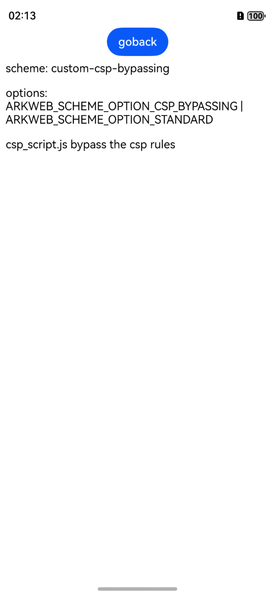
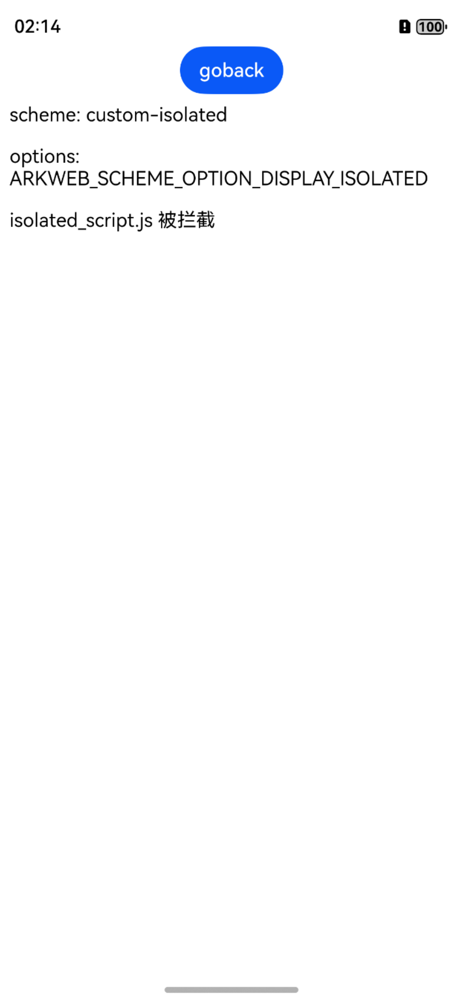
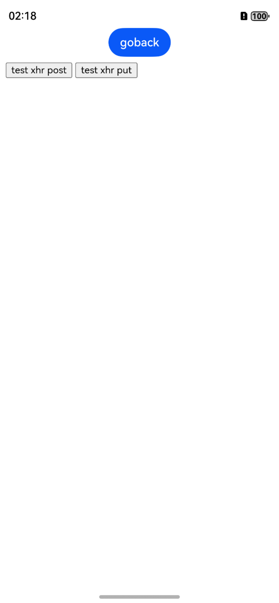

# 拦截Web组件发起的网络请求

### 介绍

1. 本示例通过使用arkweb_scheme_handler.h相关API实现对Web组件发出的请求进行拦截，并为被拦截的请求提供自定义的响应头以及响应体。
2. 本工程主要实现了对以下指南文档中 https://docs.openharmony.cn/pages/v5.0/zh-cn/application-dev/web/web-scheme-handler.md 示例代码片段的工程化，主要目标是实现指南中示例代码需要与sample工程文件同源。

### 主页

1. 本示例通过使用arkweb_scheme_handler.h相关API实现对Web组件发出的请求进行拦截，并为被拦截的请求提供自定义的响应头以及响应体。

#### 效果预览

|                   主页                   |
|:----------------------:|
|  |

#### 使用说明

1. 打开DEMO进入首页，展示html。
2. 点击各链接进入不同属性的拦截结果页面或读取结果页面。

### 拦截视频资源

#### 介绍

1. 此处模块主要介绍通过Web组件，拦截视频资源请求，读取本地mp4文件。

#### 效果预览

| 拦截视频资源                                                   |
| ------------------------------------------------------------ |
|  |

#### 使用说明

1. 通过点击主页的“拦截视频资源请求，读取本地mp4文件”链接，拦截页面请求并跳转到此页面并展示本地的mp4文件。

### 忽略csp检查并拦截

#### 介绍

1. 此处模块主要介绍通过Web组件，测试三方协议忽略csp检查，并成功拦截。

#### 效果预览

| 忽略csp检查并拦截                                                 |
| ------------------------------------------------------------ |
|  |

#### 使用说明

1. 通过点击主页的“测试三方协议忽略csp检查，并成功拦截”链接，展示被拦截的自定义scheme请求，该scheme需要遵循标准的scheme规则，允许忽略CSP检查。
2. 如果要拦截自定义scheme的请求，需要提前将自定义scheme注册到Web内核。需要在Web组件初始化之前进行注册，Web组件初始化后再注册会失败。

### 拦截ISOLATED属性

#### 介绍

1. 此处模块主要介绍通过Web组件，测试拦截设置ISOLATED属性的三方协议。

#### 效果预览

| 拦截ISOLATED属性                                                  |
| ------------------------------------------------------------ |
|  |

#### 使用说明

1. 通过点击主页的“测试拦截设置ISOLATED属性的三方协议”链接，展示被拦截的带有ISOLATED属性的自定义scheme请求，该scheme的请求必须从相同scheme加载的网页中发起。
2. 如果要拦截自定义scheme的请求，需要提前将自定义scheme注册到Web内核。需要在Web组件初始化之前进行注册，Web组件初始化后再注册会失败。

### 拦截LOCAL属性

#### 介绍

1. 此处模块主要介绍通过Web组件，测试拦截设置LOCAL属性的三方协议。

#### 效果预览

| 拦截LOCAL属性                                              |
| ------------------------------------------------------------ |
|  |

#### 使用说明

1. 通过点击主页的“测试拦截设置LOCAL属性的三方协议”链接，展示被拦截的带有LOCAL属性的自定义scheme请求，该scheme需要遵循与“file” scheme一样的规则。
2. 如果要拦截自定义scheme的请求，需要提前将自定义scheme注册到Web内核。需要在Web组件初始化之前进行注册，Web组件初始化后再注册会失败。

### 拦截service worker

#### 介绍

1. 此处模块主要介绍通过Web组件，测试拦截service worker触发的请求。

#### 效果预览

| 拦截service worker                                              |
| ------------------------------------------------------------ |
|  |

#### 使用说明

1. 通过点击主页的“测试拦截service worker触发的请求”链接，展示被拦截的Web组件发出的scheme为“custom”的请求。
2. 如果要拦截自定义scheme的请求，需要提前将自定义scheme注册到Web内核。需要在Web组件初始化之前进行注册，Web组件初始化后再注册会失败。

### 测试读取blob类型http body stream

#### 介绍

1. 此处模块主要介绍通过Web组件，测试读取blob类型http body stream。

#### 效果预览

| 测试读取blob类型http body stream                                              |
| ------------------------------------------------------------ |
|  |

#### 使用说明

1. 通过点击主页的“测试读取blob类型http body stream”链接，跳转至post_data.html，通过"test xhr post"或"test xhr put"按键，创建blob类型的对应请求，并发送至服务端，在设备日志中可查看发送结果。

### 测试读取chunked类型http body stream

#### 介绍

1. 此处模块主要介绍通过Web组件，测试读取chunked类型http body stream。

#### 效果预览

| 测试读取chunked类型http body stream                                          |
| ------------------------------------------------------------ |
|  |

#### 使用说明

1. 通过点击主页的“测试读取chunked类型http body stream”链接，跳转至pchunked_post_stream.html，通过"test post chunked http body"按键，创建chunked类型的请求，并以POST方式发送至服务端，在设备日志中可查看发送结果。

### 工程目录


```
├── entry
│   └── src
│       └── main
│           ├── cpp                                 // C++代码区
│           │   ├── CMakeLists.txt                  // CMAKE配置文件
│           │   ├── hello.cpp                       // Native业务代码实现
│           │   ├── rawfile_request.cpp             // RawfileRequest实现
│           │   ├── rawfile_request.h               // RawfileRequest类
│           │   └── types
│           │       └── libentry                    // C++接口导出
│           │           ├── Index.d.ts
│           │           └── oh-package.json5
│           ├── ets                                 // ArkTS代码区
│           │   ├── entryability
│           │   │   └── EntryAbility.ets            // 入口类
│           │   ├── entrybackupability
│           │   │   └── EntryBackupAbility.ets      // 备份恢复框架
│           │   └── pages
│           │       └── Index.ets                   // 主页
│           └── resources                           // 应用资源文件
```
### 相关权限

不涉及。

### 依赖

不涉及。

### 约束与限制

1. 本示例仅支持标准系统上运行，支持设备：华为手机。

2. HarmonyOS系统：HarmonyOS 5.0.1 Release及以上。

3. DevEco Studio版本：DevEco Studio 5.0.1 Release及以上。

4. HarmonyOS SDK版本：HarmonyOS 5.0.1 Release及以上。

### 下载

如需单独下载本工程，执行如下命令：

```
git init
git config core.sparsecheckout true
echo /DocsSample_ArkWeb/ArkWebSchemeHandler > .git/info/sparse-checkout
git remote add origin https://gitee.com/harmonyos_samples/DocsSample_ArkWeb.git
git pull origin master
```