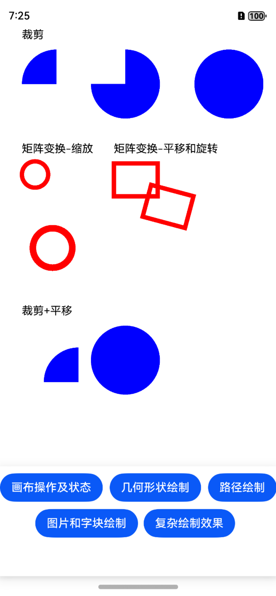
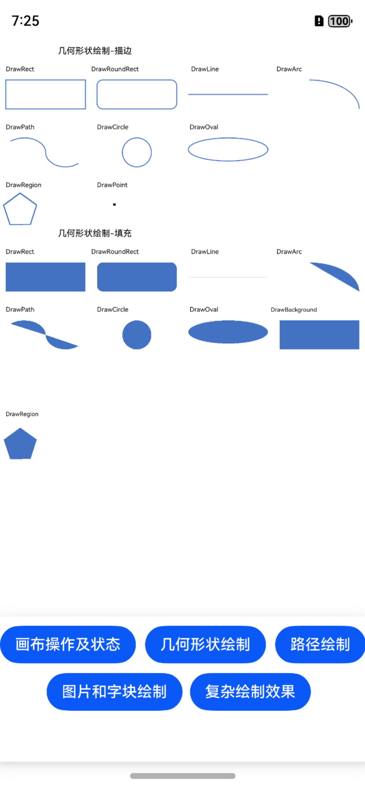
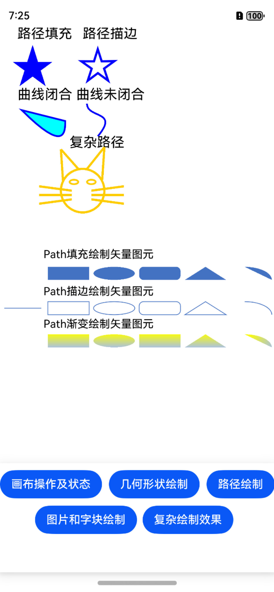
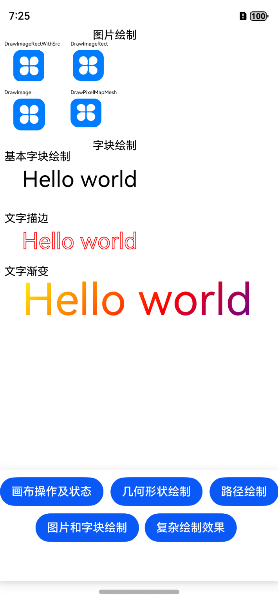
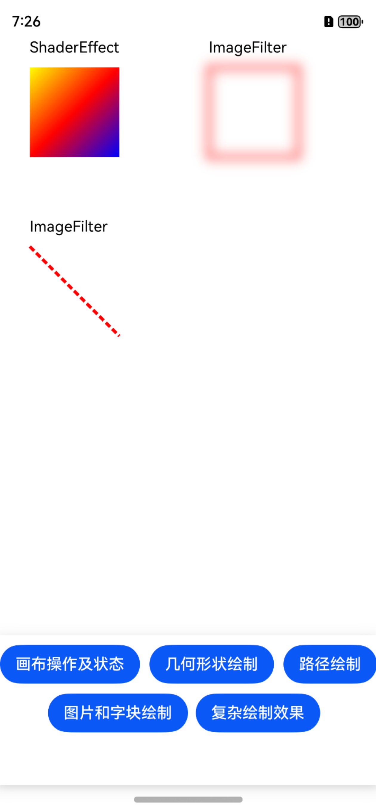

# 图形绘制与显示的示例（ArkTS）

#### 介绍

本示例以绘制矢量图元、文字、图片和其他复杂效果为例，展示了使用Drawing实现图形绘制与显示（ArkTS）的用法。本示例主要调用了[js-apis-graphics-drawing-V5](https://developer.huawei.com/consumer/cn/doc/harmonyos-references-V5/js-apis-graphics-drawing-V5)中的接口。

#### 效果预览







#### 具体实现

使用Drawing进行图形绘制与显示时，需要使用[js-apis-graphics-drawing-V5](https://developer.huawei.com/consumer/cn/doc/harmonyos-references-V5/js-apis-graphics-drawing-V5)的画布画笔绘制基本的2D图形和文字，调用绘制和显示的逻辑，最终借助Xnode在应用上显示图形和文字。

#### 使用说明

使用DevEco Studio 5.0.0及以上版本打开此工程，编译并安装到测试机中，打开应用。

#### 工程目录

```
├──entry/src/main
│  ├──ets                                 // ets代码区
│  │  ├──common
│  │  │  └──Logger.ts                     // 日志封装定义文件
│  │  │  └──CanvasRenderNode.ets          // 画布操作及状态相关的RenderNode
│  │  │  └──ShapeRenderNode.ets           // 几何形状绘制相关的RenderNode
│  │  │  └──PathRenderNode.ets            // 路径绘制相关的RenderNode
│  │  │  └──ImageRenderNode.ets           // 图片绘制相关的RenderNode
│  │  │  └──TextBlobRenderNode.ets        // 字块绘制相关的RenderNode
│  │  │  └──ComplexRenderNode.ets         // 复杂绘制效果相关的RenderNode
│  │  ├──entryability                     // 不涉及
│  │  ├──entrybackupability               // 不涉及
│  │  └──pages                            // 页面文件
│  │     └──Index.ets                     // 主界面
|  ├──resources                           // 资源文件目录
```

#### 相关权限

暂无

#### 依赖

暂无

#### 约束与限制

1. HarmonyOS系统：HarmonyOS 5.0.0 Release及以上；
2. DevEco Studio版本：DevEco Studio 5.0.0 Release及以上；
3. HarmonyOS SDK版本：API 12及以上版本；