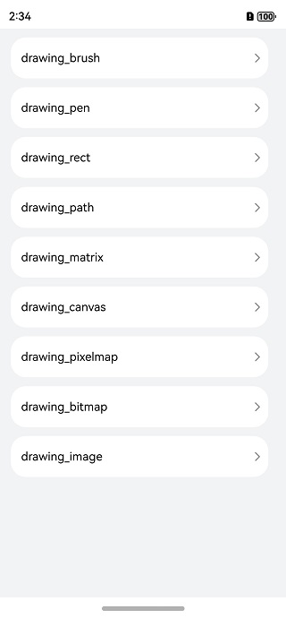
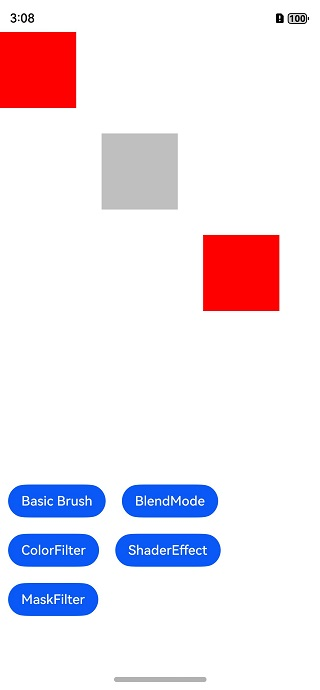
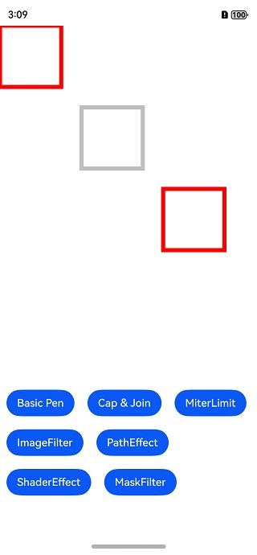
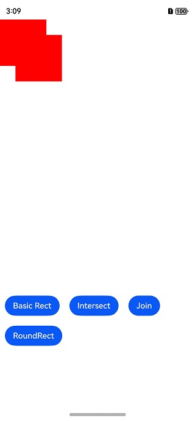
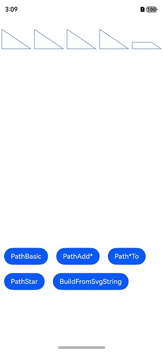
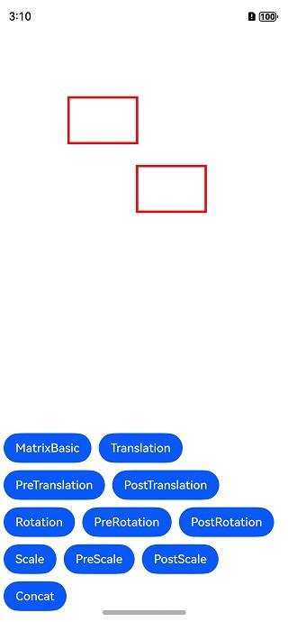
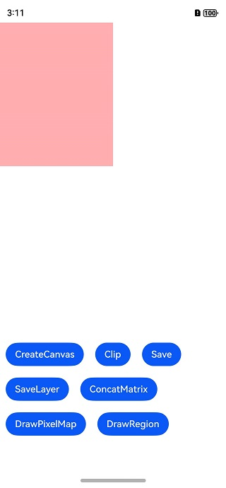
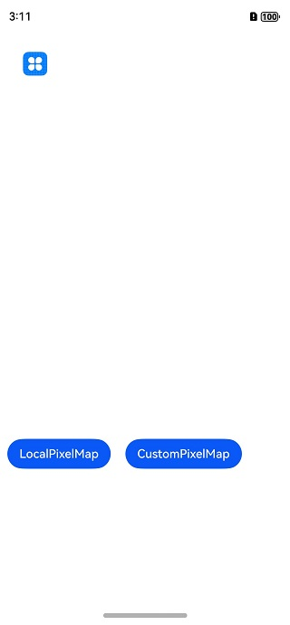
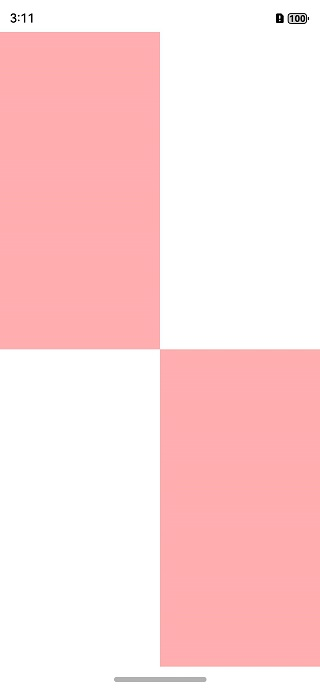

# Drawing API示例(C/C++)

#### 介绍

Drawing模块提供包括2D图形渲染、文字绘制和图片显示等功能函数。这是一个基于Drawing图形库API(C/C++)的示例项目，展示如何使用Drawing API进行基础的2D图形绘制操作，具体API详见[drawing-V5](https://developer.huawei.com/consumer/cn/doc/harmonyos-references-V5/_drawing-V5)。

#### 效果预览












#### 具体实现

使用Drawing进行图形绘制与显示时，需要使用Native Drawing模块的画布画笔绘制一个基本的2D图形；并将图形内容写入[NativeWindow](https://developer.huawei.com/consumer/cn/doc/harmonyos-guides-V5/native-window-guidelines-V5)提供的图形Buffer，将Buffer提交到图形队列；再利用XComponent将C++代码层与ArkTS层对接，实现在ArkTS层调用绘制和显示的逻辑，最终在应用上显示图形。

#### 使用说明

使用DevEco Studio 5.0.0及以上版本打开此工程，编译并安装到测试机中，打开应用。

#### 工程目录

```
├──entry/src/main
│  ├──cpp                           // C++代码区
│  │  ├──CMakeLists.txt             // CMake配置文件
│  │  ├──napi_init.cpp              // Napi模块注册
│  │  ├──common                     // 日志封装定义文件
│  │  │  └──log_common.h
│  │  ├──plugin                     // 生命周期管理模块
│  │  │  ├──plugin_manager.cpp
│  │  │  └──plugin_manager.h
│  │  ├──samples                    // samples渲染模块
│  │  │  ├──sample_graphics.cpp     // 示例代码所在的cpp文件
│  │  │  └──sample_graphics.h       // 示例代码相关代码头文件
│  │  ├──types                      // 不涉及
│  │  ├──utils                      // 多设备适配工具类
│  │  │  ├──adaptation_utils.cpp
│  │  │  └──adaptation_utils.h
│  ├──ets                           // ets代码区
│  │  ├──drawing
│  │  │  ├──pages
│  │  │  │  ├──BitmapDrawing.ets    // drawing_bitmap.h对应的示例展示界面
│  │  │  │  ├──BrushDrawing.ets     // drawing_brush.h对应的示例展示界面
│  │  │  │  ├──CanvasDrawing.ets    // drawing_canvas.h对应的示例展示界面
│  │  │  │  ├──ImageDrawing.ets     // drawing_image.h对应的示例展示界面
│  │  │  │  ├──MatrixDrawing.ets    // drawing_matrix.h对应的示例展示界面
│  │  │  │  ├──PathDrawing.ets      // drawing_path.h对应的示例展示界面
│  │  │  │  ├──PenDrawing.ets       // drawing_pen.h对应的示例展示界面
│  │  │  │  ├──PixelMapDrawing.ets  // drawing_pixel_map.h对应的示例展示界面
│  │  │  │  └──RectDrawing.ets      // drawing_rect.h对应的示例展示界面
│  │  ├──entryability               // 不涉及
│  │  ├──entrybackupability         // 不涉及
|  |  ├──interface
│  │  │  └──XComponentContext.ts    // XComponentContext
│  │  └──pages                      // 页面文件
│  │     └──Index.ets               // 主界面
|  ├──resources                     // 资源文件目录（不涉及）
```

#### 相关权限

暂无

#### 依赖

暂无

#### 约束与限制

1. HarmonyOS系统：HarmonyOS 5.0.0 Release及以上；
2. DevEco Studio版本：DevEco Studio 5.0.0 Release及以上；
3. HarmonyOS SDK版本：API 12及以上版本；
