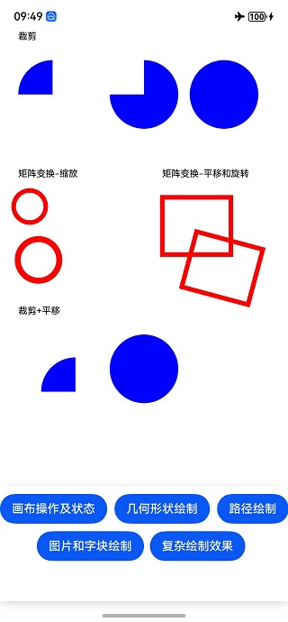
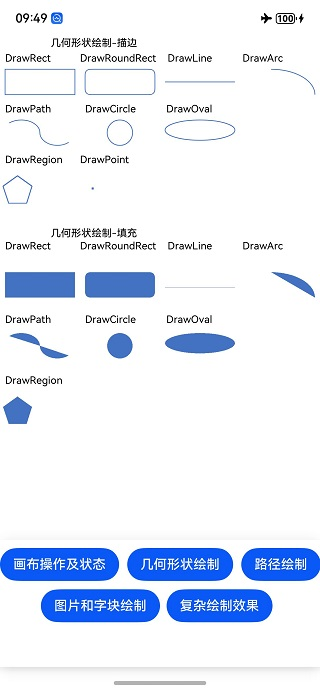
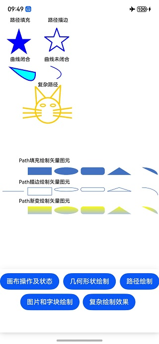
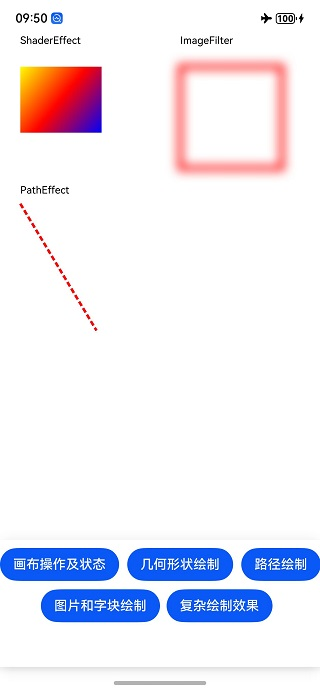

# 图形绘制与显示的示例（drawing C/C++）

#### 介绍

本示例以绘制矢量图元、文字、图片和其他复杂效果为例，展示了使用Drawing实现图形绘制与显示（C/C++）的用法。本示例主要调用了[drawing-V5](https://developer.huawei.com/consumer/cn/doc/harmonyos-references-V5/_drawing-V5)中的接口。

#### 效果预览







#### 具体实现

使用Drawing进行图形绘制与显示时，需要使用Native Drawing模块的画布画笔绘制一个基本的2D图形；并将图形内容写入[NativeWindow](https://developer.huawei.com/consumer/cn/doc/harmonyos-guides-V5/native-window-guidelines-V5)提供的图形Buffer，将Buffer提交到图形队列；再利用XComponent将C++代码层与ArkTS层对接，实现在ArkTS层调用绘制和显示的逻辑，最终在应用上显示图形。

#### 使用说明

使用DevEco Studio 5.0.0及以上版本打开此工程，编译并安装到测试机中，打开应用。

#### 工程目录

```
├──entry/src/main
│  ├──cpp                           // C++代码区
│  │  ├──CMakeLists.txt             // CMake配置文件
│  │  ├──hello.cpp                  // Napi模块注册
│  │  ├──napi_init.cpp              // Napi模块注册
│  │  ├──common
│  │  │  └──log_common.h            // 日志封装定义文件
│  │  ├──plugin                     // 生命周期管理模块
│  │  │  ├──plugin_manager.cpp
│  │  │  └──plugin_manager.h
│  │  ├──samples                    // samples渲染模块
│  │  │  ├──native_draw_canvas.cpp  // 画布操作及状态的绘制代码
│  │  │  ├──native_draw_complex.cpp // 复杂绘制效果的绘制代码
│  │  │  ├──native_draw_path.cpp    // 路径绘制的绘制代码
│  │  │  ├──native_draw_pictext.cpp // 图片和字块绘制的绘制代码
│  │  │  ├──native_draw_shape.cpp   // 几何形状绘制的绘制代码
│  │  │  └──native_draw.h           // 绘制头文件
│  │  │  ├──sample_demo.cpp         // 桥接相关代码
│  │  │  └──sample_demo.h           // 桥接相关代码头文件
│  │  ├──types                      // 不涉及
│  ├──ets                           // ets代码区
│  │  ├──entryability               // 不涉及
│  │  ├──entrybackupability         // 不涉及
|  |  ├──interface
│  │  │  └──XComponentContext.ts    // XComponentContext
│  │  └──pages                      // 页面文件
│  │     └──Index.ets               // 主界面
|  ├──resources                     // 资源文件目录（不涉及）
```

#### 相关权限

暂无

#### 依赖

暂无

#### 约束与限制

1. HarmonyOS系统：HarmonyOS 5.0.0 Release及以上；
2. DevEco Studio版本：DevEco Studio 5.0.0 Release及以上；
3. HarmonyOS SDK版本：API 12及以上版本；
