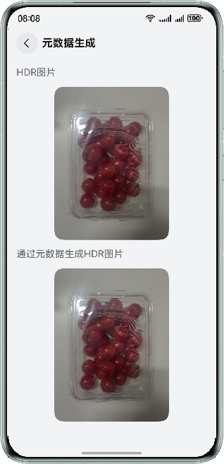

# 基于ImageProcessing处理图片

### 介绍
本示例通过使用ImageProcessing相关API实现图片缩放、图片色彩空间转换、元数据生产、HDR图片单层转双层、HDR图片双层转单层相关功能。

### 效果预览

|                   主页                   |                   图片缩放                    |
|:--------------------------------------:|:-----------------------------------------:|
|   |  |
|                图片色彩空间转换                |                   元数据生成                   |
|  |  |
|               HDR图片单双层转换               |
|    |

### 使用说明
1. 点击图片缩放跳转到图片缩放页面，切换不同的挡位可以查看不同挡位的缩放效果。
2. 点击图片色彩空间转换跳转到图片色彩空间转换页面，可以导入图库中的图片。
3. 导入图片后可以显示该图片是SDR图片还是HDR图片，点击色彩空间转换可以查看该图片可以转换的格式，点击对应格式可以将图片转换为对应格式。
4. 需要注意的是SDR转HDR图片可能会出现色彩空间转换算法不支持的情况，这时可以选择其他图片进行尝试。
5. 元数据生成以及HDR图片单双层转换这两个功能需要先有HDR图片，图片色彩空间支持导入HDR图片或者使用SDR图片生成HDR图片，确定有HDR图片后，这两个按钮变为可点击状态。
6. 点击元数据生成进入到元数据生成页面，通过HDR图片生成元数据后通过元数据也可以转换为HDR图片。
7. 点击HDR图片单双层转换按钮进入到HDR图片单双层转换页面，展示HDR单层图片转HDR双层图片以及HDR双层图片转为HDR单层图片。
### 工程目录

```
├──entry/src/main/cpp                                           // C++代码区
│  ├──ImageProcessing                                           // ImageProcessing图片处理类
│  │  ├──ImageProcessing.cpp                
│  │  └──ImageProcessing.h             
│  ├──types
│  │  └──libentry                                               // C++接口导出
│  │     ├──Index.d.ts                
│  │     └──oh-package.josn5              
│  ├──CMakeLists.txt                                            // CMake配置文件     
│  └──napi_init.cpp                                             // Native业务代码实现
├──entry/src/main/ets                                           // ArkTS代码区
│  ├──entryability
│  │  └──EntryAbility.ets                                       // 入口类
│  ├──entryability
│  │  └──EntryBackupAbility.ets                                 // 备份恢复框架
│  ├──pages
│  │  └──Index.ets                                              // 主页
│  └──view
│     ├──HDRImageConversionComponent.ets                        // 展示HDR图片单双层转换
│     ├──ImageColorSpaceConversionComponent.ets                 // 展示图片色彩空间转换
│     ├──ImageScalingComponent.ets                              // 展示图片缩放
│     └──MetadataGenerationComponent.ets                        // 展示元数据生产
└──entry/src/main/resources                                     // 应用资源文件

```

### 相关权限

不涉及。

### 依赖

不涉及。

### 约束与限制

1. 本示例仅支持标准系统上运行，支持设备：华为手机。

2. HarmonyOS系统：HarmonyOS 5.0.5 Release及以上。

3. DevEco Studio版本：DevEco Studio 5.0.5 Release及以上。

4. HarmonyOS SDK版本：HarmonyOS 5.0.5 Release及以上。