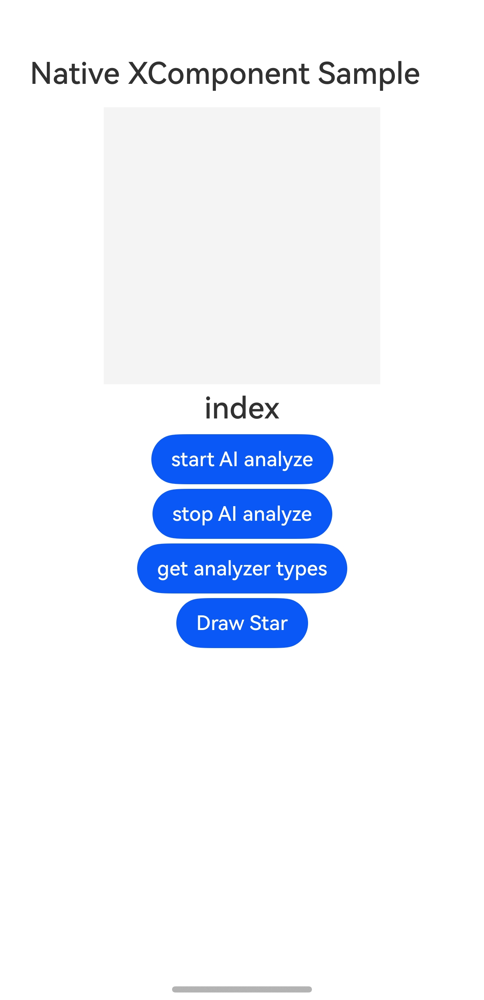
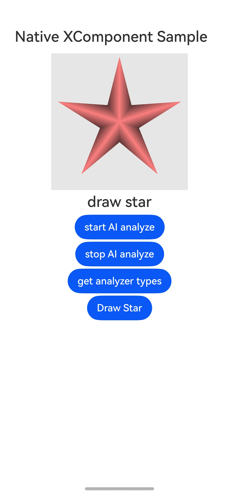
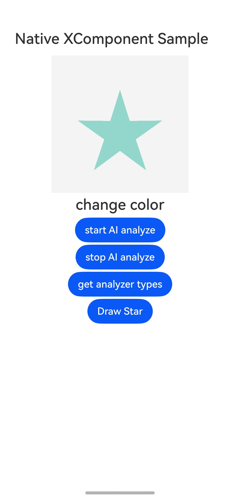

# XComponent

### 介绍

本示例主要介绍开发者如何使用ArkTS XComponent组件进行自绘制和使用AI分析能力，主要包括：XComponent组件使用，
SurfaceId获取方法，Surface生命周期回调使用，NativeWindow创建等知识点。开发者基于ArkTS侧获取的SurfaceId，
在Native侧调用OH_NativeWindow_CreateNativeWindowFromSurfaceId接口创建出NativeWindow实例后，使用OpenGL ES/EGL接口在XComponent组件上进行图形绘制。功能主要包括点击按钮绘制一个五角星，并可以通过点击XComponent区域改变五角星的颜色。

### 效果预览

| 主页                                   | 绘制五角星                                         | 改变颜色                                                |
|--------------------------------------|-----------------------------------------------|-----------------------------------------------------|
|  |  |  |

使用说明

1. 安装编译生成的hap包，并打开应用。

2. 点击页面底部“Draw Star”按钮，页面将绘制一个五角星。

3. 点击XComponent组件区域（页面中灰色区域）改变五角星颜色。


### 工程目录

```
├──entry/src/main
│  ├──cpp                           // C++代码区
│  │  ├──CMakeLists.txt             // CMake配置文件
│  │  ├──napi_init.cpp              // Napi模块注册
│  │  ├──common
│  │  │  └──common.h                // 常量定义文件
│  │  ├──manager                    // 生命周期管理模块
│  │  │  ├──plugin_manager.cpp
│  │  │  └──plugin_manager.h
│  │  ├──render                     // 渲染模块
│  │  │  ├──egl_core.cpp
│  │  │  ├──egl_core.h
│  │  │  ├──plugin_render.cpp
│  │  │  └──plugin_render.h
│  ├──ets                           // ets代码区
│  │  ├──entryability
│  │  │  └──EntryAbility.ts         // 程序入口类
│  │  └──pages                      // 页面文件
│  │     └──Index.ets               // 主界面
|  ├──resources         			// 资源文件目录
```

### 具体实现

通过在IDE中创建Native c++ 工程，在c++代码中定义对外接口为DrawPattern，在ArkTS侧调用该接口可在页面上绘制出一个五角星。在
c++代码中定义对外接口为ChangeColor，点击XComponent组件时，在ArkTs侧调用该接口可在页面绘制一个大小相同、颜色不同的五角星，达到改变颜色的目的。

在XComponentController的OnSurfaceCreated回调中，传入XComponent的surfaceId，在Native侧调用OH_NativeWindow_CreateNativeWindowFromSurfaceId创建NativeWindow实例并初始化
EGL环境。在XComponentController的OnsurfaceChanged回调中，传入surfaceId、宽和高，并以此为输入调用EGL相关的接口改变对应NativeWindow的尺寸和内容。

源码参考：[main目录](entry/src/main/)下的文件。涉及到的相关接口：

#### ArkTS组件
XComponentController

| 接口名                                       | 描述                       |
|-------------------------------------------|--------------------------|
| getXComponentSurfaceId(): string          | 获取XComponent对应Surface的ID |
| onSurfaceCreated(surfaceId: string): void |当XComponent持有的Surface创建后进行该回调|
|onSurfaceChanged(surfaceId: string, rect: SurfaceRect): void|当XComponent持有的Surface尺寸更新时进行该回调，包括初始尺寸设定|
|onSurfaceDestroyed(surfaceId: string): void|当XComponent持有的Surface销毁后进行该回调|

#### C API
| 接口名                                       | 描述                       |
|-------------------------------------------|--------------------------|
| int32_t OH_NativeWindow_CreateNativeWindowFromSurfaceId (uint64_t surfaceId, OHNativeWindow **window )         | 通过surfaceId创建对应的OHNativeWindow |
| void OH_NativeWindow_DestroyNativeWindow (OHNativeWindow* window)|将OHNativeWindow对象的引用计数减1，当引用计数为0的时候，该OHNativeWindow对象会被析构掉|


### 相关权限

不涉及。

### 依赖

不涉及。

### 约束与限制

1. 本示例仅支持标准系统上运行，支持设备：手机、PC

2. 本示例为Stage模型，支持API12版本SDK，SDK版本号(API Version 12 Release)，镜像版本号(5.0 Release)

3. 本示例需要使用DevEco Studio 版本号(4.0 Release)及以上版本才可编译运行

### 下载

如需下载本工程，执行如下命令：

```
git clone https://gitee.com/harmonyos_samples/DocsSample_XComponent.git
```
