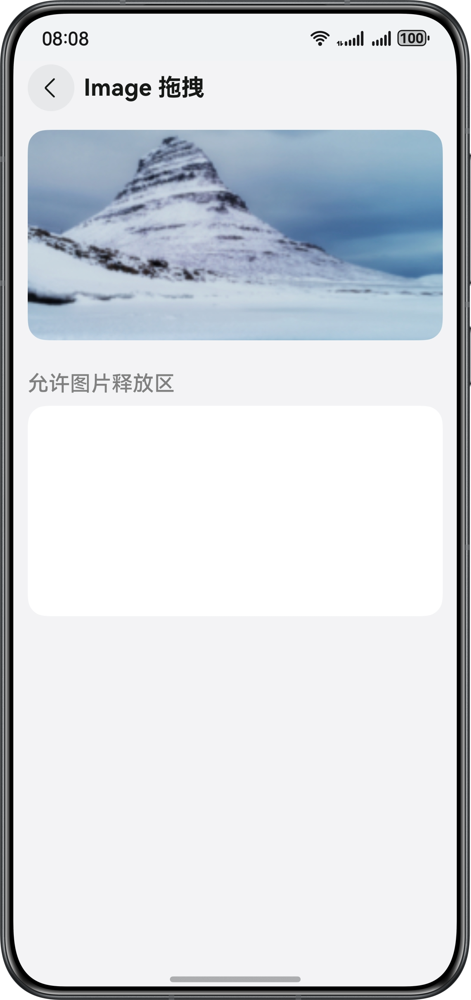

# Implement Custom Drag-and-Drop of Components

## Overview


This example is based on the drag-and-drop framework of ArkUI, implementing the drag-and-drop functions for components such as images, rich text, text, input boxes, and lists. By setting the interface information in drag-and-drop events, it customizes drag-and-drop responses to achieve scenarios like adding watermarks to drag-and-drop images, customizing drag-and-drop backplate images, and AI recognition of dragged content. For dragging file-type data, this example realizes the drag-and-drop of online image resources and local video files. For dragging mixed text and image content, this example is implemented through three methods: based on the Text component, the RichEditor component, and manually constructing multi-Entry data respectively.

## Preview

###     



## How to Use

1. The home page displays the entry component for the drag-and-drop functionality.

2. Tap the **ImageDrag**, **HyperLinkDrag**, **RichEditorDrag**, **TextInputDrag**, **TextAreaDrag** buttons to the
   drag-and-drop page of the corresponding component. Select and hold the target content and drag it
   to the component that allows drop.

3. Tap the **ListDrag** button to the drag-and-drop page of list items. Select the items to be dragged in a list, and
   then drag the selected items to another list.

4. Tap the **BackgroundCustomization** button to the page of customizing drag-and-drop background, and display the
   custom background image during the drag-and-drop process.

5. Tap the **WatermarkAdded** button to the page of adding watermarks to the dragged image, add a watermark to the
   result image after dropping it.

6. Tap the **AIRecognition** button to the page of AI text recognition, display the text recognition result after the
   image is dropped.

7. Click the **OnlineImage** button to navigate to the online image drag-and-drop page. After dragging and releasing, display the image in the release area and save the image to the local storage.

8. Click the **LocalVideo** button to navigate to the local video drag-and-drop page. After dragging and releasing, display the video in the release area and save the video to the sandbox path.

9. Click the **TextAndImageIndex** button to navigate to the mixed text-image drag-and-drop directory page.

10. On the mixed text-image drag-and-drop directory page, click the **Text** button to navigate to the mixed text-image content page using the Text component. Select mixed text-image content on the drag source side; after dragging and releasing, display images and text on the drop target side.

11. On the mixed text-image drag-and-drop directory page, click the **RichEditor** button to navigate to the mixed text-image content page using the RichEditor component. Select mixed text-image content on the drag source side; after dragging and releasing, display images and text on the drop target side.

12. On the mixed text-image drag-and-drop directory page, click the **MultiEntry** button to navigate to the MultiEntry mixed text-image content page. Select mixed text-image content on the drag source side; after dragging and releasing, drop targets with different receiving formats will accept image and text content.

13. Tap the **SpliceScreenDrag** button to create a UIAbility, trigger it to enter the pending split screen state through
   gestures, and enter any dragged page, then click the app icon on the desktop again to open a new window and enter the
   drag and drop page to achieve split screen dragging.

14. This example supports drag-and-drop across devices.

## Project Directory

```
 ├─entry/src/main/ets/                       // Home page of the app
 │   ├──common   
 │   │  ├──Constants.ets                     // Constants class     
 │   │  ├──ResoureUtil.ets                   // Link util fuctions
 │   │  └──Utils.ets                         // Util fuctions      
 │   ├──entryability
 │   │  └──EntryAbility.ets                  // Entry ability
 │   ├──entrybackupability
 │   │  └─EntryBackupAbility.ets             // Backup and restore ability
 │   ├──pages
 │   │  ├──aiRecognition
 │   │  │  └─AIRecognition.ets               // AI Recognition
 │   │  ├──background
 │   │  │  └─Background.ets                  // Customize the background                     
 │   │  ├──hyperlink
 │   │  │  └─HyperLink.ets                   // Drag and drop of a hyperlink        
 │   │  ├──image
 │   │  │  └─Image.ets                       // Drag and drop of an image       
 │   │  ├──list
 │   │  │  └─List.ets                        // Drag and drop of a list
 │   │  ├──localvideo
 │   │  │  └─LocalVideo.ets                  // Drag and drop of local video
 │   │  ├──onlineimage
 │   │  │  └─OnlineImage.ets                 // Drag and drop of online image
 │   │  ├──richEditor
 │   │  │  └─RichEditor.ets                  // Drag and drop of rich text
 │   │  ├──textandimage
 │   │  │  └─MultiEntry.ets                  // UDMF multi-entry mixed text-image drag-and-drop
 │   │  │  └─RichEditor.ets                  // RichEditor component mixed text-image drag-and-drop
 │   │  │  └─Text.ets                        // Text component mixed text-image drag-and-drop
 │   │  │  └─TextAndImageIndex.ets           // Mixed text-image drag-and-drop entry     
 │   │  ├──textarea
 │   │  │  └─TextArea.ets                    // Drag and drop of multi-line text
 │   │  ├──textInput
 │   │  │  └─TextInput.ets                   // Drag and drop of single-line text
 │   │  ├──watermark
 │   │  │  └─Watermark.ets                   // Add the watermark 
 │   │  └──Index.ets                         // Home page entry
 │   ├──singletonability
 │   │  └─SingletonAbility.ets               // Singleton mode ability
 │   └──view                                 // Styles of the view
 │      ├──SplitScreenButton.ets  
 │      └──UserButton.ets
 ├──entry/src/main/resources                 // Static resources of the app
 └──entry/src/main/module.json5              // Module configuration
 
```

## How to Implement

1. The drag framework implements drag-and-drop of data for the following components by default. For those components,
   you only need to set the **draggable** property to **true**.

2. By default, data can be dragged from the following components:

   **Search**, **TextInput**, **TextArea**, **RichEditor**, **Text**, **Image**, **FormComponent**, **Hyperlink**

3. By default, data can be dropped to the following components:

   **Search**, **TextInput**, **TextArea**, **Video**

4. Customize drag-and-drop response via common drag events. Customize the background and add watermarks in the **onDragStart()**, and realize AI recognition of the dragged content in the **onDrop()**.

5. Simulate the scenario of online image dragging and dropping, and implement the download of image resources on the receiving side.

6. For local resource file dragging, call the asynchronous data acquisition interface **startDataLoading** in **onDrop** to asynchronously fetch the dragged data.

7. Use the Text component and RichEditor component to construct **multi-record** and **multi-entry** type data, enabling drag-and-drop functionality for mixed text and image content.

8. Use **singleton** to implement split-screen drag-and-drop of the same app.


## Required Permissions

N/A

## Constraints

1. The sample app is supported only on Huawei phones, tablets, and PC/2in1 devices running the standard system.

2. The HarmonyOS version must be HarmonyOS 5.0.5 Release or later.

3. The DevEco Studio version must be DevEco Studio HarmonyOS 5.0.5 Release or later.

4. The HarmonyOS SDK version must be HarmonyOS 5.0.5 Release SDK or later.