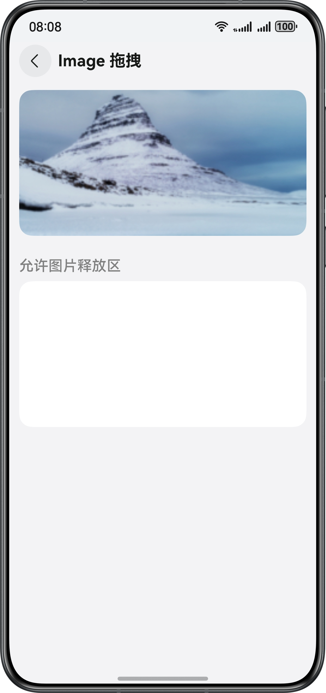

# 实现组件的自定义拖拽功能

## 介绍

本示例基于ArkUI的拖拽框架，实现图片、富文本、文本、输入框、列表等组件的拖拽功能，通过设置拖拽事件中的接口信息自定义拖拽响应，实现拖拽图像增加水印、自定义拖拽背板图、AI识别拖拽内容等拖拽场景。针对文件类型数据的拖拽，本示例实现了在线图片资源拖拽和本地视频文件拖拽。针对图文混排内容的拖拽，本示例分别基于Text组件、RichEditor组件和手动构造多Entry数据三种方式实现。

## 效果预览

### 效果预览



## 使用说明

1.首页展示拖拽功能入口。

2.点击ImageDrag、HyperLinkDrag、RichEditorDrag、TextInputDrag、TextAreaDrag按钮跳转到对应组件的拖拽页面，选中内容后长按可以将组件拖拽到释放区内。

3.点击ListDrag按钮跳转到List组件拖拽页面，选择其中一列要拖拽的内容后，将选中的内容拖拽到另一列。

4.点击BackgroundCustomization按钮跳转到自定义拖拽背板页面，在拖拽图片的过程中显示自定义的背板图。

5.点击WatermarkAdded按钮跳转到拖拽图片增加水印页面，拖拽释放后，在结果图中增加水印。

6.点击AIRecognition按钮跳转到AI识别拖拽内容页面，拖拽释放后，在释放区域内显示文字识别的结果。

7.点击OnlineImage按钮跳转到在线图片拖拽页面，拖拽释放后，在释放区域内显示图片并且将图片保存到本地。

8.点击LocalVideo按钮跳转到本地视频拖拽页面，拖拽释放后，在释放区域内显示视频，同时将视频保存到沙箱路径。

9.点击TextAndImageIndex按钮跳转到图文混排拖拽目录页面。

10.在图文混排拖拽目录页面点击Text按钮跳转到Text组件图文混排内容页面，在拖出方选择图文混排内容，拖拽释放后，在落入方显示图片和文字。

11.在图文混排拖拽目录页面点击RichEditor按钮跳转到RichEditor组件图文混排内容页面，在拖出方选择图文混排内容，拖拽释放后，在落入方显示图片和文字。

12.在图文混排拖拽目录页面点击MultiEntry按钮跳转到MultiEnty图文混排内容页面，在拖出方选择图文混排内容，拖拽释放后，不同接收格式的落入方落入图片和文字内容。

13.点击SpliceScreenDrag按钮创建一个UIAbility，通过手势触发进入待分屏状态且进入任一拖拽页面后，再次点击桌面上的应用图标打开新窗口进入拖拽页面即可实现分屏拖拽。

14.本示例支持跨设备拖拽。

## 工程目录

```
 ├─entry/src/main/ets/                       // 应用首页
 │   ├──common
 │   │  ├──Constants.ets                     // 常量类
 │   │  ├──ResoureUtil.ets                   // 链接工具函数
 │   │  └──Utils.ets                         // 工具函数
 │   ├──entryability
 │   │  └─EntryAbility.ets                   // 程序入口类
 │   ├──entrybackupability
 │   │  └─EntryBackupAbility.ets             // 备份恢复
 │   ├──pages    
 │   │  ├──aiRecognition
 │   │  │  └─AIRecognition.ets               // AI识别拖拽内容
 │   │  ├──background
 │   │  │  └─Background.ets                  // 自定义背景板                
 │   │  ├──hyperlink
 │   │  │  └─HyperLink.ets                   // 超链接拖拽
 │   │  ├──image
 │   │  │  └─Image.ets                       // 图片拖拽        
 │   │  ├──list
 │   │  │  └─List.ets                        // 列表拖拽
 │   │  ├──localvideo
 │   │  │  └─LocalVideo.ets                  // 本地视频资源拖拽
 │   │  ├──onlineimage
 │   │  │  └─OnlineImage.ets                 // 在线图片拖拽
 │   │  ├──richEditor
 │   │  │  └─RichEditor.ets                  // 富文本拖拽
 │   │  ├──textandimage
 │   │  │  └─MultiEntry.ets                  // UDMF多Entry图文混排拖拽
 │   │  │  └─RichEditor.ets                  // RichEditor组件图文混排拖拽
 │   │  │  └─Text.ets                        // Text组件图文混排拖拽     
 │   │  │  └─TextAndImageIndex.ets           // 图文混排拖拽入口
 │   │  ├──textarea
 │   │  │  └─TextArea.ets                    // 多行文本拖拽
 │   │  ├──textInput
 │   │  │  └─TextInput.ets                   // 单行文本拖拽
 │   │  ├──watermark
 │   │  │  └─Watermark.ets                   // 水印拖拽
 │   │  └──Index.ets                         // 主页入口
 │   ├──singletonability
 │   │  └─SingletonAbility.ets               // 单实例模式入口
 │   └──view                                 // 定义通用样式
 │      ├──SplitScreenButton.ets
 │      └──UserButton.ets
 ├──entry/src/main/resources                 // 应用静态资源
 └──entry/src/main/module.json5              // 模块配置相关
 
```

## 具体实现

1.拖拽框架对以下组件实现了默认的拖拽能力，支持对数据的拖入和拖出响应，开发者只需要将这些组件的draggable属性设置为true，即可使用默认的拖拽能力。

2.默认支持拖出能力的组件(可从组件上拖出数据): Search、TextInput、TextArea、RichEditor、Text、Image、FormComponent、Hyperlink。

3.默认支持拖入能力的组件(目标组件可响应拖入数据): Search、TextInput、TextArea、Video。

4.通过实现通用拖拽事件可以自定义拖拽响应，在onDragStart接口中实现自定义背板和增加水印，在onDrop接口中实现AI识别拖拽内容。

5.模拟在线图片拖拽的场景，在落入方实现图片资源的下载。

6.针对本地资源文件的拖拽，在onDrop中调用异步数据获取的接口startDataLoading异步获取拖拽数据。

7.通过Text组件、RichEditor组件，构造多Record类型和多Entry类型数据，实现图文混排内容的拖拽。

8.通过单实例模式实现同一应用分屏拖拽。

## 相关权限

不涉及

## 约束与限制

1. 本示例仅支持标准系统上运行，支持设备：phone，table，PC/2in1。

2. HarmonyOS系统：HarmonyOS 5.0.5 Release及以上。

3. DevEco Studio版本：DevEco Studio 5.0.5 Release及以上。

4. HarmonyOS SDK版本：HarmonyOS 5.0.5 Release SDK及以上。