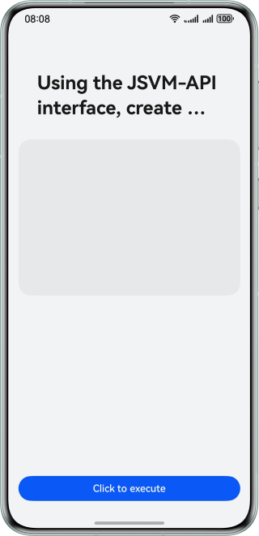

# Creating and Destroying JSVMs Using JSVM-API
### Overview
This sample shows how to use JSVM-API to dynamically pass the JavaScript code or characters of a native custom function from ArkTS to the native side for execution. After the execution is complete, the execution result is obtained and the native JSVMs are destroyed.

### Preview


### Project Directory

```
├──entry/src/main
│  ├──cpp                             // Native layer
│  │  ├──types/libentry
│  │  │  └──index.d.ts                // Interfaces exposed to ArkTS
│  │  ├──CMakeLists.txt               // Compilation entry
│  │  ├──common.h                     // Header file
│  │  └──create_jsvm_runtime.cpp      // Native methods for creating JSVM
│  └──ets                             // UI layer
│     ├──entryability
│     │  └──EntryAbility.ets          // App entry
│     ├──entrybackupability
│     │  └──EntryBackupAbility.ets
│     └──pages
│        └──Index.ets                 // Home page of the app
└──entry/src/main/resources           // App resource directory
```

### How to Implement

After JSVMs are created on the native side, the JavaScript code or characters of a custom function are passed in, that is, the function is executed on the native side. After the execution is complete, the function can be implemented and call the **releaseJsCore()** method to release the JSVMs.

### Permissions

N/A

### Constraints
1. The sample is only supported on Huawei phones with standard systems.
2. The HarmonyOS version must be HarmonyOS 5.0.5 Release or later.
3. The DevEco Studio version must be DevEco Studio 5.0.5 Release or later.
4. The HarmonyOS SDK version must be HarmonyOS 5.0.5 Release SDK or later.