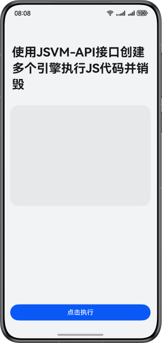

# 使用JSVM-API接口创建多个引擎执行JS代码并销毁
### 简介
本示例展示了如何使用JSVM-API在ArkTS环境中，动态传入JavaScript或自定义的Native函数代码字符串到Native侧执行，并在执行完成后获取执行结果，同时销毁Native侧执行环境，通过在Native侧执行ArkTS代码可以加快代码执行效率，提高程序性能表现。

### 效果预览


### 工程目录

```  
├──entry/src/main
│  ├──cpp                             // Native层
│  │  ├──types/libentry
│  │  │  └──index.d.ts                // 暴露给ArkTS侧的接口  
│  │  ├──CMakeLists.txt               // 编译入口  
│  │  ├──common.h                     // 头文件  
│  │  └──create_jsvm_runtime.cpp      // 创建jsvm的Native方法封装     
│  └──ets                             // UI层  
│     ├──entryability
│     │  └──EntryAbility.ets          // 应用入口
│     ├──entrybackupability  
│     │  └──EntryBackupAbility.ets  
│     └──pages                        
│        └──Index.ets                 // 应用主页面  
└──entry/src/main/resources           // 应用资源目录  
```  

### 具体实现

通过在Native侧自定义创建JS执行环境，传入要执行的JS代码或自定义函数的字符，即可在Native侧进行函数执行，执行完成后自行实现并调用释放执行环境的releaseJsCore()方法。

### 相关权限

不涉及

### 约束与限制
1. 本示例仅支持标准系统上运行，支持设备：华为手机。
2. HarmonyOS系统：HarmonyOS 5.0.5 Release及以上。
3. DevEco Studio版本：DevEco Studio 5.0.5 Release及以上。
4. HarmonyOS SDK版本：HarmonyOS 5.0.5 Release SDK及以上。