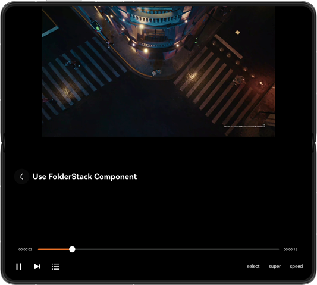
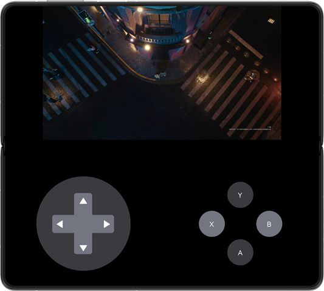
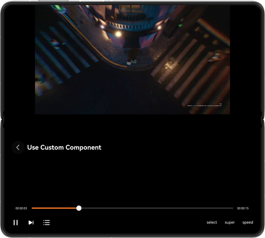

# Implementing the Hover State of a Foldable Screen

### Overview

This sample showcases the hover state of a hand-held foldable screen. That is, the device can be half-folded and then stand on the desk. This state is applicable to scenarios that do not require frequent interactions, such as video calls and video playback. When a foldable screen enters the hover state, however, the crease area in the middle is difficult to operate and may encounter deformation. Therefore, the crease area needs to be avoided. This sample provides three methods for implementing the hover state of a foldable screen: **FolderStack**, **FoldSplitContainer**, and custom component.

### Preview

| FolderStack                        | FoldSplitContainer              | Custom component                |
|------------------------------------| ------------------------------- | ------------------------------- |
|  |  |  |

### How to Use

1. Open the app to enter the home page, on which you can find three buttons for implementing the hover state. On this page, rotating the half-folded device to landscape mode directly enters the hover state implementation page.

2. Tap the first button to access the **FolderStack** component page for implementing the hover state. Operations are allowed on the video on the page. The hover state can be entered if the device is half-folded in landscape mode, and the page can be rotated freely.

3. Tap the second button to access the **FoldSplitContainer** component page for implementing the hover state. The layout of the page is similar to that of a game page, and the operation function is not implemented. In addition, only the two-pane state can be held. The hover state can be entered if the device is half-folded in landscape mode, and the page can be rotated freely.

4. Tap the third button to access the custom component page for implementing the hover state. Operations are allowed on the video on the page. The hover state can be entered if the device is half-folded in landscape mode, and the page can be rotated only horizontally.

### Project Directory

```
├──entry/src/main/ets
│  ├──common
│  │  ├──utils
│  │  │  ├──AVPlayerUtil.ets            // Media utility
│  │  │  ├──DisplayUtil.ets             // Display utility
│  │  │  └──WindowUtil.ets              // Window utility
│  │  └──CommonConstants.ets            // Common constants
│  ├──entryability
│  │  └──EntryAbility.ets               // Entry ability
│  ├──entrybackupability
│  │  └──EntryBackupAbility.ets
│  ├──pages
│  │  └──Index.ets                      // Home page
│  └──view
│     ├──basicview
│     │  ├──BackTitleView.ets           // Back component
│     │  ├──OperationView.ets           // Game operation component
│     │  ├──VideoControlView.ets        // Video control component
│     │  └──VideoPlayView.ets           // Video playback component
│     └──hoverview
│        ├──HoverByCustom               // Hover state implemented by a custom component
│        ├──HoverUseFolderStack         // Hover state implemented using FolderStack
│        └──HoverUseFoldSplitContainer  // Hover state implemented using FoldSplitContainer
└──entry/src/main/resources             // Static resources of the app
```

### How to Implement

1. The **FolderStack** component provides the hover state capability, in which the **UpperItem** field is used to modify internal components and implement the hover state layout.

2. The **FoldSplitContainer** component uses a fixed two- or three-pane layout. When the device enters the hover state, the crease area is automatically avoided, and the **primary** and **secondary** parameters can be used to set the components in each pane.

3. A custom component is used to implement the hover state by monitoring the folding and rotation of the device. When the device enters the hover state, the size and position of the crease area are obtained, and the layout of the child components is adjusted.

### Permissions

- N/A

### Dependencies

- N/A

### Constraints

1. The sample is only supported on Huawei phones with standard systems.

2. The HarmonyOS version must be HarmonyOS 5.0.5 Release or later.

3. The DevEco Studio version must be DevEco Studio 5.0.5 Release or later.

4. The HarmonyOS SDK version must be HarmonyOS 5.0.5 Release SDK or later.