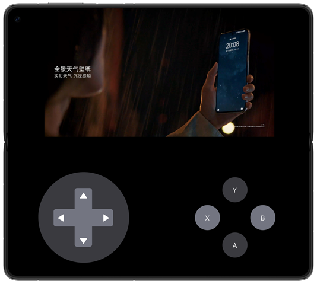

# 实现折叠屏悬停态

### 简介

本示例基于折叠屏提供的手持操作体验“悬停态”，即可将设备半折后立在桌面上，适用于不需要频繁进行交互的场景，例如视频通话，视频播放等，折叠屏进入悬停态时，中间弯折的区域难以操作且内容会变形，需要进行避让。本示例提供实现折叠屏悬停态的三种实现方式：FolderStack组件，FoldSplitContainer组件以及自定义组件。

### 效果预览：

| FolderStack组件实现悬停态              | FoldSplitContainer组件实现悬停态       | 自定义组件实现悬停态                      |
|---------------------------------|---------------------------------|---------------------------------|
|  |  |  |

### 使用说明：

1. 打开应用进入主页面后，会有三种实现悬停态页面的按钮，在此页面横屏半折设备直接进入自定义实现悬停态的页面，并展现悬停态（注意：只有在半折叠横屏状态下能上下开合的折叠屏设备才可实现悬停态效果）。

2. 点击第一个按钮，进入FolderStack组件实现悬停态页面，可对页面内的视频进行操作，横屏半折状态可进入悬停态，此时页面可自由旋转。

3. 点击第二个按钮，进入FoldSplitContainer组件实现悬停态页面，页面是仿照游戏页面进行布局，未实现操作功能，且只能保持二分栏状态，横屏半折状态可进入悬停态，此时页面可自由旋转。

4. 点击第三个按钮，进入自定义组件实现悬停态页面，可对页面内的视频进行操作，横屏展开状态下半折叠可进入悬停态，此时页面仅可横向旋转。

### 工程目录

```
├──entry/src/main/ets
│  ├──common
│  │  ├──utils      
│  │  │  ├──AVPlayerUtil.ets            // 媒体工具类   
│  │  │  ├──DisplayUtil.ets             // 显示工具类   
│  │  │  └──WindowUtil.ets              // 窗口工具类
│  │  └──CommonConstants.ets            // 公共常量类
│  ├──entryability
│  │  └──EntryAbility.ets               // 程序入口类
│  ├──entrybackupability
│  │  └──EntryBackupAbility.ets        
│  ├──pages                  
│  │  └──Index.ets                      // 首页
│  └──view
│     ├──basicview                      
│     │  ├──BackTitleView.ets           // 返回组件
│     │  ├──OperationView.ets           // 游戏操作组件
│     │  ├──VideoControlView.ets        // 视频控制组件
│     │  └──VideoPlayView.ets           // 视频播放组件
│     └──hoverview                      
│        ├──HoverByCustom               // 自定义实现悬停态组件
│        ├──HoverUseFolderStack         // FolderStack实现悬停态组件
│        └──HoverUseFoldSplitContainer  // FoldSplitContainer实现悬停态组件
└──entry/src/main/resources             // 应用静态资源目录
```

### 具体实现

1. FolderStack组件提供了悬停态能力，使用UpperItem字段修饰内部组件实现悬停态布局。

2. FoldSplitContainer组件为固定二分栏或者三分栏布局，在悬停态会自动避让折痕区，使用primary、secondary参数可设置各分栏内的组件。

3. 自定义实现悬停态主要是通过display监听设备的折叠和旋转状态，当进入悬停态时获取折痕区的大小和位置，并让子组件调整布局。

### 相关权限

- 不涉及

### 依赖

- 不涉及

### 约束与限制

1. 本示例仅支持标准系统上运行，支持设备：华为手机。

2. HarmonyOS系统：HarmonyOS 5.0.5 Release及以上。

3. DevEco Studio版本：DevEco Studio 5.0.5 Release及以上。

4. HarmonyOS SDK版本：HarmonyOS 5.0.5 Release SDK及以上。