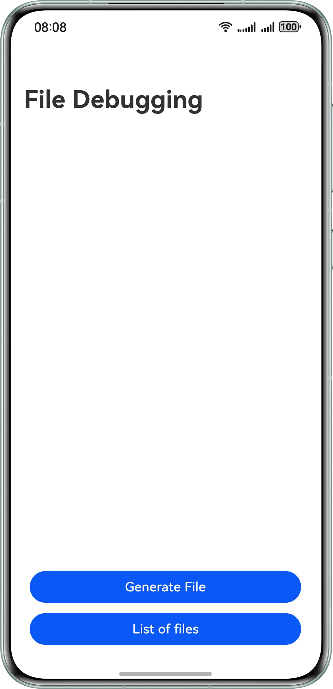
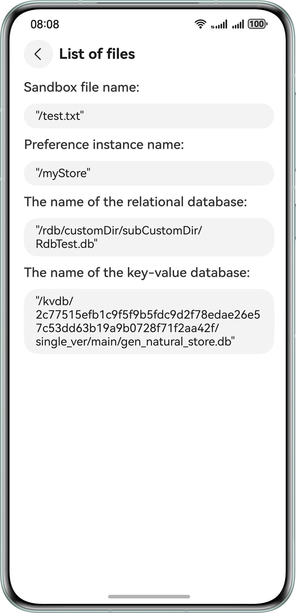

# Generating a Sandbox File with One Click

## Overview

This sample showcases one-click generation of the sandbox file, user preferences, KV store based on the **fileIo**, **distributedKVStore**, **preferences**, and **relationalStore** APIs.
The RDB store file function facilitates file transfer between the device and the computer.


## Preview
| **Home page**                                     | **File list**                                     |
|---------------------------------------------------|---------------------------------------------------|
|  |  |


## How to Use

1. Tap the Generate File button to generate an application file and a database file on the device.

2. Tap the File List button to view the names and types of the files generated on the device.

### How to Implement

1. The **fileIo**, **distributedKVStore**, **preferences**, and **relationalStore** APIs are used to generate an application file and a database file in the sandbox directory of the device.

2. You can search for the corresponding file name in the sandbox directory to check whether the file is generated.

## Project Directory
```
├──entry/src/main/ets
│  ├──common
│  │  └──Logger.ets                            // Logger  
│  ├──entryability
│  │  └──EntryAbility.ets                      // Entry ability
│  ├──entrybackupability
│  │  └──EntryBackupAbility.ets                // Data backup and restoration
│  ├──pages
│  │  └──Index.ets                             // Home page 
│  └──view
│     └──File.ets                              // File list page
└──entry/src/main/resources                    // App resource directory
```

## Permissions

ohos.permission.INTERNET: Allows an application to access the Internet.

## Constraints

1. The sample is only supported on Huawei phones with standard systems.

2. The HarmonyOS version must be HarmonyOS 5.0.5 Release or later.

3. The DevEco Studio version must be DevEco Studio 5.0.5 Release or later.

4. The HarmonyOS SDK version must be HarmonyOS 5.0.5 Release SDK or later.