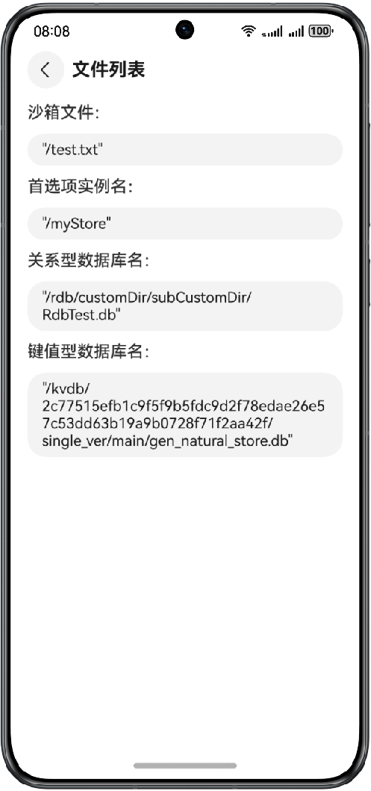

# 实现一键生成沙箱文件功能

## 介绍

本示例基于文件I/O接口和不同的数据库distributedKVStore,preferences,relationalStore接口，实现了一键在终端内生成沙箱文件、用户首选项、kv数据库、
关系型数据库文件功能，便于用户调试终端与电脑间的文件传输。


## 效果预览
| **主页**                                          | **文件列表**                                       |
|-------------------------------------------------|------------------------------------------------|
|  |  |


## 使用说明

1.点击生成文件，即可在终端内生成应用文件和数据库文件。

2.点击文件列表，即可查看终端内生成的文件名称和类型。

### 具体实现

1.通过fileIo，distributedKVStore，preferences，relationalStore接口在终端沙箱目录生成文件与数据库文件。

2.通过在终端沙箱目录搜寻对应的文件名来验证文件是否生成。

## 工程目录
```
├──entry/src/main/ets
│  ├──common
│  │  └──Logger.ets                            // 日志类  
│  ├──entryability
│  │  └──EntryAbility.ets                      // 程序入口类 
│  ├──entrybackupability
│  │  └──EntryBackupAbility.ets                // 数据备份恢复类
│  ├──pages
│  │  └──Index.ets                             // 主页页面  
│  └──view
│     └──File.ets                              // 文件列表页面
└──entry/src/main/resources                    // 应用资源目录
```

## 相关权限

ohos.permission.INTERNET：允许使用Internet网络。

## 约束与限制

1.本示例仅支持标准系统上运行，支持设备：华为手机。

2.HarmonyOS系统：HarmonyOS 5.0.5 Release及以上。

3.DevEco Studio版本：DevEco Studio 5.0.5 Release及以上。

4.HarmonyOS SDK版本：HarmonyOS 5.0.5 Release SDK及以上。