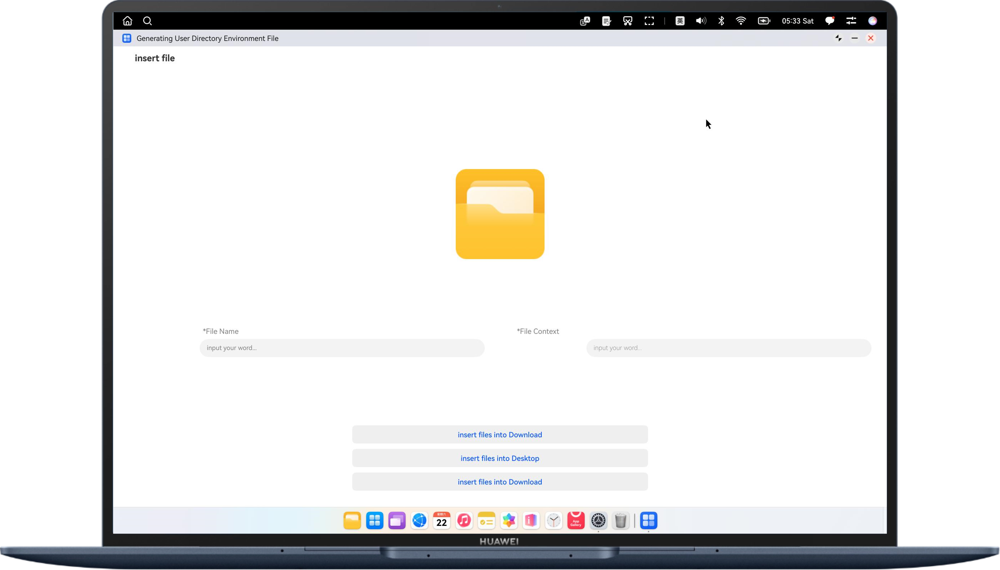

# Generating User Directory Files

## Overview

Based on the **fileIo** interface and **Environment** interface, this sample implements the function of generating files in the **Document**, **Download**, and **Desktop** directories on a PC/2-in-1 device in one-click mode, helping users better understand file interactions between the directories.


## Preview
| **Home page**                                      |
|----------------------------------------------------|
|  |


## How to Use

Enter the file name and information, and click the target directory to insert the file. Then, the target file is generated in the corresponding directory.


### How to Implement

Generate user directory files on a PC/2-in-1 device through the **fileIo** and **Environment** interfaces.

## Project Directory
```
├──entry/src/main/ets
│  ├──common
│  │  └──Logger.ets                            // Logger
│  ├──entryability
│  │  └──EntryAbility.ets                      // Entry ability
│  ├──entrybackupability
│  │  └──EntryBackupAbility.ets                // Data backup and restoration
│  └──pages
│     └──Index.ets                             // Home page
└──entry/src/main/resources                   // App resource directory
```

## Permissions

- ohos.permission.READ_WRITE_DOCUMENTS_DIRECTORY: Allows an application to access the Documents directory and its subdirectories in the user directory.
- ohos.permission.READ_WRITE_DOWNLOAD_DIRECTORY: Allows an application to access the Download directory and its subdirectories in the user directory.
- ohos.permission.READ_WRITE_DESKTOP_DIRECTORY: Allows an application to access the Desktop directory and its subdirectories in the user directory.
- Request these permissions by following the procedure in [Requesting Restricted Permissions](https://developer.huawei.com/consumer/en/doc/harmonyos-guides/declare-permissions-in-acl)

## Constraints

1. The sample is only supported on Huawei PC/2-in-1 devices with standard systems.

2. The HarmonyOS version must be HarmonyOS 5.0.5 Release or later.

3. The DevEco Studio version must be DevEco Studio 5.0.5 Release or later.

4. The HarmonyOS SDK version must be HarmonyOS 5.0.5 Release SDK or later.