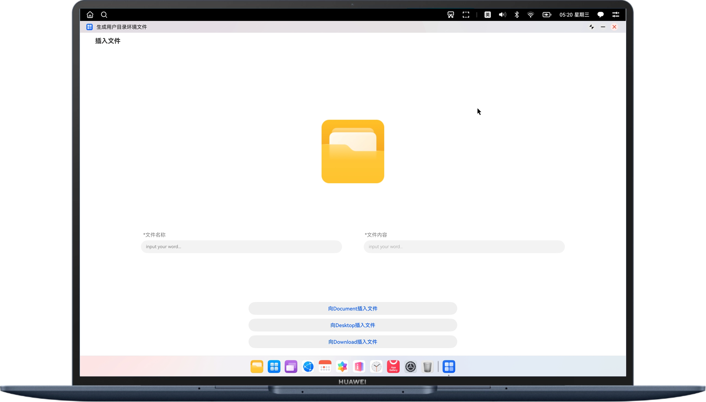

# 实现生成用户目录文件功能

## 介绍

本示例基于文件I/O接口和Environment接口，实现了一键在PC/2in1设备内生成Document目录、Download目录、Desktop目录文件功能，便于用户理解在
Document目录、Download目录、Desktop目录的文件交互。


## 效果预览
| **主页**                                          |
|-------------------------------------------------|
|  |


## 使用说明

输入文件名字和信息，点击目标目录插入文件，即可在对应目录生成目标文件。


### 具体实现

通过fileIo和Environment接口在PC/2in1设备生成用户目录文件。

## 工程目录
```
├──entry/src/main/ets 
│  ├──common
│  │  └──Logger.ets                            // 日志类 
│  ├──entryability
│  │  └──EntryAbility.ets                      // 程序入口类 
│  ├──entrybackupability
│  │  └──EntryBackupAbility.ets                // 程序出口类
│  └──pages
│     └──Index.ets                             // 主页面
└──entry/src/main/resources                   // 应用资源目录
```

## 相关权限

- ohos.permission.READ_WRITE_DOCUMENTS_DIRECTORY：允许应用访问公共目录下的Documents目录及子目录。Allows an application to access the Documents directory and its subdirectories in the user directory.
- ohos.permission.READ_WRITE_DOWNLOAD_DIRECTORY：允许应用访问公共目录下Download目录及子目录。
- ohos.permission.READ_WRITE_DESKTOP_DIRECTORY：允许应用访问公共目录下Desktop目录及子目录。

- 请[采用受限权限申请方式](https://developer.huawei.com/consumer/cn/doc/harmonyos-guides/declare-permissions-in-acl)申请使用以上权限。

## 约束与限制

1.本示例仅支持标准系统上运行，支持设备：PC/2in1。

2.HarmonyOS系统：HarmonyOS 5.0.5 Release及以上。

3.DevEco Studio版本：DevEco Studio 5.0.5 Release及以上。

4.HarmonyOS SDK版本：HarmonyOS 5.0.5 Release SDK及以上。