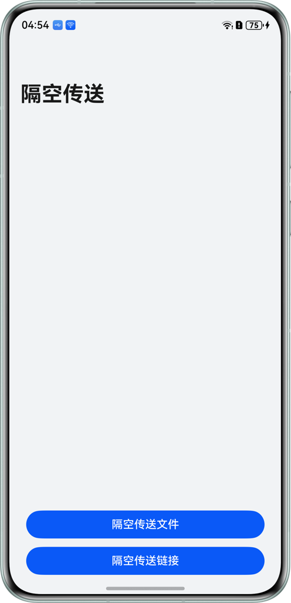
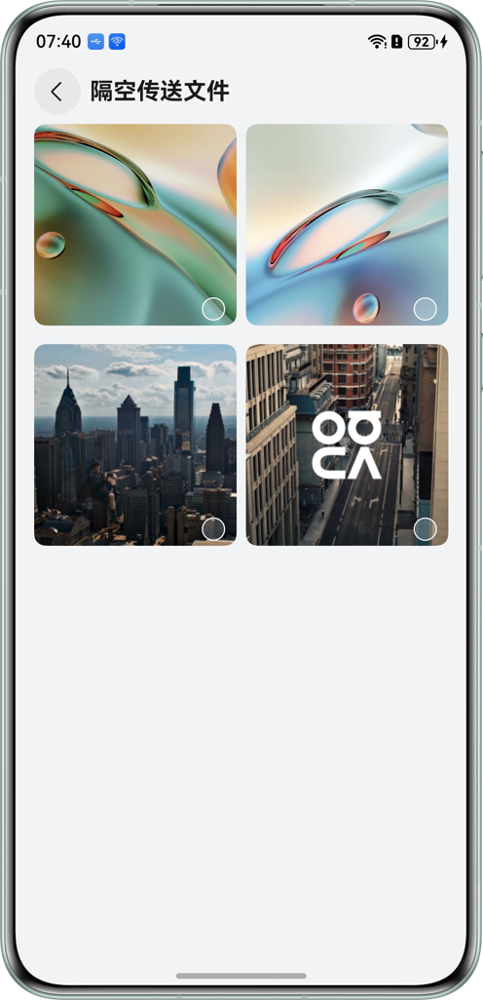
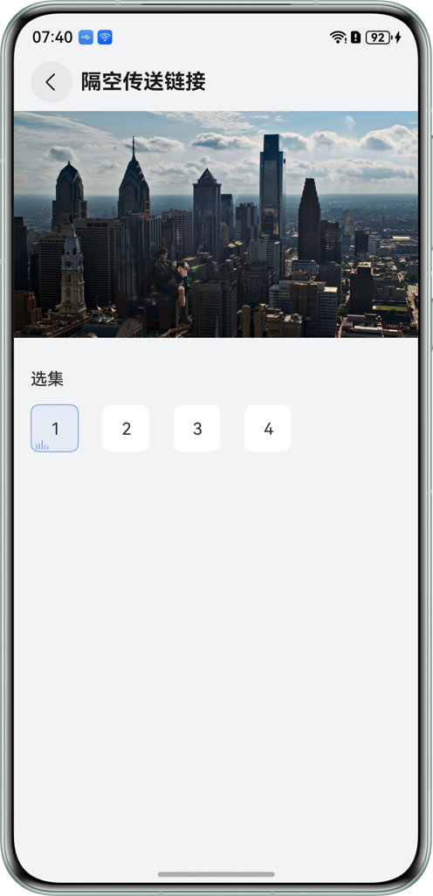

# 基于Share Kit实现隔空传送分享文件和链接

## 项目简介

本示例基于Share Kit实现快速跨设备分享文件，结合App Linking实现了快速跨设备分享链接并直接进入应用内视频播放页面的功能。通过harmonyShare.on('gesturesShare')方法注册隔空传送监听事件，并在回调中使用sharableTarget.share()方法分享文件或者分享App Linking链接，从而实现让用户通过“一抓一放”实现跨端传输。

## 效果预览

| 首页                                                 | 隔空传送文件分享页面                                        | 隔空传送链接分享页面                                         |
|----------------------------------------------------|---------------------------------------------------|----------------------------------------------------|
|  |  |  |

## 使用说明

1. 在运行项目前，需要完成App Linking的配置，以及对应用进行手动签名，具体可以参考[使用App Linking实现应用间跳转](https://developer.huawei.com/consumer/cn/doc/harmonyos-guides/app-linking-startup)。
2. 在完成App Linking的配置后，请前往[ShareModel.ets](feature/share/src/main/ets/model/ShareModel.ets)文件，将share()方法中的content参数替换为真实可用的链接地址，同时将[module.json5](product/entry/src/main/module.json5)文件中uris的host修改为可用的域名。
3. 设备A和设备B均安装运行示例代码，在亮屏、解锁的状态下并且都已开启华为分享服务（系统默认开启）。
4. 打开[设备侧隔空传送开关](https://developer.huawei.com/consumer/cn/doc/harmonyos-guides/gestures-share-open)。
5. 设备A进入首页点击隔空传送文件按钮，进入隔空传送文件页面，勾选文件后通过隔空传送手势分享文件到设备B。
6. 设备A进入首页点击隔空传送链接按钮，进入隔空传送链接页面，在当前页面通过隔空传送手势分享链接到设备B，设备B直接拉起应用进入视频播放界面。

## 工程目录

```
├──common/src/main/ets
│  ├──constants
│  │  └──BreakpointConstants.ets                 //断点常量定义
│  ├──utils
│  │  ├──BreakpointSystem.ets                    //断点系统工具
│  │  └──FileUtil.ets                            //文件处理工具类
│  └──resources                                  //资源目录
├──feature
│  └──share/src/main/ets
│     ├──model
│     │  ├──FileData.ets                         //文件数据模型
│     │  └──ShareModel.ets                       //隔空传送模块
│     ├──view
│     │  ├──FileSharePageComponent.ets           //隔空传送文件分享页面
│     │  └──LinkSharePageComponent.ets           //隔空传送链接分享页面
│     └──resources                               //资源目录
├──product
│  └──entry/src/main/ets
│     ├──entryability
│     │  └──EntryAbility.ets                     //程序入口类
│     ├──entrybackupability
│     │  └──EntryBackupAbility.ets               //数据备份恢复类
│     ├──pages
│     │  └──Index.ets                            //首页
│     └──resources                               //资源目录
└──service
   └──index.html                                 //视频播放Web页面，需要部署在服务器
```

## 具体实现
* 通过harmonyShare.on('gesturesShare')方法注册隔空传送监听事件，并在回调中使用sharableTarget.share()方法分享文件或者分享App Linking链接，从而实现让用户通过“一抓一放”实现跨端传输。
* 通过App Linking实现应用拉起功能。

## 相关权限

**不涉及**

### 约束与限制

1. 本示例仅支持标准系统上运行，支持设备：华为手机、华为平板、PC/2in1。
2. HarmonyOS系统：HarmonyOS 6.0.0 Beta5及以上。
3. DevEco Studio版本：DevEco Studio 6.0.0 Beta5及以上。
4. HarmonyOS SDK版本：HarmonyOS 6.0.0 Beta5 SDK及以上。