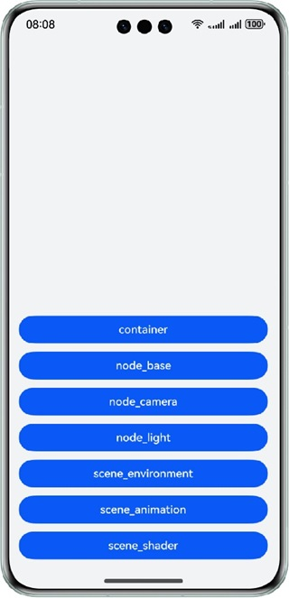
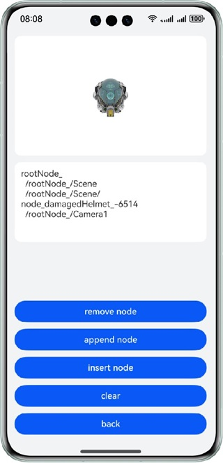
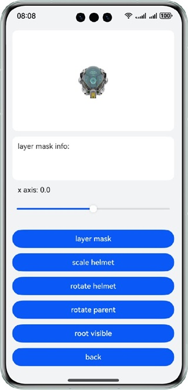
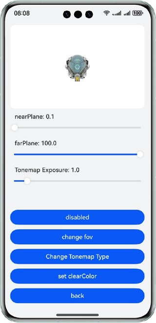
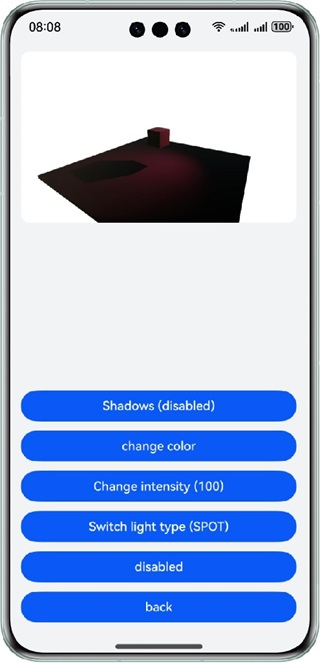
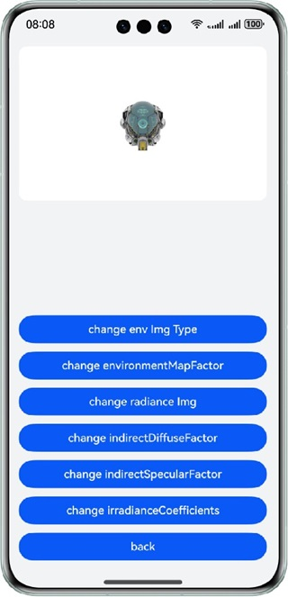
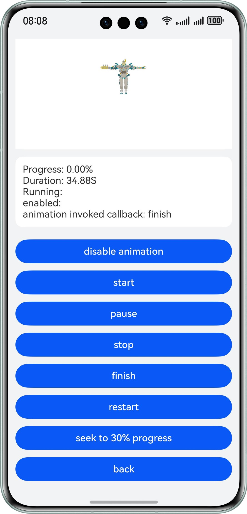
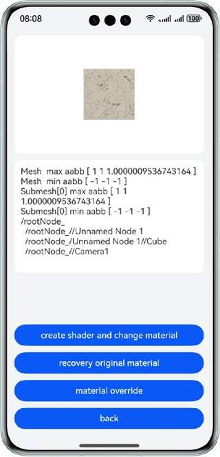

# 3D Engine APIs

### Overview

This sample demonstrates the APIs in @ohos.graphics.scene, one of the 3D engine modules.
Images rendered by the 3D engine are displayed in the **Component3D** component. This sample provides different functional buttons for you to view the changes of the rendered images.

### Preview

| Home page                      | container                           | node_base                      | node_camera                      |
| ------------------------------ | ----------------------------------- | ------------------------------ | -------------------------------- |
|  |  |  |  |

| node_light                      | scene_environment                      | scene_animation                                         | scene_shader                      |
| ------------------------------- | -------------------------------------- | ------------------------------------------------------- | --------------------------------- |
|  |  |  |  |

### How to Use

1. On the home page, you can touch different buttons to access different subpages. Each subpage demonstrates the interface functions of a type of 3D engine. It also provides a **back** button for you to return to the home page.
2. On the **container** page, touch buttons to add or remove a node. The node structure information is displayed on the page. In this sample, the node is a helmet model.
3. On the **node_base** page, touch buttons to manipulate the basic node attributes such as the position, rotation, size, and visibility. In this sample, the node is a helmet model.
4. On the **node_camera** page, touch buttons to manipulate the camera attributes such as projection and post-processing.
5. On the **node_light** page, touch buttons to perform operations on the light type, color, intensity, and shadow.
6. On the **scene_environment** page, touch buttons to perform operations on the background.
7. On the **scene_animation** page, touch buttons to play or pause an animation.
8. On the **scene_shader** page, touch buttons to perform texture operations.

### Project Directory

```
├──entry/src/main/ets
│  ├──constants
│  │  ├──Constants.ets                    // Constants         
│  ├──entryability
│  │  └──EntryAbility.ets               // Entry ability
│  ├──entrybackupability
│  │  └──EntryBackupAbility.ets
│  ├──graphics3d
│  │  ├──ContainerPage.ets              // Node operation demo
│  │  ├──NodeBase.ets                   // Node base demo
│  │  ├──NodeCamera.ets                 // Camera demo
│  │  ├──NodeLight.ets                  // Light demo
│  │  ├──SceneAnimation.ets             // Animation demo
│  │  ├──SceneEnvironment.ets           // Background demo
│  │  └──SceneShader.ets                // Texture demo
│  ├──pages
│  │  └──Index.ets                      // Home page
│  └──utils
│     ├──CalcUtils.ets                  // Calculation utility class
│     └──Logger.ets                     // Log utility
└──entry/src/main/resources
```

### How to Implement

* For details about the APIs for adding, deleting, and traversing nodes, see **ContainerPage.ets**.
  
  * During initialization, depth-first search is used to traverse and print information about each node in the scenario, starting from the root node.
  * **remove node**: Call the **remove** method to delete a node. Repeated deletion is not allowed. In this sample, the helmet node is deleted.
  * **append node**: Call the **append** method to add a node to the end of the node list. Repeated addition is not allowed. In this sample, a helmet node is added.
  * **insert node**: Call the **insertAfter** method to add a node to the specified position in the node list. Repeated addition is not allowed. In this sample, a helmet node is added.
  * **clear**: Call the **clear** method to clear all nodes in the node list. In this sample, the nodes under the root node are cleared.

* For details about operations on basic node attributes such as position, rotation, and size, see **NodeBase.ets**.
  
  * Use the **scale** attribute to change the size of the node. In this sample, the helmet size is changed.
  * Use the **position** attribute to change the position of the node. In this sample, the X coordinate of the helmet is changed.
  * Use the **rotation** attribute to change the rotation direction of the node. Changing the rotation of the parent node also changes that of its child nodes (similar to **position**). In this sample, the rotation direction of the helmet is changed.
  * Use the **visible** attribute to change the node visibility. In this sample, the visibility of the helmet is changed.
  * Call the **getEnabled** and **setEnabled** methods to operate the layer mask of the node. In this sample, the layer mask information is displayed.

* For details about the APIs for operating camera attributes such as projection and post-processing, see **NodeCamera.ets**.
  
  * Use the **fov** attribute to change the Field of View (FOV) of the projection. In this sample, the FOV can be set to 45, 60, or 90.
  * Use the **nearPlane** and **farPlane** attributes to change the near and far planes.
  * Use the **enabled** attribute to enable or disable the camera. If the attribute is set to **false**, the image in the component will no longer be refreshed.
  * Use the **postProcess.toneMapping.type** to change the tone mapping. Currently, there are three methods: ACES, ACES_2020, and FILMIC.
  * Use the **postProcess.toneMapping.exposure** attribute to change the exposure parameter for tone mapping.
  * Use the **clearColor** attribute to set the refresh background color of each frame. If this attribute is set to **0** for the alpha channel, a transparent background is obtained. If it is set to **null**, not all background pixels are refreshed.

* For details about the APIs for operating the light type, color, intensity, and shadow, see **NodeLight.ets**.
  
  * Use the read-only attribute **lightType** to indicate the light type, which can be set to **DIRECTIONAL** or **SPOT**.
  * Use the **enabled** attribute to enable or disable the light.
  * Use the **color** attribute to change the light color. In this sample, three light colors are provided.
  * Use the **intensity** attribute to change the light intensity.
  * Use the **shadowEnabled** attribute to set whether shadows are generated.

* For details about the APIs for performing operations on the background, see **SceneEnvironment.ets**.
  
  * Use the **backgroundType** and **environmentImage** attributes to set the background image. The types **BACKGROUND_IMAGE**, **BACKGROUND_EQUIRECTANGULAR**, and **BACKGROUND_CUBEMAP** indicate images in PNG, JPEG, and KTX format, respectively; the type **BACKGROUND_NONE** indicates that no background is set. In this case, you need to set **clearColor** of the alpha channel to **0** to obtain a transparent background.
  * Use the **environmentMapFactor** attribute to change the parameters of the background image.
  * Use the **radianceImage** attribute to change the environment mapping in the Physically Based Rendering (PBR) process.
  * Use the **indirectDiffuseFactor** attribute to change the corresponding parameter in the PBR process.
  * Use the **indirectSpecularFactor** attribute to change the corresponding parameter in the PBR process.
  * Use the **irradianceCoefficients** attribute to change the corresponding parameter in the PBR process.

* For details about the APIs for playing and pausing animations, see **SceneAnimation.ets**.
  
  * Use the **enabled** attribute to enable or disable the animation.
  * Use the read-only attributes **duration**, **running**, and **progress** to indicate the animation's duration, its running state, and the proportion completed, respectively.
  * Call the **start** method to start the animation.
  * Call the **pause** method to pause the animation.
  * Call the **stop** method to stop the animation and set the animation position to the beginning.
  * Call the **finish** method to end the animation and set the animation position to the end.
  * Call the **restart** method to start playing the animation from the beginning.
  * Call the **seek** method to set the animation to the specified position.
  * Call the **onStarted** method to execute the passed-in callback when the animation starts.
  * Call the **onFinished** method to execute the passed-in callback when the animation ends.

* For details about the APIs for operating textures, see **SceneShader.ets**.
  
  * Create a color shader for a shader material, and then create a shader material of the texture.
  * Use **Geometry** to obtain mesh nodes with materials.
  * Modify the **input** parameters of the shader.
  * Change the **material** attribute of the submesh to make it as a custom shader material.
  * Change the **materialOverride** attribute to overwrite the texture with the custom shader material.

### Required Permissions

N/A

### Constraints

1. The sample is only supported on Huawei phones with standard systems.

2. The HarmonyOS version must be HarmonyOS 5.0.5 Release or later.

3. The DevEco Studio version must be DevEco Studio 5.0.5 Release or later.

4. The HarmonyOS SDK version must be HarmonyOS 5.0.5 Release SDK or later.


