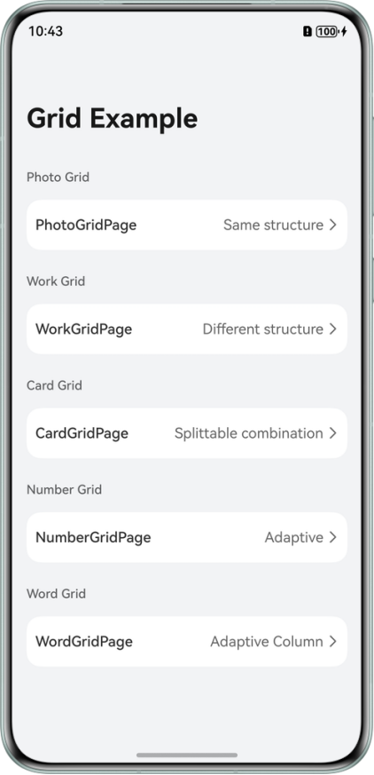

# Implementing Grid Based on ScrollComponents

## Overview

This sample demonstrates how to use ScrollComponents to build grid pages for the following scenarios:

- Reuse of grid cell components and cross-page component
- Accelerated first-screen rendering of grids
- Grid data processing: pull-down-to-refresh, pull-up-to-load, and long-press-to-delete
- Setting grid arrangement modes
- Displaying data in grids
- Setting row and column spacing in grids
- Scrollable grid layouts
- Controlling grid scroll positions
- Nested grid scrolling
- Dragging grid cells
- Adaptive grids and adaptive columns
- Setting grid cell heights based on the tallest cell in the current row
- Setting edge fading to grids
- Setting grid cell styles

## Preview



## How to use

1. Open the app homepage to display the scene list. Click on PhotoGridPage to implements the reuse of components with the same grid cell structure and grid arrangement mode setting.
2. Return to the homepage, click on WorkGridPage to implements component reuse for cells with heterogeneous structures, cross-page grid reuse with PhotoGridPage.ets, pull-down-to-refresh, pull-up-to-load, dragging cells, nested scrolling, and edge-fading effects.
3. Return to the homepage, click CardGridPage to implements component reuse with splittable combination of substructures within grid cells, accelerated first-screen rendering, data display, row and column spacing setting, scrollable layout, cell-style setting, and long-press-to-delete cell.
4. Return to the homepage, click NumberGridPage to implements grid adaptive scenario.
5. Return to the homepage, click WordGridPage to implements the grid adaptive column scenario and the scenario where grid cell heights are set based on the tallest cell in the current row.

## Project Directory

```
├──entry/src/main/ets                     // Code area.
│  ├──common
│  │  ├──constants
│  │  │  └──CommonConstants.ets           // Common constants. 
│  │  └──utils           
│  │     ├──ContextUtil.ets               // Utility class.
│  │     ├──Logger.ets                    // Log class. 
│  │     └──Utils.ets                     // Utility class. 
│  ├──entryability
│  │  └──GridAbility.ets                  // Application entry. 
│  ├──model
│  │  ├──mock.ets                         // Mock data.
│  │  ├──types.ets                        // Data model.
│  │  ├──PhotoModel.ets                   // Image data.
│  │  ├──WorkModel.ets                    // Work data.
│  │  ├──UserInfoModel.ets                // User information.
│  │  ├──NumberModel.ets                  // Number data.
│  │  └──WordModel.ets                    // Text data.
│  ├──view
│  │  ├──PhotoCellComponent.ets           // Photo cell view.
│  │  ├──PhotoGridComponent.ets           // Photo grid view. 
│  │  ├──PictureWorkComponent.ets         // Picture work view.
│  │  ├──VideoWorkComponent.ets           // Video work view.
│  │  ├──WorkTabsComponent.ets            // Work tabs view.
│  │  ├──WorkComponent.ets                // Work grid view. 
│  │  ├──WorkHeadComponent.ets            // Work page header view. 
│  │  ├──CardComponent.ets                // Card view.
│  │  ├──ManagerCardComponent.ets         // Manager view.
│  │  ├──UserCardComponent.ets            // User view.
│  │  ├──CardGridComponent.ets            // Card grid view. 
│  │  ├──NumberCellComponent.ets          // Number view.
│  │  ├──NumberGridComponent.ets          // Number grid view. 
│  │  ├──WordCellComponent.ets            // Word view.
│  │  └──WordGridComponent.ets            // Word grid view. 
│  ├──viewModel
│  │  ├──PhotoSizeViewModel.ets           // Photo size view model.
│  │  ├──PhotoViewModel.ets               // Photo view model.
│  │  ├──PhotoGridViewModel.ets           // Photo grid page view model.
│  │  ├──WorkViewModel.ets                // Work view model.
│  │  ├──WorkGridViewModel.ets            // Work grid page view model.
│  │  ├──UserInfoViewModel.ets            // User info view model.
│  │  ├──CardGridViewModel.ets            // Card grid page view model.
│  │  ├──NumberViewModel.ets              // Number view model.
│  │  ├──NumberGridViewModel.ets          // Number grid page view model.
│  │  ├──WordViewModel.ets                // Word view model.
│  │  └──WordGridViewModel.ets            // Word grid page view model.
│  └──pages
│     ├──Index.ets                        // Navigation page.
│     ├──PhotoGridPage.ets                // Photo grid page.
│     ├──WorkGridPage.ets                 // Work grid page.
│     ├──CardGridPage.ets                 // Card grid page.
│     ├──NumberGridPage.ets               // Number grid page.
│     └──WordGridPage.ets                 // Word grid page.
└──entry/src/main/resources               // Directory for storing resource files.
```

## How to Implement

1. Define the grid view manager class and register child node templates. GridManager is the base class of the grid view manager, which can be extended by customizing the GridViewManager based on service requirements.
    ```arkts
    // entry\src\main\ets\view\WordCellComponent.ets 
    
    @Component 
    export default struct WordCell { 
      @State word: WordViewModel = new WordViewModel(); 
    
      // Component reuse requires implementing the aboutToReuse function. 
      aboutToReuse(params: Record<string, ESObject>) { 
        let input = params as WordCellData; 
        this.word = input.word; 
      } 
    
      build() { 
        Text(this.word.value) 
      } 
    }
    ```
    ```arkts
    // entry\src\main\ets\view\WordGridComponent.ets 
    
    import { GridManager, NodeItem, RecyclerView } from "@hadss/scroll_components"; 
    import WordCell from "./WordCellComponent"; 
    
    @Component 
    export default struct WordGridComponent { 
      // Grid view manager instance. 
      gridViewManager: GridViewManager = new GridViewManager({ defaultNodeItem: 'word', context: this.getUIContext() }); 
    
      aboutToAppear(): void { 
        // Register node templates and establish a mapping between the identifier and the builder function. 
        this.gridViewManager.registerNodeItem('word', wrapBuilder(buildWordCell)); 
      } 
    } 
    
    // Extend a custom view manager. 
    class GridViewManager extends GridManager { 
    
      // Obtain the reusable node by unique identifier and pass node data. 
      onWillCreateItem(index: number, data: WordViewModel) { 
        let node: NodeItem<WordCellData> | null = this.dequeueReusableNodeByType('word'); 
        node.setData({ word: data }) 
        return node; 
      } 
    } 
    
    @Builder 
    function buildWordCell(data: ESObject) { 
      WordCell({ word: data.data }) 
    }
    ```
2. Grid component initialization
   ```arkts
   // entry\src\main\ets\view\WordGridComponent.ets 
   
   aboutToAppear(): void { 
     this.gridViewManager.setViewStyle() 
       .alignItems(GridItemAlignment.STRETCH); 
   
     this.gridViewManager.setViewStyle() 
       .columnsTemplate('repeat(auto-fill, 70)') 
       .columnsGap(5) 
       .rowsGap(5); 
   }
   ```
3. Set the data source for component rendering
    ```arkts
    // entry\src\main\ets\view\WordGridComponent.ets 
    
    @Component 
    export default struct WordGridComponent { 
      gridViewManager: GridViewManager = new GridViewManager({ defaultNodeItem: 'word', context: this.getUIContext() }); 
      viewModel: WordGridViewModel = new WordGridViewModel(this.gridViewManager); 
    
      aboutToAppear(): void { 
        // viewModel data loading. 
        this.viewModel.loadData(); 
      } 
    
      build() { 
        Column() { 
          // Render view component. 
          RecyclerView({ 
            viewManager: this.gridViewManager 
          }) 
        } 
        .width('100%') 
      } 
    }
    ```
    ```arkts
    // entry\src\main\ets\viewModel\WordGridViewModel.ets 
    
    async loadData() { 
      setTimeout(() => { 
        for (let index = 0; index < 15; index++) { 
          // Simulate request data. 
          let model: WordModel = new WordModel(); 
          model.value = `N ${index}`; 
          let viewModel: WordViewModel = new WordViewModel(); 
          viewModel.updateModel(model); 
          this.data.push(viewModel); 
        } 
        // Set the data source. 
        this.gridViewManager?.setDataSource(this.data); 
      }, 100); 
    }
    ```

## Permission
- The `ohos.permission.INTERNET` permission is required for downloading network resources.

## Constraints

1. The sample app is only supported on Huawei phones with standard systems.
2. The HarmonyOS version must be HarmonyOS 5.0.5 Release or later.
3. The DevEco Studio version must be DevEco Studio 5.0.5 Release or later.
4. The HarmonyOS SDK version must be HarmonyOS 5.0.5 Release SDK or later.
5. The number of rows and columns occupied by a child component cannot be set.
6. Pinch gesture recognition is not supported.

## Introduction to ScrollComponents

As a high-performance scrolling solution, ScrollComponents helps you achieve smoother scrolling experiences in complex page scenarios such as long lists and waterfalls.

Its underlying system uses a custom reuse pool to address efficiency issues under complex scenarios, offering higher reuse efficiency compared to the native Reusable.

You can achieve high-performance scrolling with minimal code, without needing to handle the complexities of component reuse pool management or other performance optimization interactions.

## Features
- Smooth scrolling for grid pages.
- Lazy loading by default.
- Component reuse, which prevents frame drops during scrolling and improves scrolling performance.
- Reused pool sharing, which enables component reuse across pages and parent components.
- Pre-creation, which reduces initial frame drops upon cold startup and improves scrolling performance.
- Preloading, which loads data in advance during scrolling to improve browsing experience.

## FAQs

[View Details](https://gitcode.com/openharmony-sig/scroll_components/blob/master/docs/FAQ.md)

## Principles

[View Details](https://gitcode.com/openharmony-sig/scroll_components/blob/master/README.md#%E5%8E%9F%E7%90%86%E4%BB%8B%E7%BB%8D)

## Repositories Involved

[scroll_components](https://gitcode.com/openharmony-sig/scroll_components/tree/master)